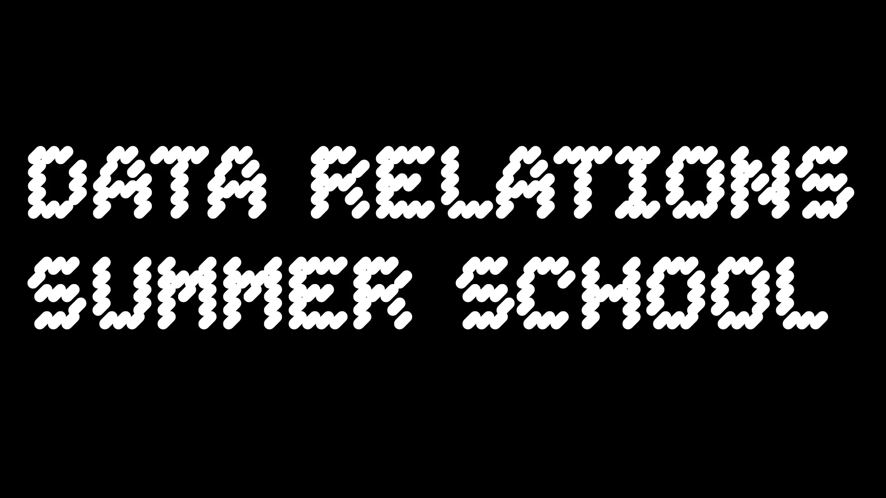

date: 2023
Institutional partner: ACCA, ADM+S

*Data Relations Summer School*
Australian Centre for Contemporary Art, RMIT
Thursday 16 – Monday 20 February 2023

*Data Relations Summer School* (DRSS) took place in Naarm/Melbourne across four days and nights comprising workshops, talks, performances and other activities. The agenda of the school was simply to hold collective space, however temporarily or provisionally, to think critically, speculatively, and collaboratively about what it means to live in a data-driven world, with all the negative and positive valences this entails.

During the daytime sessions, held primarily at RMIT University, the cohort of over 90 contributors and participants assembled in a ‘classroom’ formation, as artists, researchers, and practitioners from diverse disciplinary backgrounds, for a series of experiments and exercises grounded in pedagogy and artistic exploration. In the evenings, at Australian Centre for Contemporary Art, were performances, lectures, and conversations by Australian and visiting international artists, framed by proximity to the works in the *Data Relations* exhibition.

As part of DRSS, Machine Listening ran a workshop entitled ‘[Data Audits, or Why Listen to Datasets?](https://acca.melbourne/data-relations-summer-school-schedule-2/#_edn3:~:text=Swanston%20St%2C%20Melbourne-,Data%20Audits%2C%20or%20Why%20Listen%20to%20Datasets%3F,-with%20Machine%20Listening)’. 

A creative response and map of the DRSS by Ana Tiquia can be found in the [Data Relations Publication](https://datarelations.acca.melbourne/?entry=data-relations-summer-school)

full schedule

### **DATA RELATIONS SUMMER SCHOOL**

MELBOURNE, THURSDAY 16 to MONDAY 20 FEBRUARY, 2023

### **INTRODUCTION**

Hello, and welcome to the Data Relations Summer School. Thanks to everyone who is reading this. That likely makes you one of the enthusiastic cohort who has enrolled via the expression of interest, or a generous facilitator/performer who will be leading a session, or one of the many supporters, institutional and otherwise, of this program.

The Data Relations Summer School takes place between 16-20 February 2023, across four days and nights of workshops, talks, performances and other activities, in Naarm/Melbourne. The agenda of the school is simply to hold collective space, however temporarily or provisionally, to think critically, speculatively, and collaboratively about what it means to live in a data-driven world, with all the negative and positive valences this entails.

During the daytime sessions, held primarily at RMIT University, we will assemble in ‘classroom’ formation, as artists, researchers, and practitioners from diverse disciplinary backgrounds, for a series of experiments and exercises grounded in pedagogy and artistic exploration. Snacks, power, WiFi, tables and chairs will be provided. In the evenings, at Australian Centre for Contemporary Art, we will witness performances, lectures and conversations by Australian and visiting international artists, framed by proximity to the works in the Data Relations exhibition. There will be a bar and plenty of time to chat.

Beyond the institutional platforms of the University and gallery, we will hold a third, online, space, in the form of a Discord server for parallel conversations, communications and exchange. You’ll receive an invitation to your email address or can access the server [here](https://discord.gg/mbazpRb9sf). In these different contexts, the aim is to produce a cohort or learning community, grounded in shared sociality, to generate and circulate knowledge, ideas, tactics and techniques.

In the document that follows you will find a schedule of events and program descriptions, information on the contributors, access and venues. In some instances, we will ask that you prepare for sessions by reading, listening or watching pre-prepared materials. In other cases, you can simply arrive ready for action.

See you at the Summer School.

### **DAY ONE: THURSDAY 16 FEBRUARY**

### **Session #1**

12pm-4pm

RMIT Media Portal (14.02.131), Swanston St, Melbourne

### **Why Study Data Relations? with Sean Dockray, Andrew Brooks, Winnie Soon, Victoria Ivanova**

You aren’t the first to arrive. People are already milling around inside, behind the thick glass that is both a window and a threshold to the city. You are about to enter an event staged by a gallery and a handful of Universities, in a room that calls itself a ‘media portal’ but will soon become a ‘classroom’. There are nine flat screens on the wall, speakers mounted overhead, a control panel in the corner, food and drinks on the trestle tables, chairs scattered everywhere.

The Summer School’s opening session will be dedicated to the reflexive question: what are we even doing here? Why study ‘data relations’ specifically? And what might it mean to undertake this study in the form of a ‘summer school’? What is at stake in appropriating that phrase, attached to an exhibition, amidst a never-ending crisis of education, and as the pandemic continues to unfold? Is there something about studying data relations that seems to demand particular forms of pedagogy? And what degree of agency do we have in this respect, given the material conditions in which we find ourselves? In the process of instituting a school, how might we also unmake schooling, data relations, and ourselves?

This session, like every daytime session across the School’s four days, will be co-facilitated by a cohort of artists, researchers, activists and educators, whose biographies you will find below. Together, we will move between a variety of formats: conversation, lecture, small group activities, and experiments.

Reference material:

1. Miriam Kelly, *Data Relations*: [https://datarelations.acca.melbourne/?page=curatorial-essay](https://datarelations.acca.melbourne/?page=curatorial-essay)
2. Sean Dockray, *Expanded Appropriation*: [https://vimeo.com/60889535](https://vimeo.com/60889535)
3. Andrew Brooks and Astrid Lorange, *Homework*: [https://snacksyndicate.net/homework/](https://snacksyndicate.net/homework/)
4. Winnie Soon, *Erasure by Any Other Name*: [https://datarelations.acca.melbourne/?entry=erasure-by-any-other-name](https://datarelations.acca.melbourne/?entry=erasure-by-any-other-name)
5. Victoria Ivanova, [*Future Art Ecosystems 3: Art x Decentralised Tech*](https://futureartecosystems.org/) (you can download the PDF and read the introduction at the link)

### 

### **Public Program #1**

6pm-8pm

Australian Centre for Contemporary Art, Melbourne

### **Mimi Ọnụọha: The Hair in the Cable**

**lecture performance and conversation with Mehak Sawhney**

“In much of my work I’m bringing forward different rituals, and ways of being that can feed into new stories, positionings, and understandings of technologies. More often than not these new stories aren’t entirely new. They might consist in part of my own ideas, but often I’m simply making space for older ways of being that have been discarded along the paths of modernity, coloniality, and globalisation.” Through a series of media and artworks, Mimi Ọnụọha’s performance-lecture explores absence, knowledge, and how what is missing is still there.

### **Winnie Soon: The Poetics of Unerasable Characters**

**lecture performance and conversation with Mat Spisbah**

Data today occupies communication, affective relationships and infrastructure via network protocols, censoring and filtering algorithms. According to *Data Relations* digital publication writer Yung Au, ‘All of us have lived through some form of erasure. That is the experience of having our sentences cut short. Or the experience of being the subject of the moderation that occurs across communication infrastructures.’ We have experienced, in one way or another, various forms of curated information by human and machine forces. This artist talk will unfold the poetics of erasure through forgetting, remembering, recalling, erasing, voicing and generating characters.

### **DAY TWO: FRIDAY 17 FEBRUARY**

### **Session #2**

12pm-4pm

RMIT Media Portal (14.02.131), Swanston St, Melbourne

### **Scrapism with Tega Brain, Sam Lavigne**

**Adventures in Scrapism**

“I define "scrapism" as the practice of web scraping for artistic, emotional, and critical ends. It combines aspects of data journalism, conceptual art, and hoarding, and offers a methodology to make sense of a world in which everything we do is mediated by internet companies. These companies surveil us, vacuum up every trace we leave behind, exploit our experiences and interject themselves into every possible moment. But in turn they also leave their own traces online, traces which when collected, filtered, and sorted can reveal (and possibly even alter) power relations. The premise of scrapism is that everything we need to know about power is online, hiding in plain sight.” Sam Lavigne

In the first part of this session, artists Tega Brain and Sam Lavigne will introduce and then lead a workshop on what they call ‘scrapism’: the critical practice of using web scraping to subvert, invert and detourn online data asymmetries. The workshop will include a basic introduction to web-scraping focusing on text, sound and video. Participants will need to either bring or be willing to share a laptop, and if you are able to install ??? in advance, that would be greatly appreciated.

Reference material:

1. [https://distant.gallery/scrapism](https://aus01.safelinks.protection.outlook.com/?url=https%3A%2F%2Fdistant.gallery%2Fscrapism&data=05%7C01%7Cj.stern%40rmit.edu.au%7C2c1a59abd30143220c6208dafdabdf55%7Cd1323671cdbe4417b4d4bdb24b51316b%7C0%7C0%7C638101211880572608%7CUnknown%7CTWFpbGZsb3d8eyJWIjoiMC4wLjAwMDAiLCJQIjoiV2luMzIiLCJBTiI6Ik1haWwiLCJXVCI6Mn0%3D%7C3000%7C%7C%7C&sdata=m1JlS1R55O%2FmPMOW2cg8blugByAZeeS05V9IBzWyLNo%3D&reserved=0)
2. https://scrapism.lav.io/

### **Machine Vision Reading Groupwith Chris O’Neill, Thao Phan, Zach Blas and Michael Richardson**

“The first *Facial Weaponization Suite* mask, *Fag Face Mask*, is a response to gay face and fag face scientific studies that link the successful determination of sexual orientation through rapid facial recognition techniques. The mask is generated from the biometric facial data of many queer men’s faces, which was collected during a workshop in Los Angeles in fall 2012. Pink in color and blob-like in form, the *Fag Face Mask* refuses the scientific determinism of sexual orientation and opposingly invests in an opacity that conceals against such readability and signals an irreducibly othered presence. The mask is not a denial of sexuality nor a return to the closet; rather, it is a collective and autonomous self-determination of sexuality, a styling and imprinting of the face that evades identificatory regulation.” Zach Blas

In the second part of the session, researchers Chris O’Neill and Thao Phan will convene an experimental session of the reading group on ‘machine vision’ they co-facilitate under the auspices of the ARC Centre of Excellence for Automated Decision Making. Because of the size of the cohort, collective reading is not necessarily easy. So the session will move between reflections on how and why to read well, together, and experiments in reading texts by and with Zach Blas and Michael Richardson, in small and large groups. Please try to spend some time with these texts in advance.

Reference material:

1. Zach Blas: [Escaping the Face: Biometric Facial Recognition and the Facial Weaponization Suite](https://zachblas.info/writings/escaping-the-face-biometric-facial-recognition-and-the-facial-weaponization-suite/)
2. Michael Richardson: [Witnessing Algorithms and the Paradox of Synthetic Media](https://circusbazaar.com/witnessing-algorithms-and-the-paradox-of-synthetic-media/)

### 

### **Public Program #2**

6pm-8pm

Australian Centre for Contemporary Art, Melbourne

### **Lauren Lee McCarthy: *Surrogate, Performance in Progress***

**performance and conversation with Jenny Kennedy**

*Roe v. Wade* is overturned while gene editing is opening entirely new reproductive futures. What does kin mean as reproductive technologies shift our relationships? How much control should we have over a birthing person’s body, and over a life before it begins?

‘The *Surrogate* project began with a desire to serve as a surrogate. During the pregnancy, the parents would have an app I made that provides 24/7 access to all my biodata, and an interface to control me. So in essence, they could have complete control over my body in which their baby is growing.

The past few years of the pandemic have reshaped our bodily boundaries. We’ve swabbed and spit in tubes and traded ownership of our bodily substances in an attempt to feel safe. But these fluids hold the data of our DNA, our personal information, and our identity.

I’m fascinated by the ways we’re taught to interact with data, and how this shapes the way we interact with each other. Central to my work is a critique of the simultaneous technological and social systems we’re building around ourselves. What are the rules? What happens when we introduce glitches?’

### 

### **DAY THREE: SATURDAY 18 FEBRUARY**

### **Session #2**

12pm-4pm

RMIT Media Portal (14.02.131), Swanston St, Melbourne

### **Data Audits, or Why Listen to Datasets?with Machine Listening (James Parker, Sean Dockray, Joel Stern), Mehak Sawney and Lauren Lee McCarthy**

You open a dataset, click on a file, and hear a person coughing three times. You click on another one, and a voice starts counting briskly from one to twenty. You notice an accent but you can’t place it. The next file is labeled ‘oooo.wav’. It sounds like the same voice, only holding the phoneme ‘oh’ (o-e) this time. An online tool tells you the frequency is around 140hZ, a C#, though the tuning starts to wobble as the vocalist runs short of breath. Throughout the file you hear shuffling, and a mouse clicking. The recording sounds clipped, low fidelity, a bit like a Zoom call.

You open another dataset, click on a file entitled ‘YAF_voice_sad.wav’, and hear a voice recite the phrase ‘say the word voice’. Or maybe they are singing. Does the voice sound sad, as promised? Maybe. But mostly you are struck by how musical the performance is, and by the strangeness of the phrase, which is also a command. Say (C#) the (C#) word (G#) voice (F#), the voice sings, with no response. You listen again. Say (C#) the (C#) word (G#) voice (F#). Voice, you say to yourself, as you search for another file.

What are these recordings? Why were they made? What can they tell us about the datasets of which they are a part, and the uses to which they are put? In this experimental workshop we will listen to datasets and other audio archives as sites of both power and possibility, critique and creativity. We will consider how auditory data is stored and processed, and how different modes of listening might reveal a world of social relations - of labour, ownership, and context - embedded within these datasets. Across a series of lectures, conversations, and listening exercises, we will attempt to collectively audit two datasets and one dataset-in-waiting, with and against the technocratic purposes for which they were gathered.

You may like to spend some time with these datasets and related materials in advance of the session.

Reference material:

1. Sean Dockray, James Parker and Joel Stern, *(Against) The Coming World of Listening Machines*: [https://machinelistening.exposed/topic/against-the-coming-world-of-listening-machines/](https://machinelistening.exposed/topic/against-the-coming-world-of-listening-machines/)
2. Machine Listening, *After Words:* [https://datarelations.acca.melbourne/?entry=after-words](https://datarelations.acca.melbourne/?entry=after-words)
3. Sean Dockray, [*Listening to the Diagnostic Ear*](https://www.youtube.com/watch?v=7mcBE-qTcVI&t=2s)
4. Mehak Sawhney, [*Data Genesis and Speech Recognition in India*](https://youtu.be/5E98ddSdghA?t=5730)
5. Lauren Lee McCarthy, *Live Data:* [https://datarelations.acca.melbourne/?entry=live-data](https://datarelations.acca.melbourne/?entry=live-data)
6. Kate Crawford and Trevor Paglen, *Excavating AI*: [https://excavating.ai/](https://excavating.ai/)
7. Cifor, M et al, *Feminist Data Manifest-No*: [https://www.manifestno.com/home](https://protect-au.mimecast.com/s/ZDUdCVAGLrsllVjKyCGiM9n?domain=manifestno.com)
8. Critical Dataset Studies Reading List: [https://knowingmachines.org/reading-list](https://knowingmachines.org/reading-list)

Datasets/Archives:

1. AudioSet: [https://research.google.com/audioset/](https://research.google.com/audioset/)
2. The Speech Accent Archive: [https://accent.gmu.edu/](https://accent.gmu.edu/)
3. Sperm Cryo Banks, ‘Hear the Donor’ audio archive [https://fairfaxcryobank.com/search/](https://fairfaxcryobank.com/search/)

### **Public Program #3**

6pm-8pm

Australian Centre for Contemporary Art, Melbourne

### **Zach Blas: Expositio, Iudicium, Lacrimae, or, Does an AI God Have an Ass?**

**lecture-performance and conversation with Mark Andrejevic**

Zach Blas explores the idea of religious-un/conscious thriving in today’s tech industry. Charting his encounters with various artificial intelligence gods, Blas tells of a computational world of divine judgment and devout submission, where artificial intelligence exists alongside mystical glyphs, occult sigils, captured bodies, and corporate transcendence. Through a consideration of religious sermons, offerings of worship, and spiritual iconography, an AI religiosity is traced, in which flesh becomes biometric and emotional crying transmutes into a symbolic language of holy quantification.

### **DAY OFF: SUNDAY 19 FEBRUARY: FREE DAY**

### **DAY FOUR: MONDAY 20 FEBRUARY**

### **Session #4**

12pm-4pm

Australian Centre for Contemporary Art, Melbourne

### **Capture Allwith Laura McLean with Mehak Sawhney, Uzma Falak, Suvani Suri, Aasma Tulika, Tom Smith, Shareeka Helaluddin, Joel Sherwood Spring**

This is (not) a field trip. Today’s class takes place in the gallery, at ACCA, in closer relation to the works in *Data Relations*. The session will be run by the collective *Capture All*, convened by Laura McLean, Suvani Suri, and Mehak Sawhney, and comprising artists, researchers, activists and educators all interested in understanding and intervening in forms of data capture, extraction, and governance in settler- and post-colonial Australia and India. It will comprise screenings, performances and discussions, as well as lectures and experiments by the collective, all concerned with how sound and listening practices can critically analyse, and break, the recursive colonial patterns in data-driven governance that haunt and impact contemporary life in setter- and post-colonial countries. Where and how do such practices relate to histories of migration and forced-migration in the Asia Pacific context? How is audibility understood, stretched and counter-mobilised in relation to settler-colonial extractivism, technological control and capture, and ongoing modes of statist and corporate governance?

**Reference materials**

1. Laura McLean and Mehak Sawhney, *Capture All: A Sonic Investigation:* [https://disclaimer.org.au/contents/capture-all](https://disclaimer.org.au/contents/capture-all)
2. Joel Spring, *Unbalanced Formula(tions)*: [https://www.uts.edu.au/sites/default/files/2022-11/CloudStudies-Book-Final-Web.pdf](https://www.uts.edu.au/sites/default/files/2022-11/CloudStudies-Book-Final-Web.pdf)
3. Tom Smith, *Narrative 001: The Things We Like* [https://disclaimer.org.au/contents/capture-all/narrative-001-the-things-we-like](https://disclaimer.org.au/contents/capture-all/narrative-001-the-things-we-like)
4. Shareeka Helaluddin, [Echoic Memory Song: Listening for Loss, Grief and Possibility through Keeladi Objects](https://disclaimer.org.au/contents/capture-all/echoic-memory-song-listening-for-loss-grief-and-possibility-through-keeladi-objects)
5. Aasma Tulika, [Listening to Success Stories](https://disclaimer.org.au/contents/capture-all/listening-to-success-stories)
6. Uzma Falak, [Echoes from an Anechoic Chamber](https://disclaimer.org.au/contents/capture-all/echoes-from-an-anechoic-chamber)
7. Suvani Suri, [The Search for Hassaina’s Song and Other Phonophanies](https://disclaimer.org.au/contents/capture-all/the-search-for-hassaina-s-song-and-other-phonophanies)

### 

### **Public Program #4**

20 February, 5–8pm

Australian Centre for Contemporary Art, Melbourne

### **Suvani Suri w/ Aasma Tulika, Uzma Falak, Shareeka Helaluddin, Mehak Sawhney: Loops, Echoes, Phonophanies, and other Détournments**

**lecture and musical performance**

A drift that begins with the attempts to tune into the inaudible recordings of the Linguistic Survey of India archives, producing short circuits in the process. The slow rummaging opens up ways of listening to co-relationalities, within the archival crackles, echoic memories, archaeological artefacts, earwitness testimonies, computational instructions, and cultural data sets moored in South Asian contexts.

### **Thao Phan: Listening to Misrecognition**

**lecture-performance**

What is the sound of racialisation? How might we listen to misrecognition? What does machine error tell us about the precision of racism? And how can the tools of a racist system be used to transcribe new forms of resistance?

This experimental presentation is a collaboration between feminist technoscience researcher Thao Phan and Machine Listening, an ongoing investigation and experiment in collective learning, instigated by artist Sean Dockray, legal scholar James Parker, and researcher, curator and artist Joel Stern. Part lecture and part performance, this event brings together critical work on race and algorithmic culture with new techniques for dissecting and analysing automatic speech recognition, applied to personal and public archives drawn from Thao’s life and research. It features a discussion and demonstration of the Word Processor tool, developed in 2021 by the Machine Listening team and Reduct, a US-based tech company co-founded by the artist Robert Ochschorn.

**These performances will be followed by a closing celebration of the Data Relations Summer School.**

### **CONTRIBUTOR BIOGRAPHIES**

**Aasma Tulika** is an artist based in Delhi. Her practice locates technological infrastructures as sites to unpack how power embeds, affects, and moves narrative making processes. Her work engages with moments that disturb belief systems through assemblages of video, zines, interactive text, writings and sound. Aasma was a fellow at the Home Workspace Program 2019-20, Ashkal Alwan, her work has appeared in Restricted Fixations, Abr_circle, Khoj Art+Science program, HH Art Space. She is a member of the collective -out-of-line-, and collaboratively maintains a home server hosting an internet radio station. She is currently teaching at Ambedkar University Delhi.

**Andrew Brooks** is a lecturer in the School of Arts and Media at UNSW whose work investigates media and mediation, circulation struggles, infrastructure, race, policing, and aesthetics. He is a co-director of [The Media Futures Hub](https://mediafutureshub.org/), a founding member of the [Infrastructural Inequalities](https://infrastructuralinequalities.net/) research network, a co-editor of the publishing collective [Rosa Pres](https://rosapress.net/)s, a member of the UNSW Antiracism Collective, and an affiliate investigator with the [ARC Centre of Excellence for Automated Decision-Making and Society](https://www.admscentre.org.au/). With Astrid Lorange, he is one half of the critical art collective [Snack Syndicate](https://snacksyndicate.net/). Their book of essays on art and politics, Homework, was published by Discipline in 2021. He is also the author of the poetry collection, Inferno, published by Rosa Press in 2021.

**James Parker** is an Associate Professor and ARC DECRA fellow at Melbourne Law School. He is author of *Acoustic Jurisprudence: Listening to the Trial of Simon Bikindi* (OUP 2015) and co-curator of *Eavesdropping*, an exhibition and extensive public program staged at the Ian Potter Museum of Art in 2018 and City Gallery, Wellington in 2019. His current work, with Sena Dockray and Joel Stern, is on machine listening.

**Jenny Kennedy** is a research fellow in Media and Communication at RMIT University, Melbourne. Jenny’s projects currently focus on digital inclusion of low-income households, and the gendering of AI and automation in home environments. Jenny’s most recent publications are Digital Domesticity: *Media, Materiality and Home Life* (Oxford University Press) and *The Smart Wife* (MIT Press). She presently holds an ARC Discovery Early Career Research Award (DECRA) fellowship and is a core member of the Digital Ethnography Research Centre (DERC).

[http://www.jennykennedy.net](http://www.jennykennedy.net/)

**Joel Sherwood Spring** is a Wiradjuri anti-disciplinary artist, who works collaboratively on projects that sit outside established notions of contemporary art and architecture attempting to transfigure spatial dynamics of power through discourse, pedagogies, art, design and architectural practice. Joel is focused on examining the contested narratives of Australia’s urban cultural and Indigenous history in the face of ongoing colonisation.

**Joel Stern** is a researcher, curator and artist and currently holds the position of Vice Chancellor’s Postdoctoral Fellow in DSC|School - Media & Communication, RMIT. With a background in experimental music, Stern’s work focuses on practices of sound and listening and how these shape our contemporary worlds. He was Artistic Director of Australian sonic art organisation Liquid Architecture, 2013–2022, co-curator of *Eavesdropping* with James Parker, and is co-founder of *Machine Listening* with James Parker and Sean Dockray. In collaboration with the ACCA team, Joel is curator of the *Data Relations Summer School*.

**Laura McLean** is a Melbourne-based curator, writer, and researcher. She is Associate Curator at Liquid Architecture, curating Capture All; a member of the ARC Centre of Excellence for Automated Decision-Making and Society (ADM+S); and is currently completing a PhD in Curatorial Practice at MADA, Monash University. She teaches Art History and Fine Art at Monash and RMIT universities and holds an MFA in Curating from Goldsmiths, University of London. Past projects include CIVICS, Maroondah Federation Estate Gallery, Melbourne (2020); Startup States, Sarai-CSDS, Delhi (2019); The Conversational Cosmos, West Space, Melbourne (2017); Behavioural Modernity and Jenna Sutela_Orgs, Artistic Bokeh, Vienna (2015); and Contingent Movements Archive, Maldives Pavilion, 55th Venice Biennale (2013).

**Lauren Lee McCarthy** is an artist, software developer and educator whose work examines the impact of surveillance, automation, and Artificial Intelligence (AI) on contemporary interpersonal relationships. Her humorous and unnerving works explore our morphing relationship with technology and its increasing role in the most personal aspects of our lives.

[https://lauren-mccarthy.com](https://lauren-mccarthy.com/)

Established in 2020 by artist-researchers Sean Dockray (b.1977), James Parker (b.1983) and Joel Stern (b. 1979), **Machine Listening** is a platform for collaborative research and experimentation, focused on the political and aesthetic dimensions of the computation of sound and speech. The collective works across diverse media. In addition to research, writing and audio installation, Machine Listening have produced an online [library](https://aus01.safelinks.protection.outlook.com/?url=https%3A%2F%2Fmachinelistening.exposed%2Flibrary%2FBROWSE_LIBRARY.html&data=05%7C01%7Cj.stern%40rmit.edu.au%7C0d0df4aaa05441447b2808daf84dc276%7Cd1323671cdbe4417b4d4bdb24b51316b%7C0%7C0%7C638095310124142620%7CUnknown%7CTWFpbGZsb3d8eyJWIjoiMC4wLjAwMDAiLCJQIjoiV2luMzIiLCJBTiI6Ik1haWwiLCJXVCI6Mn0%3D%7C3000%7C%7C%7C&sdata=qFE5VnWq1G3LvYc3Rj8jIo7ZsM3FWrg0Ht%2F8sytFiI0%3D&reserved=0) and an [interview series](https://aus01.safelinks.protection.outlook.com/?url=https%3A%2F%2Fmachinelistening.exposed%2Ftopic%2Finterviews&data=05%7C01%7Cj.stern%40rmit.edu.au%7C0d0df4aaa05441447b2808daf84dc276%7Cd1323671cdbe4417b4d4bdb24b51316b%7C0%7C0%7C638095310124142620%7CUnknown%7CTWFpbGZsb3d8eyJWIjoiMC4wLjAwMDAiLCJQIjoiV2luMzIiLCJBTiI6Ik1haWwiLCJXVCI6Mn0%3D%7C3000%7C%7C%7C&sdata=DHsT1kgLxGLhbuktbVg%2BpE17FktHXjFWNgxHR%2Fh9q3Y%3D&reserved=0), staged lectures and performance programs, made films, and an [‘instrument’](https://aus01.safelinks.protection.outlook.com/?url=https%3A%2F%2Finstrument.machinelistening.exposed%2F&data=05%7C01%7Cj.stern%40rmit.edu.au%7C0d0df4aaa05441447b2808daf84dc276%7Cd1323671cdbe4417b4d4bdb24b51316b%7C0%7C0%7C638095310124142620%7CUnknown%7CTWFpbGZsb3d8eyJWIjoiMC4wLjAwMDAiLCJQIjoiV2luMzIiLCJBTiI6Ik1haWwiLCJXVCI6Mn0%3D%7C3000%7C%7C%7C&sdata=IvN5dAR7mJBOBq%2FMyY2im6gzun8tlXLO63on5c5j%2FSA%3D&reserved=0) for composing with audio and video via text. All of this material has been gathered online as an expanded [‘curriculum’](https://aus01.safelinks.protection.outlook.com/?url=https%3A%2F%2Fmachinelistening.exposed%2Fcurriculum&data=05%7C01%7Cj.stern%40rmit.edu.au%7C0d0df4aaa05441447b2808daf84dc276%7Cd1323671cdbe4417b4d4bdb24b51316b%7C0%7C0%7C638095310124142620%7CUnknown%7CTWFpbGZsb3d8eyJWIjoiMC4wLjAwMDAiLCJQIjoiV2luMzIiLCJBTiI6Ik1haWwiLCJXVCI6Mn0%3D%7C3000%7C%7C%7C&sdata=Llwi1h22AgJjt6DUWaiqk7NjUZnO8PfdlXFvJ27zTtc%3D&reserved=0), conceived as an experiment in collective learning and community formation.

**Mark Andrejevic** is a Chief Investigator at the Monash University node of the ARC Centre of Excellence for Automated Decision-Making & Society (ADM+S) and Professor of Media Studies in the School of Media, Film, and Journalism at Monash University. His research covers the social, political, and cultural impact of digital media, with a focus on surveillance and popular culture. He is the author of four monographs, including, most recently Automated Media, as well as more than 90 academic articles and book chapters. He is a member of the Council for Big Data, Ethics, and Society and heads up the Automated Society Working Group at Monash.

[https://research.monash.edu/en/persons/mark-andrejevic](https://research.monash.edu/en/persons/mark-andrejevic)

**Mat Spisbah** is a curator and producer whose work focuses on contemporary new media and building connections between Australia and the Asia-Pacific region. He is Artistic Director of digital arts collective Exhibitionist and also provides curatorial, consultancy and creative producing work for many of Australia’s leading arts festivals, museums and institutions. [https://www.spisbah.com/](https://www.spisbah.com/)

**Mehak Sawhney** is a Montréal-based researcher and activist with research interests in sound and media cultures of South Asia. She is a PhD researcher in Communication Studies at McGill University where her doctoral project explores audio surveillance and the weaponization of sound and listening technologies in postcolonial India. She has been associated with Sarai, the media research programme at the Centre for the Study of Developing Societies (CSDS), Delhi, since 2017, and with Liquid Architecture, where she is a member of the Capture All project.

[https://disclaimer.org.au/contents/capture-all](https://disclaimer.org.au/contents/capture-all)

**Mimi Ọnụọha** is an artist and researcher with an interest in the ways social bias and power dynamics shape and are perpetuated by contemporary technological systems and networks. She works across different fields and disciplines to create projects that use technology to interrogate the power dynamics within digital, cultural, historical, and ecological systems.

[https://mimionuoha.com/](https://mimionuoha.com/)

**Sam Lavigne** is an artist and educator whose work deals with data, surveillance, cops, natural language processing, and automation. He has exhibited work at Lincoln Center, SFMOMA, Pioneer Works, DIS, Ars Electronica, The New Museum, the Smithsonian American Art Museum. Sam is currently an Assistant Professor in the Department of Design at UT Austin.

[https://lav.io](https://lav.io/)

**Sean Dockray** is an artist, writer, and programmer living in Melbourne whose work explores the politics of technology, with a particular emphasis on artificial intelligences and the algorithmic web. He is also the founding director of the Los Angeles non-profit Telic Arts Exchange, and initiator of the knowledge-sharing platform, The Public School. He is Senior Lecturer in the Department of Fine Art at Monash University. With James Parker and Joel Stern, Dockray is co-founder of the research project Machine Listening.

**Shareeka Helaluddin** is a sound artist, DJ, producer at FBi Radio and community facilitator working in queer mental health. Creating under the pseudonym akka, her practice is concerned with drone, dissonance, memory, ritual, generative somatics and a pursuit of deeper listening. She is currently creating on unceded Gadigal and Wangal lands.

**Suvani Suri** is an artist and researcher currently based in Delhi, India. She works with sound and intermedia assemblages and has been exploring various modes of transmission such as podcasts, auditory texts, sonic environments, maps, objects, installations, workshops and live interventions. Actively engaged in thinking through the techno-political processes that listening is embedded in, her curiosity about the spectral qualities of sound lends itself to the uncanny acoustic constructions, often found in her work. She is drawn towards generating chronicles of absurd sonic instances while recomposing the concepts, histories, fictions, myths, sensations and intensities that the aural carries and reveals.

**Tega Brain** (b. 1982) and **Sam Lavigne** (b. 1981) have collaborated on a range of digital projects that playfully make visible the opaque political and economic conditions that shape computational technologies and Artificial Intelligence (AI) systems, and their impact on the social and material conditions of the wider world.

**Tega Brain** is an Australian-born artist and environmental engineer whose work examines issues of ecology, data systems and infrastructure. She is currently Assistant Professor of Integrated Digital Media, New York University. Tega works with the Processing Foundation on the Learning to Teach conference series and p5js project. She has been awarded residencies and fellowships at Data & Society, Eyebeam, GASP Public Art Park, the Environmental Health Clinic and the Australia Council for the Arts.

[https://www.tegabrain.com](https://www.tegabrain.com/)

**Thao Phan** is a Research Fellow at the Monash University node of the ARC Centre of Excellence for Automated Decision-Making & Society (ADM+S). Thao Phan is a feminist technoscience researcher who specialises in the study of gender and race in algorithmic culture. She has researched and published on topics including the aesthetics of digital voice assistants like Siri, Amazon Echo, and Google Home; ideologies of ‘post-race’ in algorithmic culture; and AI in popular culture.

**Tom Smith** is an artist, musician, writer and researcher. His work is concerned with the tyranny and poetics of computational systems, the politics of creative economies, emerging digital subjectivities, planetary futures and music as a mode of critical inquiry. He has worked across speculative fiction, video, curatorial projects, live performance, websites, critical writing and electronic music. Thomas produces music as T.Morimoto, is one half of production duo Utility, and runs independent label Sumactrac with Jarred Beeler (DJ Plead) and Jon Watts.

Born and raised in Hong Kong, **Winnie Soon** is an artist coder, researcher and educator who is interested in the materiality and political ramifications of the computational processes that underpin our experiences within the digital realm. Alert to the growing importance of software in shaping our daily lives and identities, their work probes the technological and cultural imaginaries of programming, engaging with topics like queer code and coding otherwise, digital censorship, experimental diagramming and software publishing.

[https://siusoon.net](https://siusoon.net/)

**Usma Falak** is a DAAD doctoral candidate in anthropology at the University of Heidelberg where her work focuses on the intersection of sound, time and violence. Her poetry, essays, and reportage have appeared in publications like Guernica, The Baffler, Adi Magazine, Al Jazeera English, Warscapes, The Caravan and several edited volumes and anthologies. She won an honourable mention in the Society for Humanistic Anthropology’s Ethnographic Poetry Award (2017). Her film, Till Then The Roads Carry Her, exploring Kashmir women’s repertories of resistance, has been screened at the Art Gallery of Guelph (Guelph), University of Copenhagen, University of Warsaw, Karlstorkino (Heidelberg), Tate Modern, and others.

**Victoria Ivanova** is a curator, writer and strategic consultant (with a shadow passion for tennis). She is currently working with [the Serpentine’s Arts Technologies team](https://www.serpentinegalleries.org/arts-technologies/) as R&D Strategist and also completing [a practice-based PhD](https://www.centreforthestudyof.net/?page_id=4502). Ivanova’s core focus is on systemic and infrastructural conditions that shape socio-economic, political and institutional realities. To this extent, she develops (i.e. researches, writes about, curates programmes, does public talks and consults on) innovative approaches to organisational design, policy, finance and rights. [https://www.vivanova.net/](https://www.vivanova.net/)

**Zach Blas** is an artist, filmmaker and writer whose practice probes the philosophies, mythologies and imaginaries that permeate contemporary digital technologies and infrastructures, ranging from artificial intelligence, biometric recognition, predictive policing, airport security, the internet, through to biological warfare. His practice spans moving image, computation, theory, performance, and science fiction.

[https://zachblas.info](https://zachblas.info/)

Ana Tiquia is the founder of All Tomorrow’s Futures. For over a decade Ana has worked across the arts, design, and technology in the UK and Australia. Her practice is transdisciplinary and includes curation, producing, art making and performance, foresight and future strategy. As a producer and curator, Ana has worked with leading cultural organisations such as [Somerset House](https://www.somersethouse.org.uk/), [the Barbican](https://www.barbican.org.uk/), [Melbourne Museum](https://museumsvictoria.com.au/melbournemuseum/) and London’s [Philharmonia Orchestra](https://philharmonia.co.uk/) to produce digitally-driven exhibitions, installations, and interactive projects

Chris O’Neil is a Research Fellow at the Monash University node of the ARC Centre of Excellence for Automated Decision-Making & Society (ADM+S). His doctoral research, completed in 2020, was in the analysis of body-sensing technologies, such as heart rate monitors and productivity sensors. He studied their historical development and contemporary impact in the workplace, the medical clinic, and the (smart) home. He has a particular interest in the development of biometric technologies such as facial recognition cameras, and what implications such technologies might have for conceptions of identity and governance.

Michael Richardson researches the intersections of war, surveillance, trauma, witnessing, and emerging technology. He is an Associate Professor of Media at UNSW Sydney, where he co-directs the [Media Futures Hub](https://mediafutureshub.org/) and Autonomous Media Lab, and an Associate Investigator with the [ARC Centre of Excellence on Automated Decision-Making + Society](https://www.admscentre.org.au/). Drawing on a transdisciplinary background in media studies, cultural studies, literature, and international relations, his research examines technology, violence, and affect in war, security, and surveillance. His research appears in edited collections and leading academic journals such as Theory, Culture & Society, Continuum, Environmental Humanities, Cultural Studies, and Media, Culture and Society.

### **VENUES AND ACCESS**

### **RMIT University**

Media Portal (14.02.131)

Building 14, 414-418 Swanston St, Melbourne VIC 3000

(corner of Swantson St and Franklin St)

Map and directions - [https://www.rmit.edu.au/maps/melbourne-city-campus/building-14](https://www.rmit.edu.au/maps/melbourne-city-campus/building-14)

ACCA volunteers will be there to assist.

This room is fully wheelchair accessible.

### **ACCA**

[https://acca.melbourne/visit/](https://acca.melbourne/visit/)

### 

### **ACKNOWLEDGMENTS**

Data Relations Summer School is curated by ACCA in collaboration with RMIT Research Fellow Joel Stern, co-convened with James Parker, and presented with the support of The Ian Potter Foundation, ARC Centre of Excellence for Automated Decision-Making & Society (ADM+S), RMIT School of Media and Communication, University of Melbourne, Australian Research Council (ARC), Capture All with Liquid Architecture x Sarai, ACMI and UNSW Sydney.

ACCA acknowledges the Wurundjeri Woiwurrung people as sovereign custodians of the land on which we work and welcome visitors, along with the neighbouring Boonwurrung, Bunurong, and wider Kulin Nations. We acknowledge their longstanding and continuing care for Country and we recognise First Peoples art and cultural practice has been thriving here for millennia. We extend our respect to ancestors and Elders past and present, and to all First Nations people.

RMIT University acknowledges the people of the Woi wurrung and Boon wurrung language groups of the eastern Kulin Nation on whose unceded lands we conduct the business of the University. RMIT University respectfully acknowledges their Ancestors and Elders, past and present. RMIT also acknowledges the Traditional Custodians and their Ancestors of the lands and waters across Australia where we conduct our business

Michael Richardson and Andrew Brooks’ participation is supported by Australian Research Council DECRA grant DE190100486 “Drone Witnessing: Technologies of Perception in War and Culture”