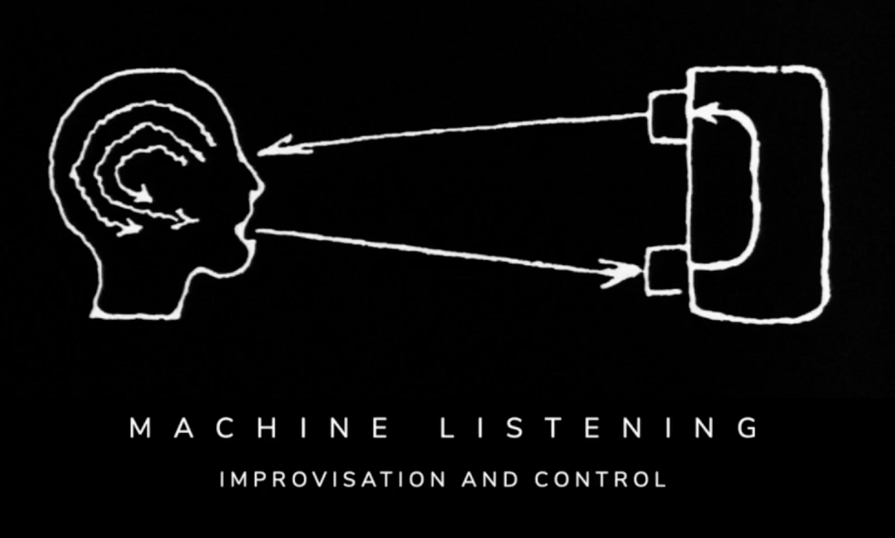

date: 2021
Institutional partner: CCA NTU, Unsound

*Ep 4: Improvisation and Control*
online event, 13 March 2021
Presented by Liquid Architecture, NTU Singapore, and Unsound

Staged as part of the NTU CCA Singapore’s recurring Free Jazz exhibition program, this session focuses on the complex and evolving dialectic between improvisation and control, framed via a detour into the experimental computer music laboratories of the 1980s and 1990s where the term ‘machine listening’ first begins to circulate.

Read our [zoom essay text ‘Improvisation and Control’ here](http://archive.machinelistening.exposed/topic/improvisation-and-control/)

[00:02:00](https://www.youtube.com/watch?v=EZvK8atIlnA&t=120s) Machine Listening, Essay I: Interactive (music) systems
[00:15:32](https://www.youtube.com/watch?v=EZvK8atIlnA&t=932s) Jessica Feldman
[00:42:00](https://www.youtube.com/watch?v=EZvK8atIlnA&t=2520s) Luca Lum
[00:54:02](https://www.youtube.com/watch?v=EZvK8atIlnA&t=3242s) Machine Listening, Essay II: Rainbow Family
[01:07:19](https://www.youtube.com/watch?v=EZvK8atIlnA&t=4039s) Mattin
[01:25:52](https://www.youtube.com/watch?v=EZvK8atIlnA&t=5152s) Bani Haykal & Lee Weng Choy
[01:43:16](https://www.youtube.com/watch?v=EZvK8atIlnA&t=6196s) Machine Listening, Essay III: DARPA Improv
[01:53:22](https://www.youtube.com/watch?v=EZvK8atIlnA&t=6802s) Bridget Chappell
[02:08:20](https://www.youtube.com/watch?v=EZvK8atIlnA&t=7700s) Lee Gamble

[https://www.youtube.com/embed/EZvK8atIlnA](https://www.youtube.com/embed/EZvK8atIlnA)