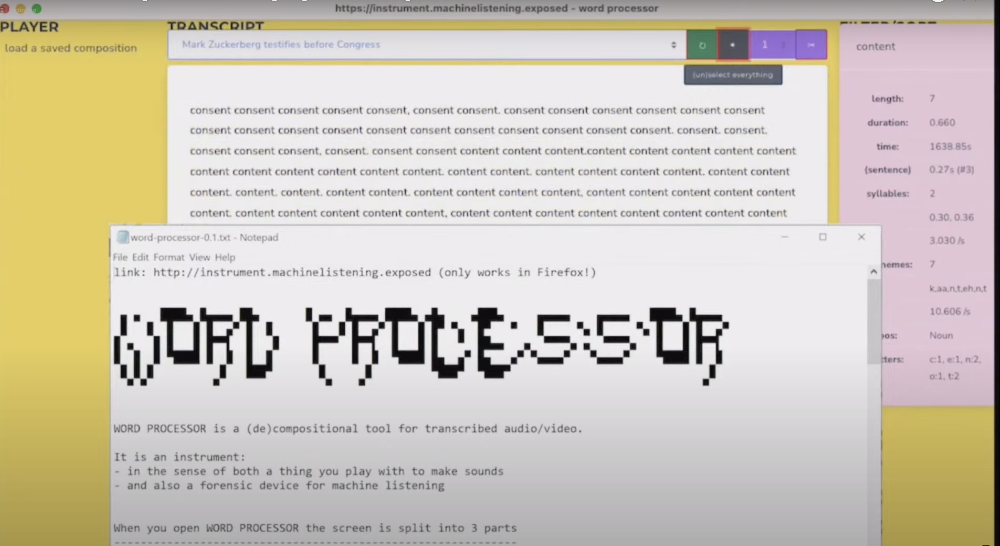

date: 2021
Institutional partner: Unsound

*Unnatural Language Processing* 
17 October 2021
online event, Liquid Architecture x Unsound Festival

Machine Listening returned to Unsound in 2021, with a fifth live session. Unnatural Language Processing explored the history, politics and artistic potential of automatic speech recognition.

Along with talks, conversations and newly commissioned audio experiments, the session launches an ‘[[word-processor-v1|instrument]]’, built in collaboration with [*Reduct*](https://reduct.video/), for the filtering, processing and manipulation of speech and text, which the public were invited to play.

The following artists appeared at the live session: Alessandro Bosetti,  Martina Raponi,  Sue Tompkins,  Roslyn Orlando,  Justin Clemens, and  Mehak Sawney; plus contributions by Robert Ochshorn,  Jennifer Walshe,  Tomomi Adachi,  Johannes Kreidler, Michael McClelland and more.

[https://www.youtube.com/embed/QL4--f3gRC4](https://www.youtube.com/embed/QL4--f3gRC4)