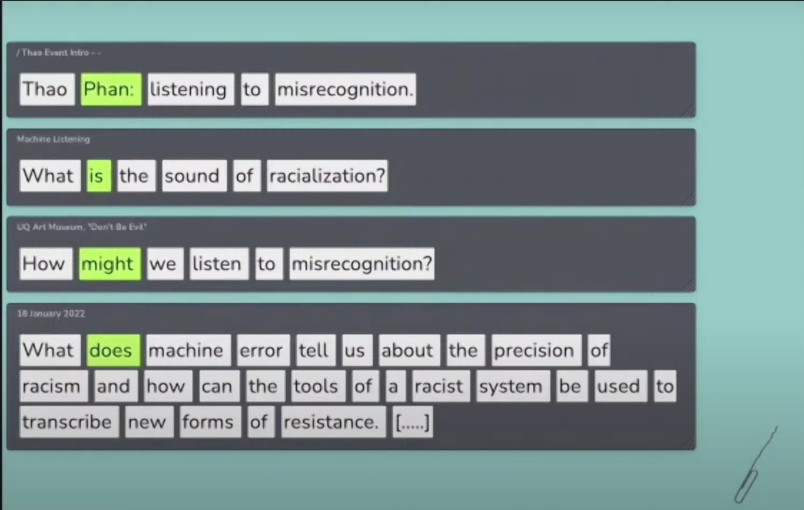

date: 2022, 2023
Institutional partner: Unsound

*Listening to Misrecognition*
written and performed by Thao Phan

online event, Liquid Architecture x University of Queensland Art Museum, 18 Jan 2022
lecture-performance, Australian Centre for Contemporary Art, 20 Feb 2023

What is the sound of racialisation? How might we listen to misrecognition? What does machine error tell us about the precision of racism? And how can the tools of a racist system be used to transcribe new forms of resistance? This experimental presentation by feminist technoscience researcher Thao Phan brings together critical work on race and algorithmic culture with new techniques for dissecting and analysing automatic speech recognition, applied to personal and public archives drawn from Thao’s life and research.

Thao gave this lecture twice. First on Zoom, and across multiple platforms, as part of the artistic program for the 2021 *Digital Intimacies #7* symposium hosted by Liquid Architecture in partnership with UQ Art Museum’s *Conflict in My Outlook* exhibition series. Secondly, [live at ACCA](https://soundcloud.com/acca_melbourne/thao-phan-performance-lecture-listening-to-misrecognition) as part of the public program for the [[data-relations-summer-school|Data Relations Summer School]].

[https://www.youtube.com/embed/D3vbd4QHeb0](https://www.youtube.com/embed/D3vbd4QHeb0)