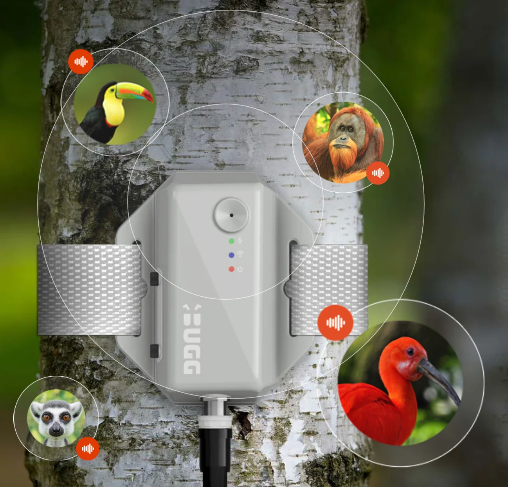

date: 2023
Institutional partner: RMIT Design Hub

*Planetary Auditions* 
RMIT Design Hub
*2 Sep 2023*

A series of performances and presentations with artists and researchers exploring the intersections of sound, listening, ecology, machine learning, AI, and planetary thinking.

[https://nowornever.melbourne.vic.gov.au/.../planetary...](https://nowornever.melbourne.vic.gov.au/event/planetary-auditions?fbclid=IwAR3pqBihUQFhqOqA9Xqa-uY5NScURAfi7VuxFUGJM5ES3n8XbNVKl4k15sY)

Computer scientist and bird-listener 𝕊𝕒𝕟𝕥𝕚𝕒𝕘𝕠 ℝ𝕖𝕟𝕥𝕖𝕣𝕚𝕒 will perform a new work titled 'Spectral (De)compositions: Dadamining Datamining' in which the carols and warbles of Australian magpies are analysed, computed, decoded and estranged in real-time, to try to work out what they might be saying.

Drawing inspiration from visionaries like James Lovelock, Rosi Braidotti and Gregory Bateson, and the sometimes contradictory legacies of acoustic ecology, storyteller, researcher and citizen technologist 𝕊𝕒𝕣𝕒𝕙 𝔹𝕒𝕣𝕟𝕤 will present her soundscape collaboration with and musician Nigel Cruikshank, 'Superorganisms: Listening to the Anthropocene'

And finally, Wild Hope exhibition artists 𝕊𝕖𝕒𝕟 𝔻𝕠𝕔𝕜𝕣𝕒𝕪, 𝕁𝕒𝕞𝕖𝕤 ℙ𝕒𝕣𝕜𝕖𝕣 𝕒𝕟𝕕 𝕁𝕠𝕖𝕝 𝕊𝕥𝕖𝕣𝕟 (𝕄𝕒𝕔𝕙𝕚𝕟𝕖 𝕃𝕚𝕤𝕥𝕖𝕟𝕚𝕟𝕘) will host a listening session to their piece, Environments 12, about what it means to capture, synthesise and play the sound of the world back to the world, in a never-ending feedback loop.

ᴛʜɪꜱ ꜰʀᴇᴇ ᴇᴠᴇɴᴛ ɪꜱ ᴄᴜʀᴀᴛᴇᴅ ʙʏ ᴊᴏᴇʟ ꜱᴛᴇʀɴ (ʀᴍɪᴛ). ɪᴛ ɪꜱ ᴘᴀʀᴛ ᴏꜰ ᴛʜᴇ ɴᴏɴꜱᴛᴏᴘ ᴡᴋɴᴅ ᴘʀᴏɢʀᴀᴍ ꜰᴏʀ ɴᴏᴡ ᴏʀ ɴᴇᴠᴇʀ ꜰᴇꜱᴛɪᴠᴀʟ, ᴀɴᴅ ᴀ ᴘᴜʙʟɪᴄ ᴘʀᴏɢʀᴀᴍ ᴏꜰ ᴡɪʟᴅ ʜᴏᴘᴇ: ᴄᴏɴᴠᴇʀꜱᴀᴛɪᴏɴꜱ ꜰᴏʀ ᴀ ᴘʟᴀɴᴇᴛᴀʀʏ ᴄᴏᴍᴍᴏɴꜱ, ᴀɴ ᴇxʜɪʙɪᴛɪᴏɴ ᴄᴀʟʟɪɴɢ ꜰᴏʀ ᴀ ʀᴀᴅɪᴄᴀʟ ꜱʜɪꜰᴛ ᴛᴏ ‘ᴘʟᴀɴᴇᴛᴀʀʏ ᴛʜɪɴᴋɪɴɢ’ ᴀꜱ ᴠɪᴛᴀʟ ᴛᴏ ᴛʜᴇ ꜱᴜʀᴠɪᴠᴀʟ ᴏꜰ ʜᴜᴍᴀɴ ᴀɴᴅ ɴᴏɴ-ʜᴜᴍᴀɴ ʟɪꜰᴇ ᴏɴ ᴇᴀʀᴛʜ, ᴀᴛ ʀᴍɪᴛ ᴅᴇꜱɪɢɴ ʜᴜʙ ɢᴀʟʟᴇʀʏ 15 ᴀᴜɢᴜꜱᴛ–30 ꜱᴇᴘᴛᴇᴍʙᴇʀ, 2023.