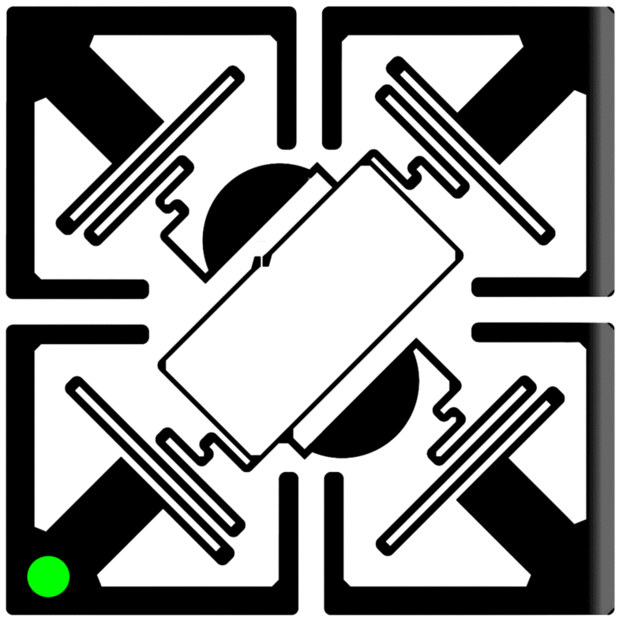

‘Machine Listening, a Curriculum’ is an evolving resource, comprising: reading lists, a library, discussions, prompts and exercises, existing and newly commissioned writing, interviews, music, artworks, and documentation of online events, performances, and workshops.

[archival version 2020-2024](http://archive.machinelistening.exposed/curriculum/). 

[Open Curriculum, in progress 2024-](https://shorturl.at/bciFU)

When we initiated this project in 2020, just as the Covid-19 pandemic was beginning, we put it like this:

“Amidst oppressive and extractive forms of state and corporate listening, practices of collaborative study, experimentation and resistance will, we hope, enable us to develop strategies for recalibrating our relationships to machine listening, whether through technological interventions, alternative infrastructures, new behaviours, or political demands. With so many cultural producers – whose work and research is crucial for this kind of project – thrown into deeper precarity and an uncertain future by the unfolding pandemic, we also hope that this curriculum will operate as a quasi-institution: a site of collective learning about and mobilisation against the coming world of listening machines.

A curriculum is also a technology, a tool for supporting and activating learning. And this one is open source. It has been built on a platform developed by [Pirate Care](https://pirate.care/pages/concept/) for their own experiments in open pedagogy. We encourage everyone to freely use it to learn and organise processes of learning and to freely adapt, rewrite and expand it to reflect their own experience and serve their own pedagogies.”

We stand by that as a statement of intent. 

As Machine Listening has grown, however, the curriculum has changed from being the entirety of our project to one, albeit crucial, dimension of it. That was the impetus for developing the current site as a platform and index for the broader project. But it also made it possible to return to the curriculum with fresh eyes in order to reimagine it as something more streamlined: more like a curriculum. Curriculums change, in response and as interventions in the worlds around them. We will be releasing an updated version as it continues to evolve.