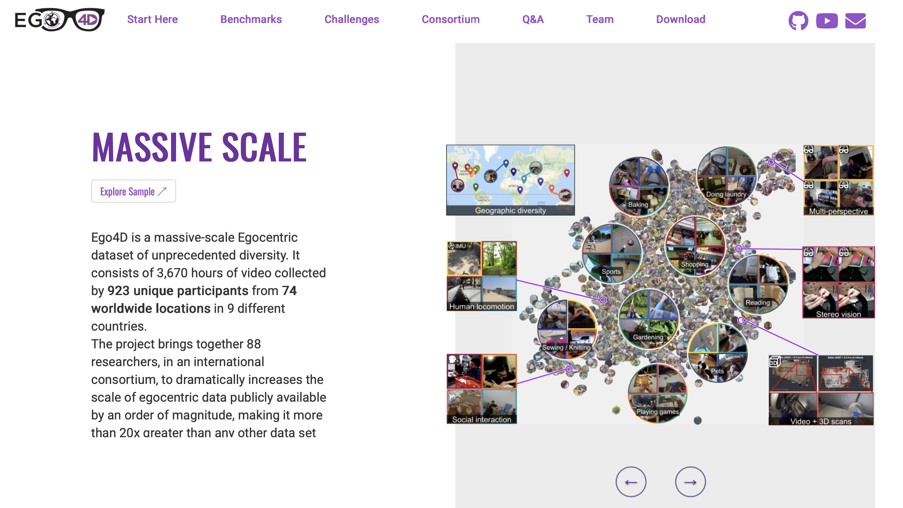
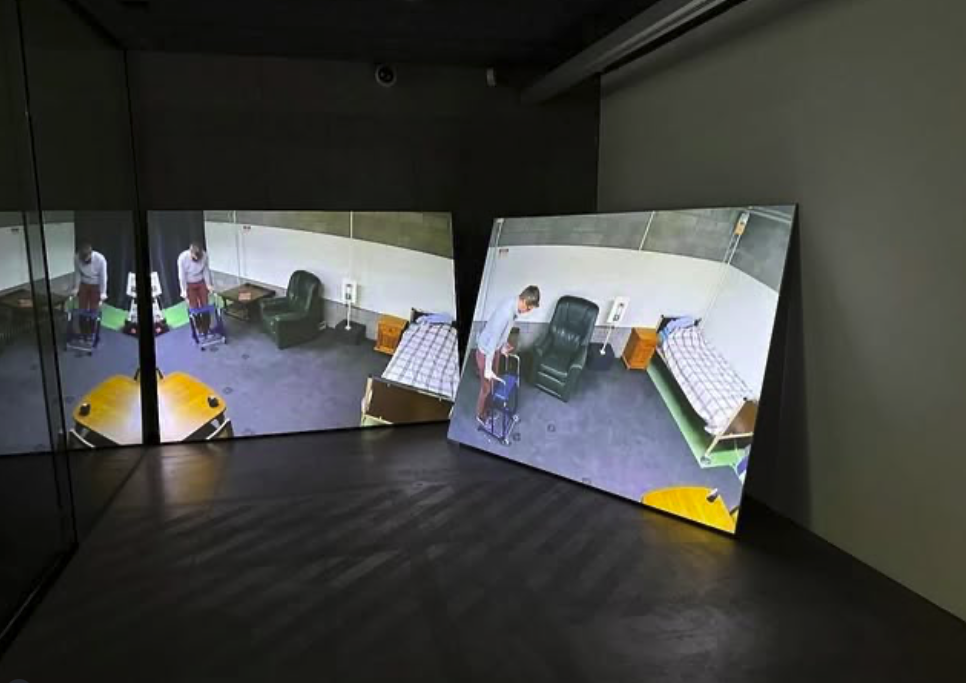
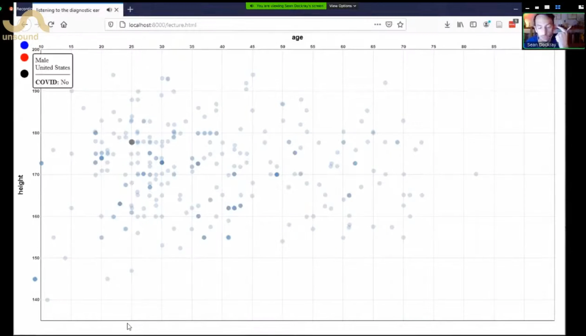

proposal for Abbotsford Convent

### **What?**

**Dataset LARP** is an artistic research project conceived by *Machine Listening* (Sean Dockray, James Parker, Joel Stern) in collaboration with critical legal theorist Connal Parsley.

The project aims to prototype new, experimental, and participatory methods for engaging with—and interrogating—the datasets that underpin contemporary machine learning and AI systems. It draws on approaches from experimental art, performance, theatre, and other disciplines.

Motivated by a desire to make dataset critique more accessible, expansive, and democratic, Dataset LARP brings together Machine Listening’s longstanding interest in dramatising, narrating, and deconstructing datasets (a practice we refer to as ‘dataset auditing’) with Connal Parsley’s pioneering work using Live Action Role Play (LARPing) as a critical method.

### **When?**

The project will unfold in four phases:

1. **Pre-development and planning** (July 2025 – February 2026): During this phase, we will select a dataset (relevant to the immediate local setting), invite relevant collaborators (including data scientists, artists, and community groups), apply for funding, and plan a series of events at Abbotsford Convent.
2. **Creative development** (February-March 2026): This phase will take place onsite at Abbotsford Convent in the Oratory. Over one to two weeks, project leaders and invited co-designers will collaboratively develop the protocols for running the Dataset LARP. We currently have 25 Feb - 3 March in our diaries, but are happy to discuss. 
3. **Dataset LARP** (Late 2026): The LARP will be staged at Abbotsford Convent. It may take the form of improvised, long-form theatre presented to audiences, or it may be conducted as a closed session. Accompanying outputs may include installation, documentation, and other materials exhibited at the Convent once the LARP concludes.
4. **Post-event development and documentation**: After the LARP, we will reflect on and document the process, refining the method to enable replication or adaptation by others.

### **Datasets?**

Behind every machine learning system is a dataset. Datasets can be large or small, public or private. They can contain texts, numbers, images, audio, video, or any kind of data at all. But they are always curated. Decisions have to be made about what information to include and exclude, and then about how to categorise and structure them for the purposes of training. This curation process is one way that bias can creep into automated decision making. A facial recognition system trained predominantly on white male faces will struggle to identify darker-skinned women. A language model built on text scraped from social media will start to sound like a Nazi.

The problem is well-known, but the solution is complicated. Even though the decisions made by automated systems affect millions of people every day, the public has very little access to or involvement in the critical evaluation of datasets. Calls are currently increasing to open up artificial intelligence to broader public participation and better address social and cultural implications. Yet so-called ‘dataset audits’ tend to be conducted in-house and behind closed doors, by data scientists and engineers on the payroll of the biggest companies in the world. Often they amount to little more than an exercise in rubber-stamping. Affected communities and experts with relevant forms of non-technical knowledge are rarely included.

Our project is about addressing this problem, responding to the growing demand for broad-spectrum socio-technical approaches to the development and review of algorithmic technologies. Our aim is to develop new, more expansive, accessible, participatory and democratic forms of dataset critique that can be used in a variety of settings. We do so by turning to emerging experimental, participatory, and arts-based methods, guided by the researchers’ interdisciplinary expertise in media theory, creative practice, political philosophy and jurisprudence.

### LARP?

Dataset LARP will develop an innovative use of Live Action Role Play (LARP), where participants collectively audit a dataset by stepping into roles defined by a series of protocols developed by the research team.

A LARP is a space built by designers for people to experience in the first person; stepping into the shoes of a character and interacting as that person for the game’s duration. There are no lines to recite, only improvisation. While LARP is relatively new as a research method, it is increasingly used as a participatory tool for examining the socio-political dimensions of data-driven algorithmic technologies, and to ‘prefigure’ potential future publics and practices. LARP is also used as a participant-action research method, giving communities of practice agency over the development of new knowledge. 

Grounded in play and improvised exploration, LARP leverages creative practice to explore potential approaches to algorithmic systems, without the pressure and limitations associated with the contexts in which they are typically used, which are often highly constrained, high-stakes commercial or public institutional settings.

- As a **research method**, LARP will allow experimentation with new participatory forms of dataset critique, which may be refined for application in diverse settings.
- As an **audit method**, LARP facilitates the articulation and inclusion of plural local perspectives and forms of expertise, and models their interaction. It offers a path to broaden what is often identified as an unduly narrow focus on the concerns of data science in audits (Urman et al).
- As a **method of arts-based public education**, LARP will give participants the experience of collectively auditing a dataset through its dramatisation. They will learn about datasets’ features, functions, risks and potential harms through their collective articulation via specific characters and points of view, and explore how concerns often need to be ‘traded off’ or otherwise seen in interaction.

### **Who?**

This project is led collaboratively by Sean Dockray, James Parker, and Joel Stern (Machine Listening) and Connal Parsley.

[**Machine Listening**](https://machinelistening.exposed) is a platform for collaborative research and artistic experimentation, founded in 2020 by Dockray, Parker, and Stern. The collective works across writing, installation, performance, software, curation, pedagogy, and radio. Their work has been presented at major institutions including the Australian Centre for Contemporary Art, Cricoteka Tadeusz Kantor Museum (Kraków), Warsaw Museum of Modern Art, Galerie Nord (Berlin), the National Communication Museum, RMIT Design Hub, and MUMA. They have performed at Unsound Festival, Soft Centre, and Melbourne Recital Centre, among others. Machine Listening’s projects frequently focus on the politics of datasets and algorithmic systems.

*

[**James Parker**](https://jamesekparker.org/) is an Associate Professor at Melbourne Law School, who works across legal scholarship, art criticism, curation, and production. He is an Associate Investigator with ADM+S, former ARC DECRA fellow, former visiting fellow at the Program for Science, Technology and Society at the Harvard Kennedy School for Government, and sits on the advisory board of [Earshot](https://earshot.ngo/), an NGO specialising in audio forensics.

[**Joel Stern**](https://www.rmit.edu.au/profiles/s/j-stern) is an artist, curator, and researcher based in Naarm/Melbourne. His work focuses on sound and listening as critical and creative practices. He is a Research Fellow in the School of Media and Communication at RMIT University, an Associate Investigator at ADM+S, and was Artistic Director of Liquid Architecture from 2013 to 2022.

[**Sean Dockray**](https://research.monash.edu/en/persons/sean-dockray) is an artist and writer whose work explores the politics of technology, with a particular emphasis on artificial intelligences and the algorithmic web. He is a Senior Lecturer in Fine Art at Monash University, a founding director of the Los Angeles non-profit Telic Arts Exchange, and initiator of knowledge-sharing platforms, The Public School and AAAARG.ORG. 

***
[Connal Parsley](https://www.kent.ac.uk/kent-law-school/people/1334/parsley-connal)** is a Reader (Associate Professor) in Law at the University of Kent, a UKRI Future Leaders Fellow, and the project’s expert in LARPs, which are a major part of his 7-year UKRI Future Leaders Fellowship on ‘The Future of Good Decisions: An Evolutionary Approach to Human-AI Administrative Decision-Making’. Bringing together philosophies of evolving technosocial ecologies, critical AI studies, decision and design studies, political and legal theory, legal reform, creative practice, and multi-sited ethnographic and creative ‘prefigurative’ research methods, the project aims to collaboratively re-think and re-design administrative decision-making.

### **Budget for creative development phase**

| **Personnel**  | $5000 |
| --- | --- |
| **Travel expenses** | $5000 |
| **Event expenses** | $5000 |
| **Accommodation** | $5000 |
| **Other costs** |  |
| Total | $20,000 |

### **Funding partners / schemes**

Melbourne Law School impact grant ([due Friday 10 October 2025](https://staff.unimelb.edu.au/mls/research/funding-grants/melbourne-law-school-schemes/impact-booster-and-communication-grant))

Monash Engagement Grant

ADM+S

Future Leaders Fellowship?

Remaining ARC DECRA funds?