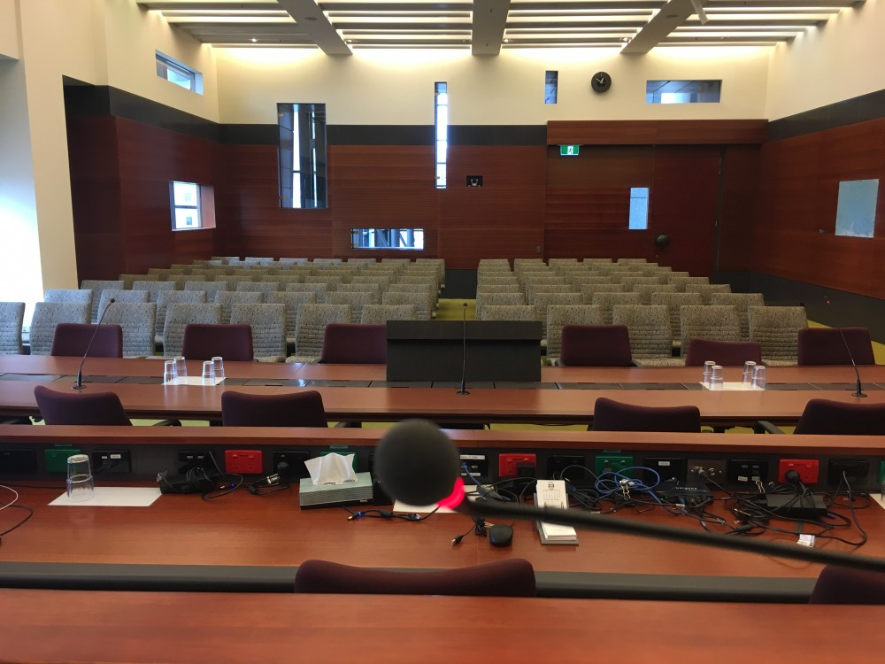

2026: July 15, 2017

*I am sitting in a courtroom*

Written and performed by Joel Stern as part of [Acoustic Justice](https://liquidarchitecture.org.au/events/acoustic-justice/), a performance program curated by James Parker and Joel Stern for Liquid Architecture, and staged in Court 8A at the Federal Court Building, Melbourne.

*I am sitting in a courtroom the same as the one you are in now. I am having the sound of my speaking voice transcribed and I am going to read it back to you again and again until this tacit operation of the courtroom reinforces itself so that the coherence of my speech, with perhaps the exception of isolated words, is destroyed. What you will hear, then, is this tacit operation of the courtroom articulated by speech and text. I regard this activity not so much as a demonstration of an institutional fact, but more as a way to draw out any irregularities of this hearing.*

[https://www.youtube.com/watch?v=XoSrykqa4So](https://www.youtube.com/watch?v=XoSrykqa4So)

There is a reason it’s called a hearing. Gavels knock, oaths are sworn, testimony is delivered, judgement pronounced: and all this out loud, viva voce. Contemporary courtrooms are wired for sound. The microphone is becoming a condition of legal practice. Trials are intensely mediated: video-linked, transcribed, recorded, compressed and archived; the judicial soundscape no longer limited to the phenomenological range of those physically present.

Stenography is also a (juridical) machine.

The courtroom is also a (juridical) machine.

Language is also a (juridical) machine.

Excerpt from  ‘*Speaking of atmospheres: more than voice and voice of the more-than*’ by Norie Neumark

One of the works in the *Acoustic Justice* event that made the atmosphere most palpable for me was Joel Stern’s *Calling the matter of Joel Stern v Alvin Lucier* (2017). What he did in the work was re-place Alvin Lucier’s famous sitting in a room musical composition with sitting in a courtroom. Stern’s work has been haunting me for a while as I’ve wondered where and how I could think/write about it.  I went to the performance partly drawn by the chance to go inside a courtroom where civil and criminal trials take place.  I found myself sitting in the back of the public gallery—a legal gallery not art gallery—even though art was taking place here. When Stern’s work began, I was immediately immersed in a strange atmosphere (legal and art entangled) as the ‘court clerk’ called Joel Stern to the stand—and called me in, called me to order and re-called Alvin Lucier to my memory.

The atmosphere was replete with the voicing of an uncanny place—a gallery but not an art gallery, a court room but with nothing on trial except perhaps experimental sound art—as the performance inhabited the space, playing and playing with/ disturbing the protocols of place. The heavy, stale air of the court room deadened the atmosphere and demanded the silence that speaks of an institutional, legal setting. Yet strangely, enlivened by and enlivening an (art) gallery atmosphere, the people around me chattered and fidgeted, took photos and video with their phones, felt like an art crowd—haunting the atmosphere with very different proceedings, very different ‘audiences.’ As the performance began, we were stilled and called into this heterogeneous space, listening attentively, like an art crowd, to every sound as Stern poured water, and placed his glass on the table. The gesture of a performer or a lawyer or a witness…a call to witness for us and to performance for him. And then came the hollowed sound of the microphone in the hallowed room. This unfamiliar but palpable atmosphere stirred me to watch and listen.

Riffing off Alvin Lucier’s famous piece, *I am sitting in a room*, Stern’s work also called for listening anew to speech, but this time foregrounding not resonant frequencies of a voice in a room but the hearing of language. Perhaps it was hearing on trial—hearing in the legal sense and hearing in the sensory sense. Unlike Lucier’s composition with tape recording, the repetition in this case happened through collaboration with an actual court stenographer who typed, with stenographer’s specific renderings, Stern’s repetition of his text.

He read the transcription and she transcribed his reading, each time both becoming more humorously incoherent, precarious. The transcriber looked at him, he read her screen. The atmosphere was tinctured with uncanny humour and zany affect—as the court transcriber spoke to the artist and he asked if she’d transcribed that. “Stop stop stop.”  She inserted some comments. Laughter in the gallery. As music began at the end, Stern signalled the end by reading her writing (“open brackets gentle music plays”).  Eventually the music (and dancing) take over “(now annoying music)” “It is hard work for me too.” Lots of brackets, but no bracketing of life, the world, institutions and their atmospheres—both art and legal.

For Stern, the work composed a ‘feedback loop’ between himself and the stenographer—a loop that created an experimental agitation of language—text transformed through disassembling. As he spoke the text as she typed, the peculiarities of stenographic ‘language’ coloured his speech. While Lucier’s work had played with his speech impediment, transforming it into music which erased his stutter, Stern brought stuttering back as his voiced text disintegrated into a grammatical mess… a degradation in the language… The atmosphere in the room stuttered with it—between the artful and the legal—assembling and dis-assembling both.

Stern explained that his work was interested in “the way speech acts in a courtroom.”  For me, the work brought to the fore how the atmosphere of a court room acts on speech and speech acts on atmosphere, by infecting it with an art gallery atmosphere through its art audience and art history reference. Stern wanted to make material what is lost and what is added in the translations of transcribing in a court room. To do this he worked with Lucier’s piece as a methodology for allowing something which is in the background of a scene or a situation to be intensified progressively up to the point where it completely takes over and becomes dominant. His work is about this background becoming the foreground or this atmosphere which is tacit becoming overwhelming and dominant. That doesn’t have to be thought of just in terms of acoustics, that can be thought of in terms of politics or meditation. It’s about in any given situation thinking what is tacitly operating in the background and by bringing it into the foreground in a way that is structurally transparent, then you get to hear that it happens in stages. The movement of something from the background to the foreground when it is structurally transparent tells you a lot about how that thing operates. How it behaves. Amplification and intensification are really interesting tactically and strategically … they also might be a certain kind of transformation of the situation… So it’s a way of radically reordering the space.”