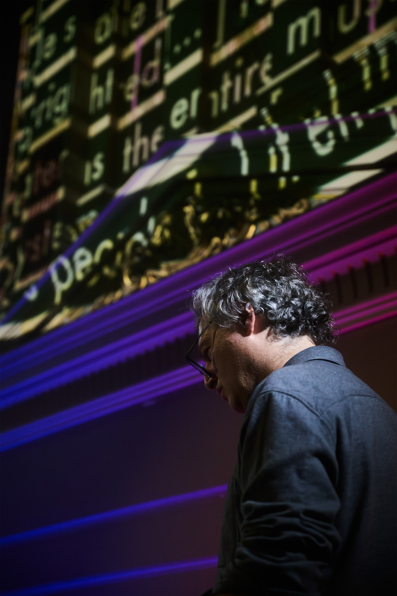
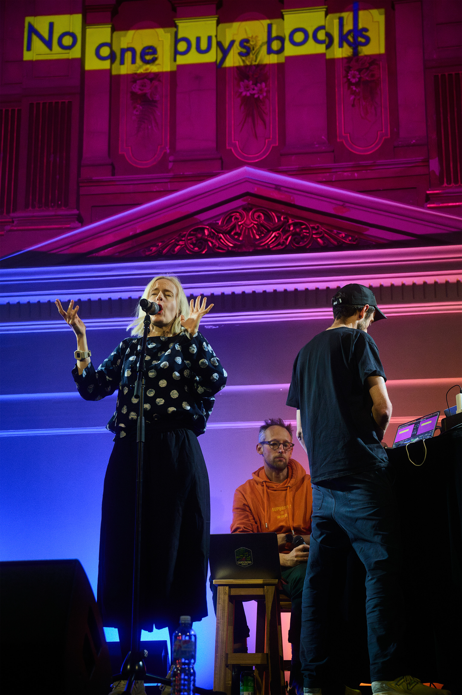
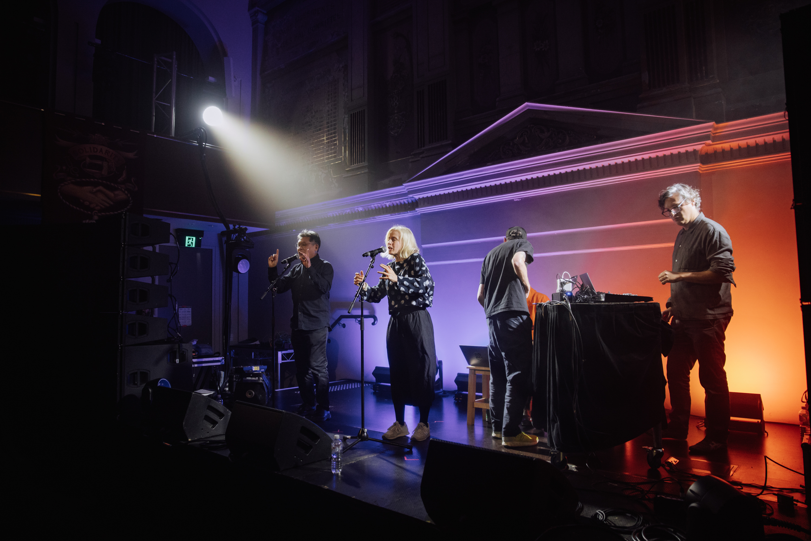

](../_assets/performances/machine-listening-songbook-5-x/SOFT_CENTRE_-_LATE_NIGHT_-_soft_centre_-_Josh_Pickup_-_pickupjosh-5.jpg)

Machine Listening, *Machine Listening Songbook (5-x) ft.* Jennifer Walshe and Tomomi Adachi*,* 2024, performance at SOFT CENTRE SUPERMODEL, Victorian Trades Hall. 31 August 2025. **Photo by Will Hamilton-Coates[.](https://www.instagram.com/will.hamiltoncoates/)

*Machine Listening Songbook: 5-x,* 2024

Audio, audio-video, and live performance.
Researched, written and produced: Sean Dockray, James Parker, and Joel Stern.
Voices: cloned using ElevenLabs.
Instrument design: Sean Dockray.
Live performers: Jennifer Walshe and Tomomi Adachi.
Videos: Emile Zile.

Presented: [SOFT CENTRE:](https://www.softcentre.com.au) SUPERMODEL Now or Never

Machine Listening, *Machine Listening Songbook (5-x) ft.* Jennifer Walshe and Tomomi Adachi*,* 2024, performance at SOFT CENTRE SUPERMODEL, Victorian Trades Hall. 31 August 2025. **Photo by Josh Pickup.

A songbook is a media technology. It untethers lyrics from their expression and in doing so enables them to be shared, canonised, archived, performed, and appropriated in weird and surprising ways. The original songbook, for instance, was the hymnal. But the [Great American Songbook](https://thesongbook.org/about/what-is-the-songbook/) and [Left Songbook](https://archive.org/details/leftsongbook0000bush/mode/2up) (1938) are two important examples from the early twentieth century.

The Machine Listening Songbook joins this tradition by using automatic transcription, phonemic alignment, voice cloning and music generation technologies to reconfigure the relationship between voices and texts, music and lyrics, production and reproduction. Like all songbooks, this one is open-ended. Songbook (5-x) is the first Australian iteration of a project premiered at Unsound Krakow in 2023 with support from ADM+S. In the historic Trades Hall in Carlton, [Machine Listening](https://machinelistening.exposed/) presents a suite of new songs exploring techniques of automatic reading, writing, recitation, composition, and decomposition.

Read more about this work: [[machine-listening-songbook-5-x-songs-about-fucki|Songs About Fucking Suno.]]

Machine Listening, *Machine Listening Songbook (5-x) ft.* Jennifer Walshe and Tomomi Adachi*,* 2024, performance at SOFT CENTRE SUPERMODEL, Victorian Trades Hall. 31 August 2025. **Photo by Josh Pickup.

[https://www.youtube.com/watch?v=Jfb6iISein8](https://www.youtube.com/watch?v=Jfb6iISein8)

[https://app.notion.com](https://app.notion.com)