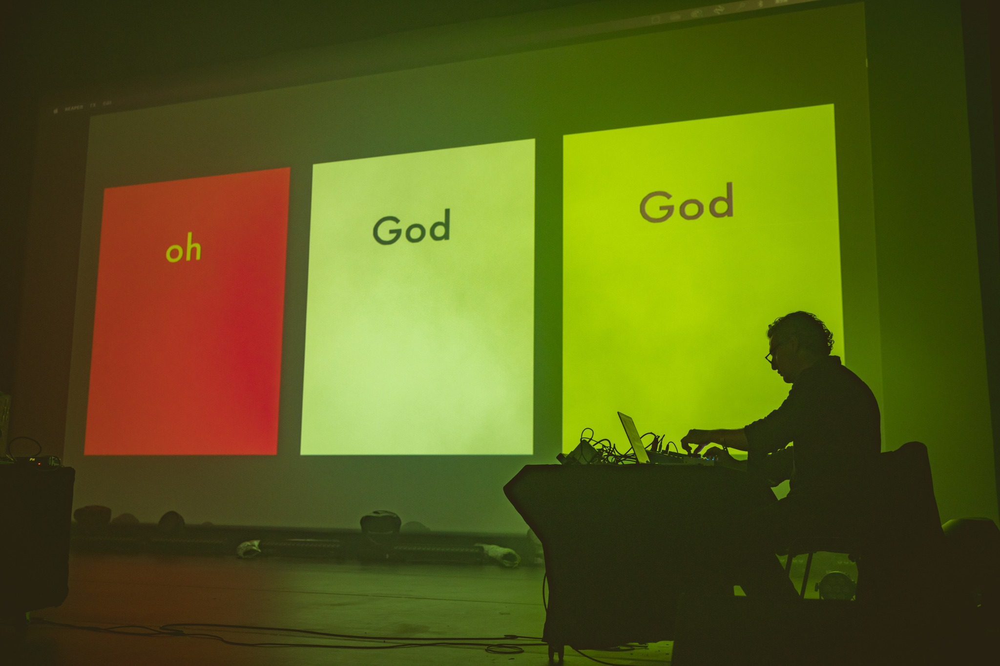
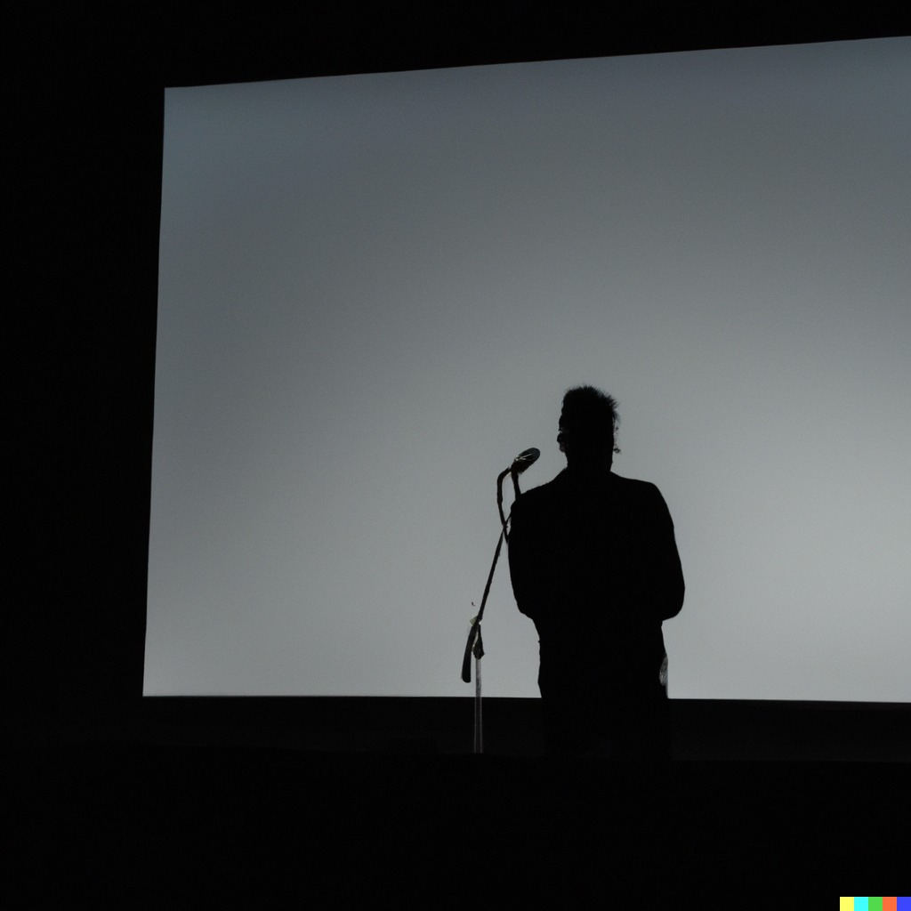

2026: October 5, 2023 → October 8, 2023

^ ICE Krakow. Unsound Festival. 2023.

*Machine Listening Songbook (1-4)*, 2023 - ongoing
Audio and audio-video

Researched, written and produced: Sean Dockray, James Parker, Joel Stern
Voices: cloned using ElevenLabs
Instrument design: Sean Dockray

A songbook is a media technology. It untethers a collection of songs’ lyrics from their expression, and in doing so enables them to be archived, canonised, shared, circulated, and performed in surprising new ways. The original songbook, for instance, was the hymnal. But the [Great American Songbook](https://thesongbook.org/about/what-is-the-songbook/) and [Left Songbook](https://archive.org/details/leftsongbook0000bush/page/4/mode/2up) (1938) are two important examples from the early twentieth century.

The *Machine Listening Songbook* joins this tradition by using automatic transcription, phonemic alignment, and voice cloning technologies to reconfigure the relationship between voices and texts, lyrics and their expression, in vocal performance and composition.

Like all songbooks, this one is open-ended. It will keep growing. The first four entries were produced during our [residency](https://www.unsound.pl/en/dada/machine-listening-residency) at Unsound 2023, in response to the festival’s theme: Dada/Data. 

The *Machine Listening Songbook* was made using the second iteration of Sean Dockray’s [[word-processor-v1|Word Processor]]. The pieces were originally performed at Unsound as a series of [in(ter)ventions](https://www.unsound.pl/en/dada/interventions) in the program and staged across multiple venues.

**1 Clone Ursonate**

*Clone Ursonate* is a reading of Kurt Schwitters’ classic poem *Ursonate* (1932) by clone. We think of it as a kind of completion of Schwitters’ project: a performance not only without sense, but also without subjectivity, and all the more masterful for it. 

[ML Songbook 1 - Clone Ursonate.mp3](../_assets/performances/machine-listening-songbook-dada-data/ML_Songbook_1_-_Clone_Ursonate.mp3)

^ Kino Kijów. Unsound Festival. 5 Oct 2023.

**2 Screeching Phonograph** 

*Screeching Phonograph* works with the text of Tristan Tzara’s *Dada Manifesto* (1918) as the raw material for a performance on a massive sound system at a club. 

[Performed at Kamienna 12 club space. Unsound Festival. 5 Oct 2023.
](https://youtu.be/XMnv0xXWA18)

Performed at Kamienna 12 club space. Unsound Festival. 5 Oct 2023.

**3 Oh God**

*Oh God* comes out of our collective surprise when we asked OpenAI’s Whisper to transcribe *Clone Ursonate*, and what it produced was the phrase ‘oh god’, repeated again and again. Of course, these words never appear in Schwitters’ text, but they seemed to capture a sense of exasperation at the impossible task they’d been set, which perhaps shades into wonder at the technological sublime. 

[Performed at ICE Krakow. Unsound Festival. 7 Oct 2023.](https://www.youtube.com/embed/bpI85fLL8EQ?si=Q52AjtQdw4XoeOr2&amp;controls=0)

^ Performed at ICE Krakow. Unsound Festival. 7 Oct 2023.

**4 Orchard Farming**

*Orchard Farming* is a reading of Baroness Elsa von Freytag-Loringhoven’s 1927 poem by a chorus of clones, which preserves and reworks the piece’s proto-concrete poetry for the digital age.

[Performed at ICE Krakow. Unsound Festival. 8 Oct 2023.](https://youtu.be/_18luNkqV8Y)

^ Performed at ICE Krakow. Unsound Festival. 8 Oct 2023.

**Reviews**

[Philip Sherbourne](https://futurismrestated.substack.com/p/futurism-restated-unsound-festival)

[A Closer Listen](https://acloserlisten.com/2023/10/30/a-closer-look-unsound-2023/#:~:text=final%20performance%20by-,Machine%20Listening,-.%20Comprised%20of%20artist)