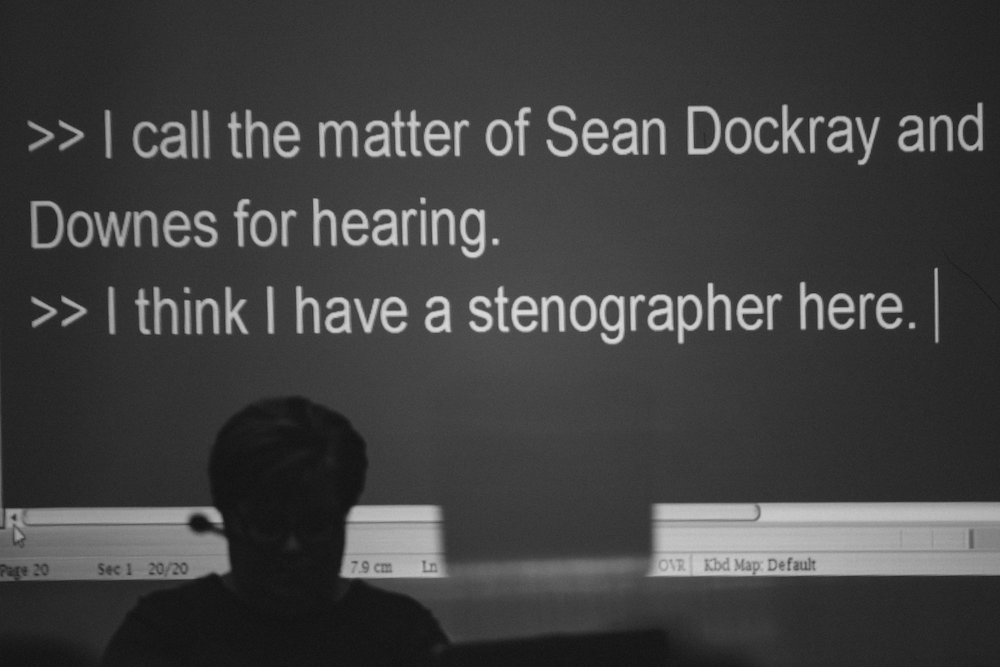

Written and performed by Sean Dockray as part of [Acoustic Justice](https://liquidarchitecture.org.au/events/acoustic-justice/), a performance program curated by James Parker and Joel Stern for Liquid Architecture, and staged in Court 8A at the Federal Court Building, Melbourne.

> There is a reason it’s called a hearing. Gavels knock, oaths are sworn, testimony is delivered, judgement pronounced: and all this out loud, viva voce. Contemporary courtrooms are wired for sound. The microphone is becoming a condition of legal practice. Trials are intensely mediated: video-linked, transcribed, recorded, compressed and archived; the judicial soundscape no longer limited to the phenomenological range of those physically present.
> 

Written documentation to come.