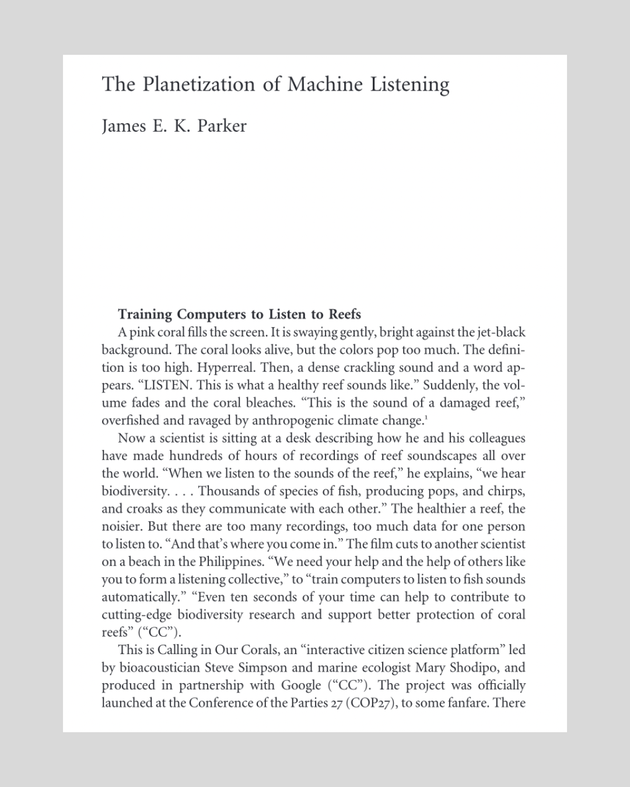

[The Planetization of Machine Listening](https://www.journals.uchicago.edu/doi/abs/10.1086/737056)

James E. K. Parker

Critical Inquiry 2025 52:1, 21-47

Abstract:

This article provides a critical account of work currently being done at the intersections of bioacoustics, computer science, and ecology, in which machine-listening systems are being turned on the environment for the purposes of conservation. What is being imagined, I argue, is the full planetization of audio AI: the automated monitoring, analysis, governance, and modulation of both human and nonhuman planetary systems by means of computational renderings of the soundscape. I suggest, first, that the continued expansion of machine listening for ecology is extremely likely. This argument is partly empirical, based on current directions and incentives in the field. Machine listening is already dependent on big tech for much of its basic infrastructure, and already an excellent candidate for greenwashing. But if the current push towards biodiversity markets is successful, then capital would suddenly have a direct material interest in machine listening’s planetization. This empirical argument is bolstered by a media-theoretical one, about the “bias of automation” towards total information capture, operationalism, and environmentality. The ambition to automate listening, I suggest, is self-reinforcing, so that, under capitalism, it will tend to expand: to planetize. In the second part of the argument, I argue that what will be planetized with machine listening is a form of decision-making and environmental governance in conflict with certain basic assumptions about democratic accountability and with a definite imperial flavor. In the article’s final section, therefore, I offer some notes towards a less “hungry,” more plural and “situated” form of machine listening

[Read here (limited downloads available)](https://www.journals.uchicago.edu/doi/epdf/10.1086/737056)