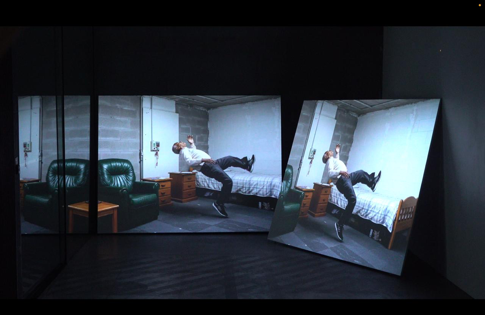
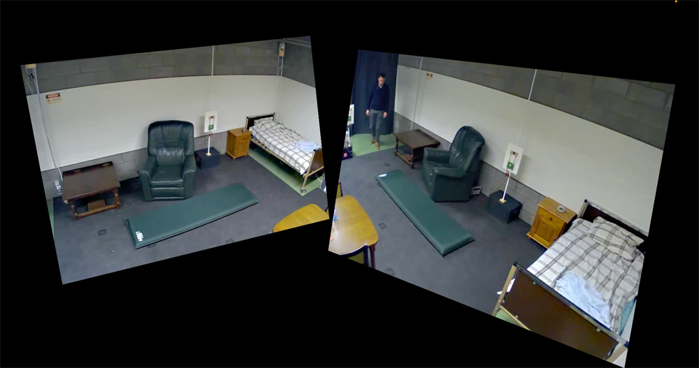
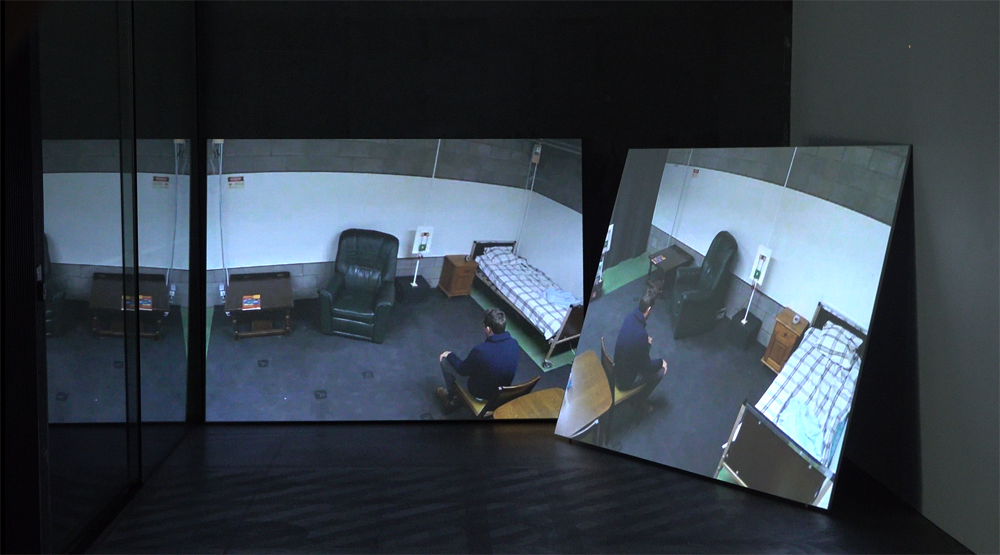

Date: 2025

[https://app.notion.com](https://app.notion.com)

*55 Falls / Ambient Assisted Living,* 2025

Video installation (2-channel video, 4-channel audio)

Researched, written and produced: Machine Listening (Sean Dockray, James Parker, Joel Stern)

Dataset: “High quality fall simulation data” created by Advanced Integrated Sensing lab at the Faculty of Engineering Technology of KU Leuven

*A series of simulated accidents are projected onto two large, leaning screens: young people pretending to be old repeatedly enter a room and fall. They pass into the windowless space, hunched and hesitant, clutching walking aids like props in an unconvincing theatre, before improvising their own descent to the floor where they lie motionless for precisely measured intervals.* 

What is happening here? What is this place? 

*55 Falls / Ambient Assisted Living* replays sequences from a Belgian healthcare technology dataset published in 2016—“High quality fall simulation data”—videos in which young researchers perform their imagination of elderly fragility in a fabricated care home to stage falls for training machine learning algorithms. The videos, originally silent, serve as a score for musicians Lizzy Welsh (violin), Jessica Aszodi (voice), and Joel Stern (synthesiser) to soundtrack a film that was never intended for human eyes.

Interwoven with these research performances are generative AI recreations of this staged environment, where artificial intelligence attempts to depict the same scenarios that the human performers enacted. Here, technology falters differently: the AI-generated bodies hesitate, the very act of falling becomes uncertain, unconsummated, abstract. Two forms of failure converge—the human failure to authentically embody frailty, and the machine's failure to convincingly render that embodiment. 

As violin, voice, and synthesiser track and sonify these doubled inadequacies, the work reflects on the distance between care as human relationship and care as technological solution calling forth its own quiet requiem. In this space between what cannot be performed and what cannot be computed, capital is busy rearranging social bonds, generational touch, and mortality itself.

[WhatsApp Video 2025-08-17 at 23.03.29.mp4](../_assets/works/55-falls-ambient-assisted-living/WhatsApp_Video_2025-08-17_at_23.03.29.mp4)

**Presentations:**

- [*The Mourning After,* 24 July - 20 September 2025, RMIT Design Hub Melbourne](https://www.themourningafter.net/exhibitions/)