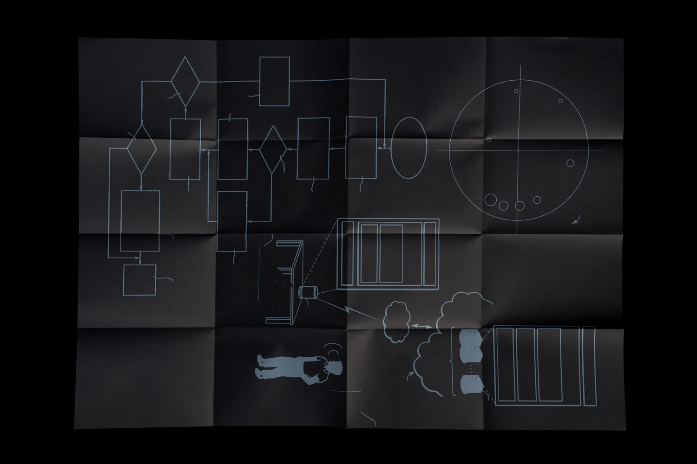
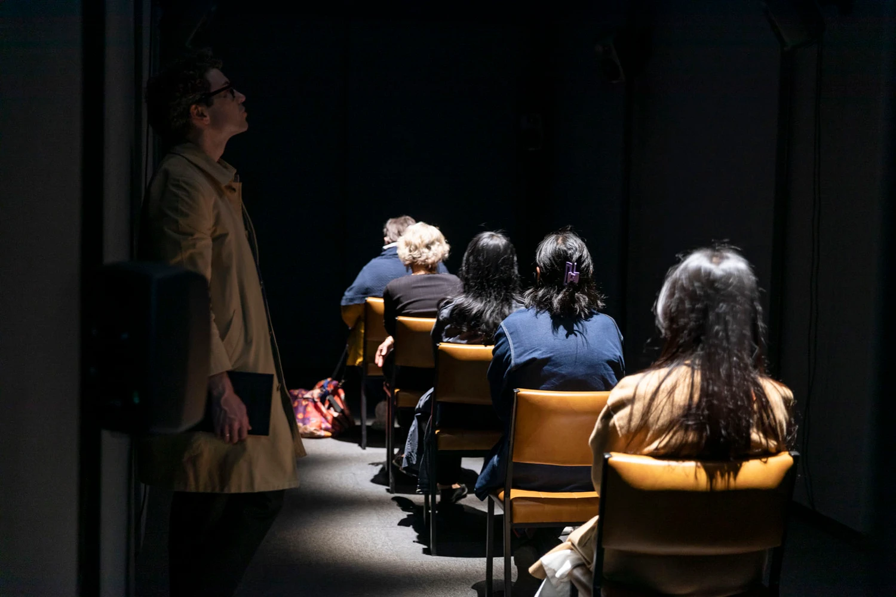
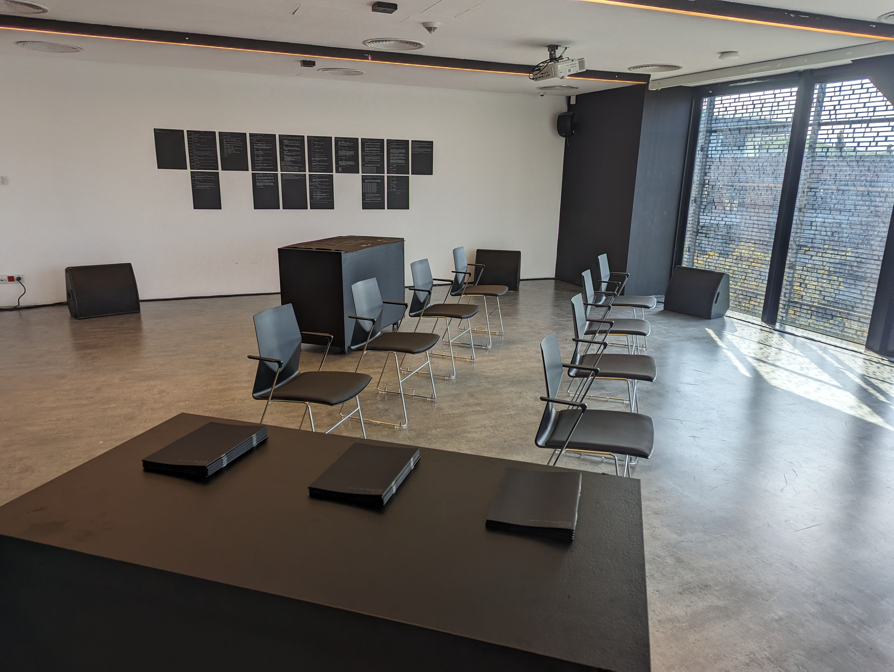
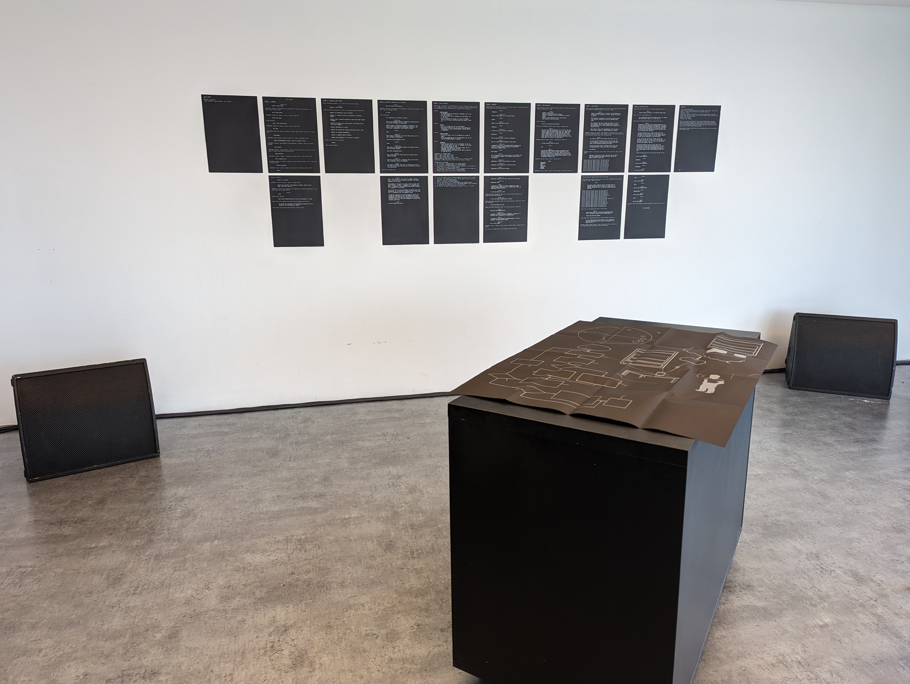
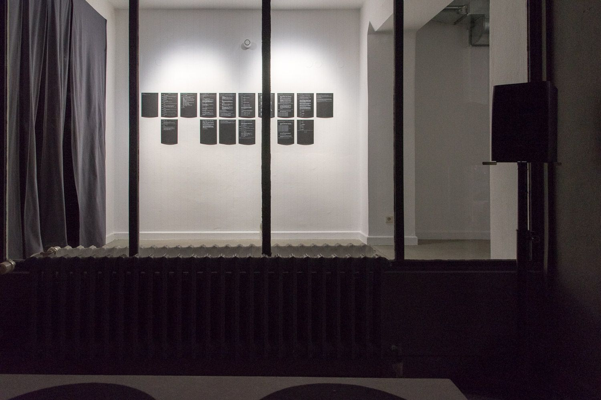
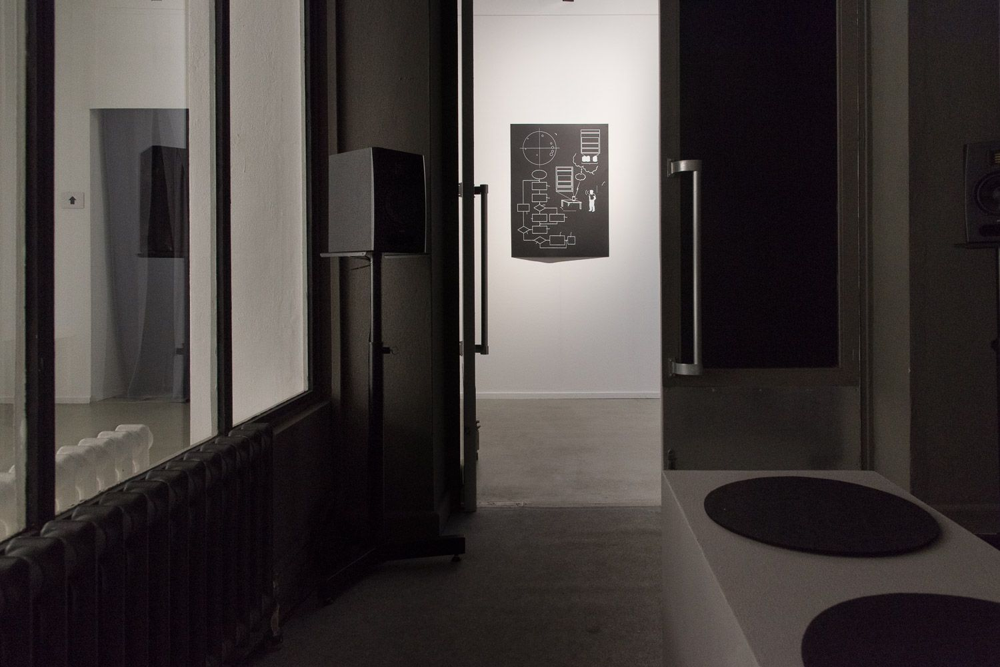

Date: 2022

^ Machine Listening, *After words,* 2022, detail, Australian Centre for Contemporary Art (ACCA), Melbourne. Design: Stuart Geddes. Photograph: Matthew Stanton.

*After Words*, 2022.
8-channel sound installation (18 minutes, looped), printed material.

Researched, written and produced: Sean Dockray, James Parker, Joel Stern.
Voices: Mark Andrejevic, Sean Dockray, Jake Goldenfein, Roslyn Orlando, James Parker, Thao Phan, Joel Stern.
Design: Stuart Geddes.

Commissioned for the exhibition [Data Relations](https://acca.melbourne/exhibition/data-relations/) at [Australian Centre for Contemporary Art](https://acca.melbourne/exhibition/data-relations/), 10 December 2022 - 19 March 2023.

---

“*Imagine a computer made of humans. Imagine this computer as a new kind of theatre. Listen*.”

Data is never mined. It is always made. A computational theatre. Many datasets are literally performed by actors, or researchers pretending to be actors. Others are the product of our own performances for and with machines, every time we ‘wake up’ Alexa or upload a video to YouTube. 

*After Words* explores these dynamics across a series of speculative scenes. Each scene works with readymade audio, repurposed from machine learning datasets, and woven through a script written with and against an ‘autoregressive language model’. The result is a strange set of semi-fictional tales of computational scripting, instruction, production, and performance, staged in 8-channel audio. In this strangeness, *After Words* gestures at a near future in which language has been fully operationalised: where every word we speak has a computational effect and residue.

---

[After Words (2022), stereo mix.](../../_assets/works/after-words/After_Words_(2022).mp3)

^ After Words (2022), stereo mix.

^ Machine Listening, *After words,* 2022, installation view, Australian Centre for Contemporary Art (ACCA), Melbourne. Photograph: Lucy Foster.

This work contains audio material from the following datasets: Consensus Auditory-Perceptual Evaluation of Voice Dataset (2009), Toronto Emotional Speech Dataset (2010), DCASE Sound Event Detection: Office Live Testing Dataset (2013), DCASE Synthetic Audio Sound Event Detection: Train and Development Dataset (2016), Google AudioSet (2017).

The voice artists who recorded original material for this work are all researchers in critical data studies with prior links to the project. 

[ACCA’s digital publication](https://datarelations.acca.melbourne/?entry=after-words) features additional information about [After Words](https://datarelations.acca.melbourne/?entry=after-words), along with essays by Miriam Kelly, Zach Blas, Tega Brain and Sam Lavigne, Lauren Lee McCarthy, Mimi Ọnụọha and Tiara Roxanne, and Winnie Soon.

For information about installing this work in an exhibition, email us at machinelistening2020@gmail.com

[https://drive.google.com/open?id=15UgpDjrPAFlbgL1ZPmfluJQXj_olbzsd&usp=drive_fs](https://drive.google.com/open?id=15UgpDjrPAFlbgL1ZPmfluJQXj_olbzsd&usp=drive_fs)

^ Machine Listening, *After words,* 2022, detail, Australian Centre for Contemporary Art (ACCA), Melbourne. Design: Stuart Geddes. Photograph: Matthew Stanton.

**Presentations:** 

- [Data Relations](https://acca.melbourne/exhibition/data-relations/), 10 December 2022 - 19 March 2023, [Australian Centre for Contemporary Art](https://acca.melbourne/exhibition/data-relations/).
- Articulating Data: vocalisation, machine listening, and the (in)security of language in a digital age, University of Edinburgh, 2023
- Radiophrenia, Centre for Contemporary Arts Glasgow, 2023
- Unsound Festival, Cricoteka Tadeusz Kantor Museum, Kraków, 2023
- Galerie Nord | Kunstverein Tiergarten in Berlin as part of the exhibition [v01ces – The Human Voice in the Age of Artificial Intelligence](https://kunstverein-tiergarten.de/en/archive/exhibition/v01ces-the-human-voice-in-the-age-of-artificial-intelligence/), 2023

Reviews:

- [Audrey Pfister, Memo Review](https://www.memoreview.net/reviews/data-relations-by-audrey-pfister)
- Jarrod Zlatic, Australian Book Review
