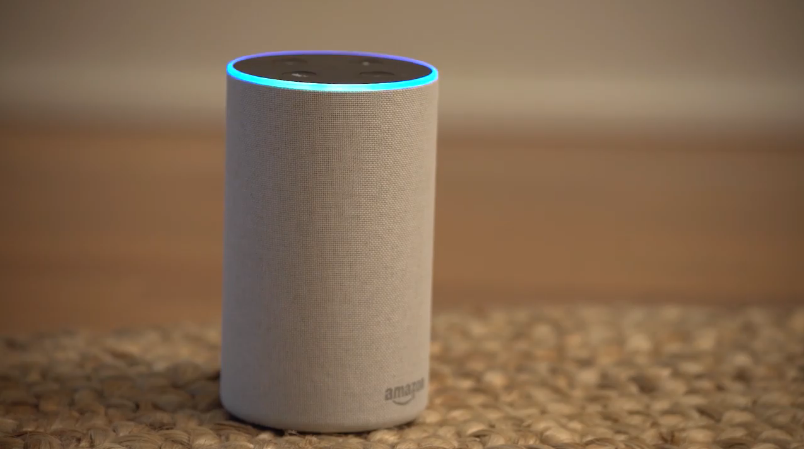
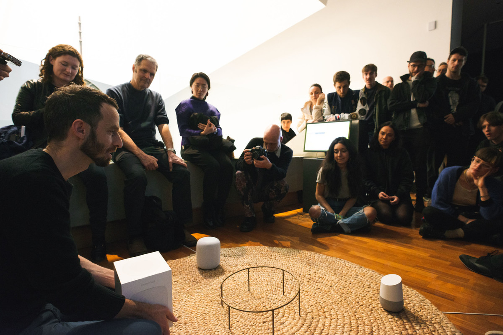
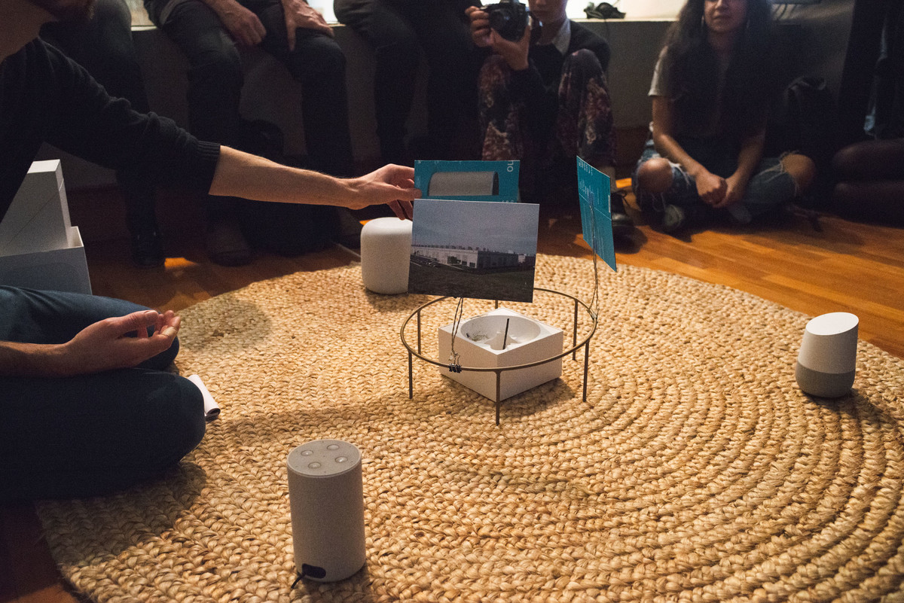

Date: 2018

^ Sean Dockray, *Always Learning,* 2018, audio-video (video still).

*Always Learning,* 2018, audio-video
Researched, written and produced: Sean Dockray

Commissioned: [Eavesdropping](https://eavesdropping.exposed/events/alwayslearning) curated by James Parker and Joel Stern at Ian Potter Museum of Art, Melbourne Australia. 

*Always Learning* stages a con­ver­sa­tion between three devices – an Amazon Echo, a Google Home Assis­tant, and an Apple Home­pod – about the philo­soph­i­cal, moral and polit­i­cal impli­ca­tions of net­worked machine lis­ten­ing (e.g. “What should I do when I over­hear a wrong­do­ing?”). 

[Sean Dockray, *Always Learning,* 2018, audio-video (excerpt)
](https://www.youtube.com/watch?time_continue=5&v=sPEci8NjoKQ&embeds_referring_euri=https%3A%2F%2Fart-museum.unimelb.edu.au%2F&source_ve_path=Mjg2NjQsMjg2NjQsMjg2NjY)

Sean Dockray, *Always Learning,* 2018, audio-video (excerpt)

[Sean Dockray, *Always Listening*, presentation at Ian Potter Museum in collaboration with Liquid Architecture, 2018.](https://www.youtube.com/watch?v=4fVviaTvUYA)

^ Sean Dockray, *Always Listening*, presentation at Ian Potter Museum in collaboration with Liquid Architecture, 2018.

^ Sean Dockray, Always Learning, Liquid Architecture, 2018.

^ Sean Dockray, Always Learning, Liquid Architecture, 2018.

**Presentations:**

- [Ian Potter Museum in collaboration with Liquid Architecture](https://liquidarchitecture.org.au/events/alwayslearning), [2018](https://liquidarchitecture.org.au/events/alwayslearning).
- [Unsound Machine Listening Ep 1: Against The Coming World of Listening Machines, 2020.](https://www.youtube.com/watch?app=desktop&v=iUbglqQLdrI&t=74s)

**Review and papers:**

- [*Eavesdropping: A reader,](https://www.researchcatalogue.net/view/558982/1115318)* 2018, Journal of Sonic Studies, Tyler Shoemaker