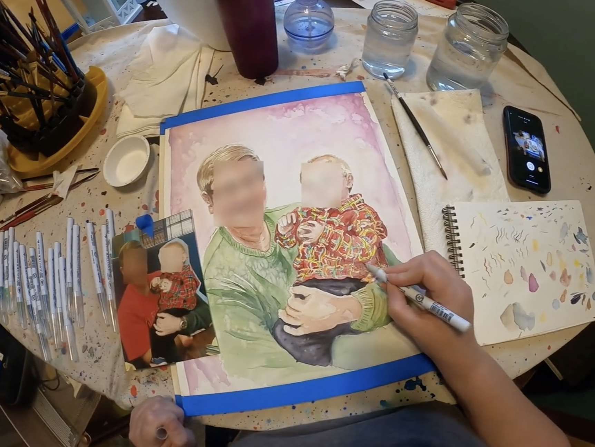
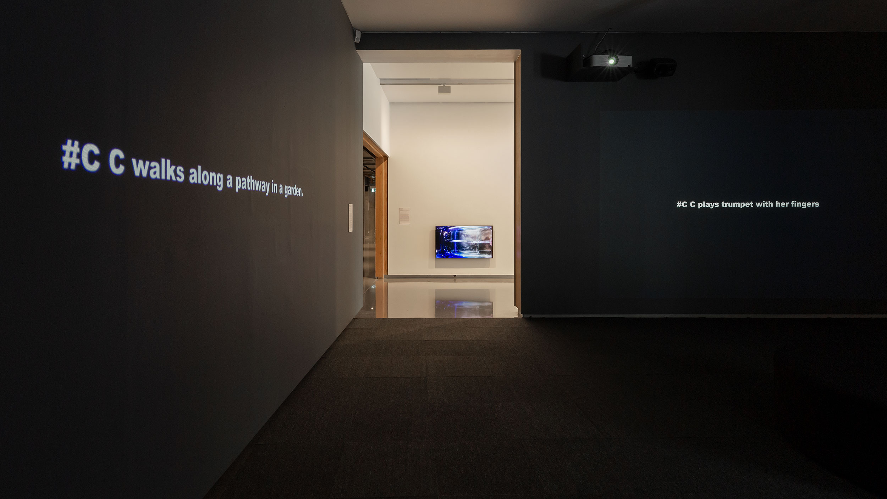
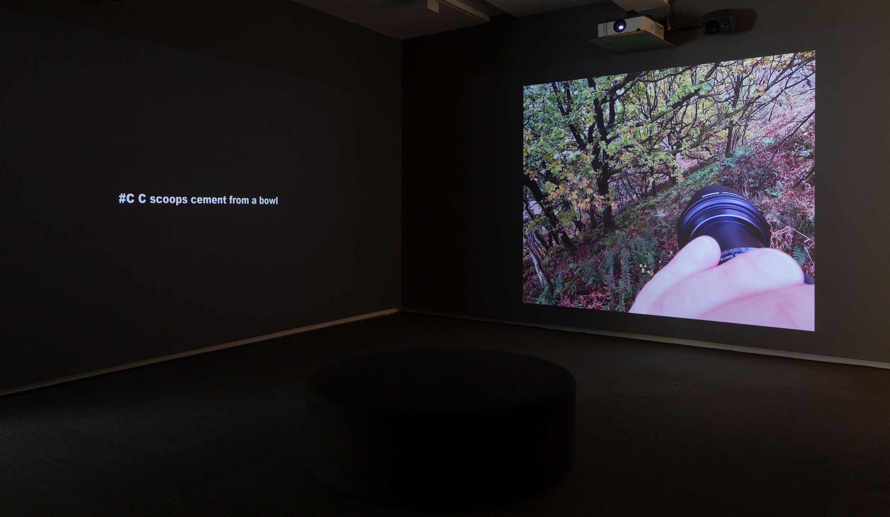
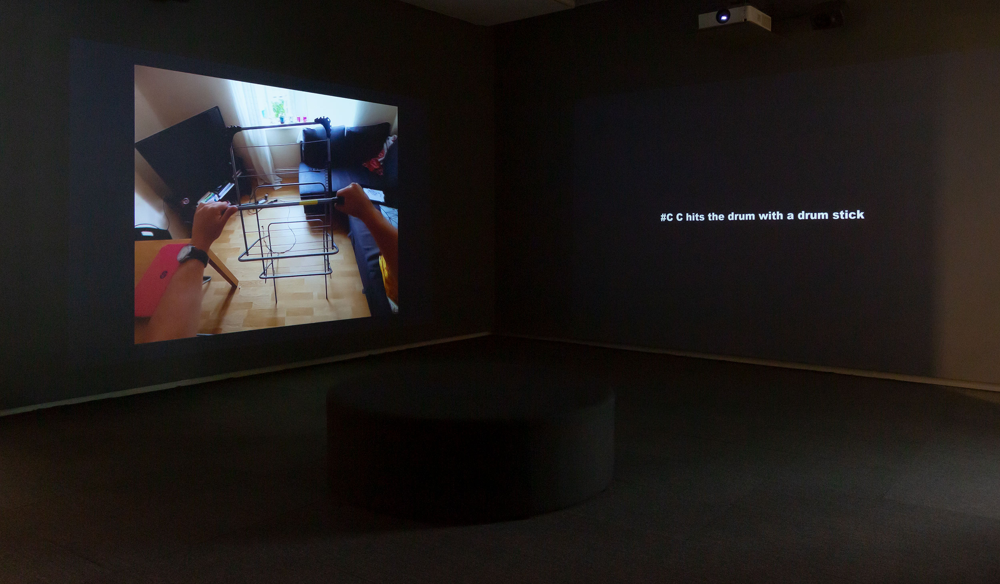

Date: 2025

Machine Listening, *#C,* 2025, 4-channel video, audio, 75 mins, (Video Still).

*#C***,** 2025
4-channel video, audio, 75 minutes

Machine Listening (Sean Dockray, James Parker, and Joel Stern)

In #C, Machine Listening examines [Ego4D](https://ego4d-data.org), a dataset released by Facebook AI in 2021 to advance the automation of ‘egocentric perception’. This is the ‘first person’ perspective of virtual reality, robotics, smart glasses and the Metaverse. To train machines to see the world this way, Facebook commissioned 9000 videos, captured by 855 camera wearers across nine countries, and painstakingly annotated by low-paid ‘narrators’. ‘#C’ is the subject of every one of the 3.85 million resulting annotations: #C opens the washing machine. #C cuts spinach with a sickle. #C hits the guitar strings with a pencil. Officially, #C denotes the camera wearer, but it also names a new subject position: the protagonist of an emergent, doubly egocentric image economy.

[guitar pencil.mp4](../_assets/works/c/guitar_pencil.mp4)

This multichannel work loops 20 four-minute videos from Ego4D—just 0.03% of the dataset—narrated by an ambiguously located synthetic agent and layered with sounds and annotations from other clips. None of this material was originally intended for human eyes or ears, but *#C* offers a glimpse behind the curtain. The material is deliberately de-aligned and estranged, drawing out and enhancing the dataset's artifice and voyeurism. *#C* explores how perspective itself is being captured, mined and commodified in the age of AI.

Machine Listening, *#C***,** 2025, 4-channel video, audio, 75 minutes. Installation view at Monash University Museum of Art (MUMA). Image courtesy MUMA. Photo: Christian Capurro.

**Exhibitions:**

• [*Image Economies](https://www.monash.edu/muma/exhibitions/current/upcoming/image-economies),* 8 February - 17 April 2025, Monash University Museum of Art (MUMA)

**Presentations:**
•  ****[*Egocentric Perception Workshop*](https://machinelistening.exposed/egocentric-perception-workshop), 19 February 2025, Monash University Museum of Art (MUMA), part of the public program '[Recompositions](https://westspace.org.au/program/recompositions)' in collaboration with Liquid Architecture and West Space. 

**Reviews:**

• [*Image Economies and how technology transforms,*](https://drive.google.com/file/d/1q_EpHWtleOQjKDENHW6h56JXTVQEsi_0/view?usp=sharing) The Saturday Paper, 2025