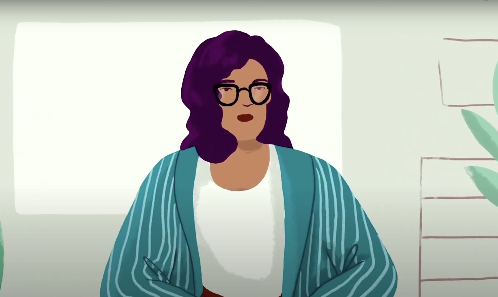

Date: 2022

^ Machine Listening, *Ego Trip,* 2022, video, 48 min.

*Ego Trip,* 2022
online video, 48 min

Researched, written and produced: Machine Listening (Sean Dockray, James Parker, Joel Stern)
Commissioned: Christof Migone for [You and I Are Water Earth Fire Air of Life and Death](https://youandiarewaterearthfireairoflifeanddeath.com/project/i-2022)

In 2021, Facebook AI announced a long-term project called Ego4D, which was different from most other computer vision and machine listening projects because it was focused explicitly on the first-person perspective. This egocentric perspective of AR Ray-Ban sunglasses and a Metaverse VR headset needs to be constructed. The digital self has to be programmed. Ego4D is a dataset, an international research network coordinated by Meta, and a set of machine learning challenges to competitively answer the questions: “What did I do?”, “What am I doing now?”, and “What will I do next?” through the eyes and ears of an augmented human body. 

This video extracts moments from an Ego4D promotional video and relentlessly recomposes them into new variations of their slogan-question, What if AI could understand your world through your eyes?, connecting across to the Metaverse launch and Mark Zuckerberg’s Congressional testimony. This video was made using a CLI version of the [Word Processor](https://instrument.machinelistening.exposed/), a (de)compositional tool for transcribed audio/video. It is an instrument in the sense of both a thing you play with to make sounds and also a forensic device for machine listening.

[https://www.youtube.com/embed/zc8EIdMK00Q?start=28814](https://www.youtube.com/embed/zc8EIdMK00Q?start=28814)

Machine Listening, *Ego Trip,* 2022, video, 48 min. *[starts at 8.00.00]*

**Presentations:**

- [You and I Are Water Earth Fire Air of Life and Death](https://youandiarewaterearthfireairoflifeanddeath.com/project/i-2022), 12 December 2022, 12 hour livestream online event