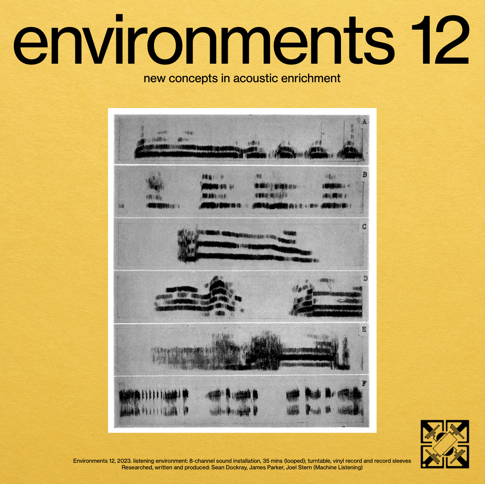
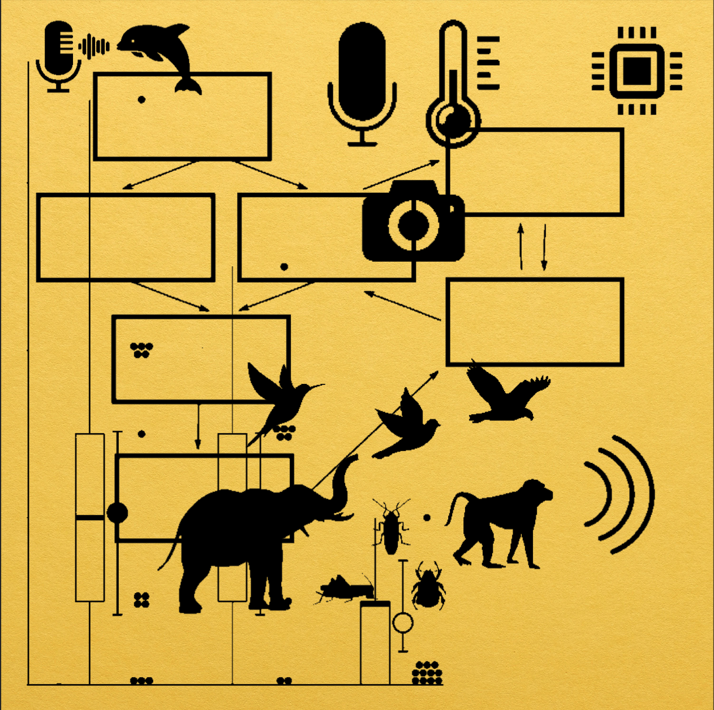
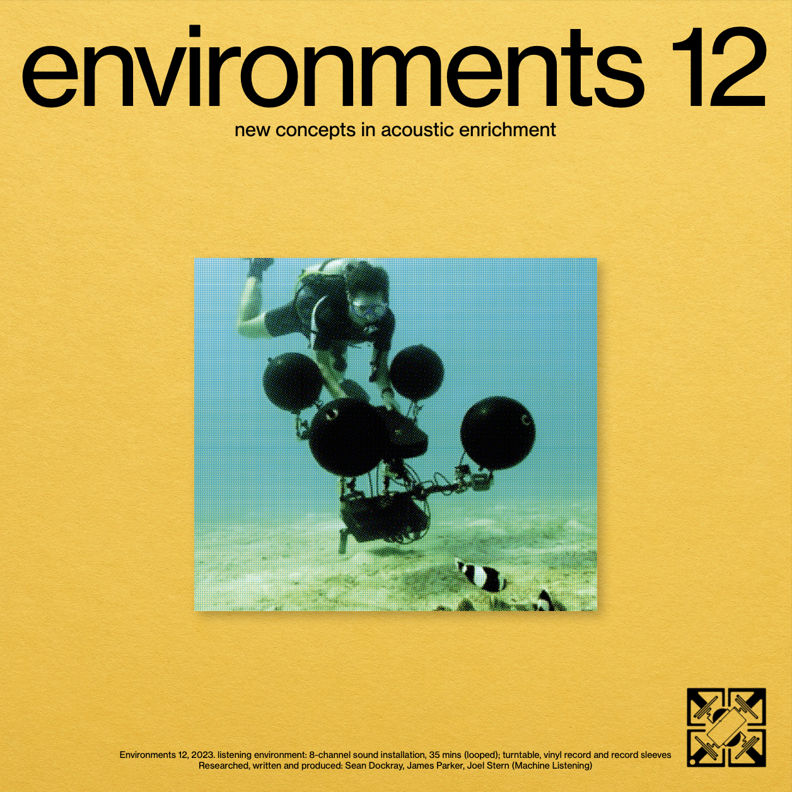
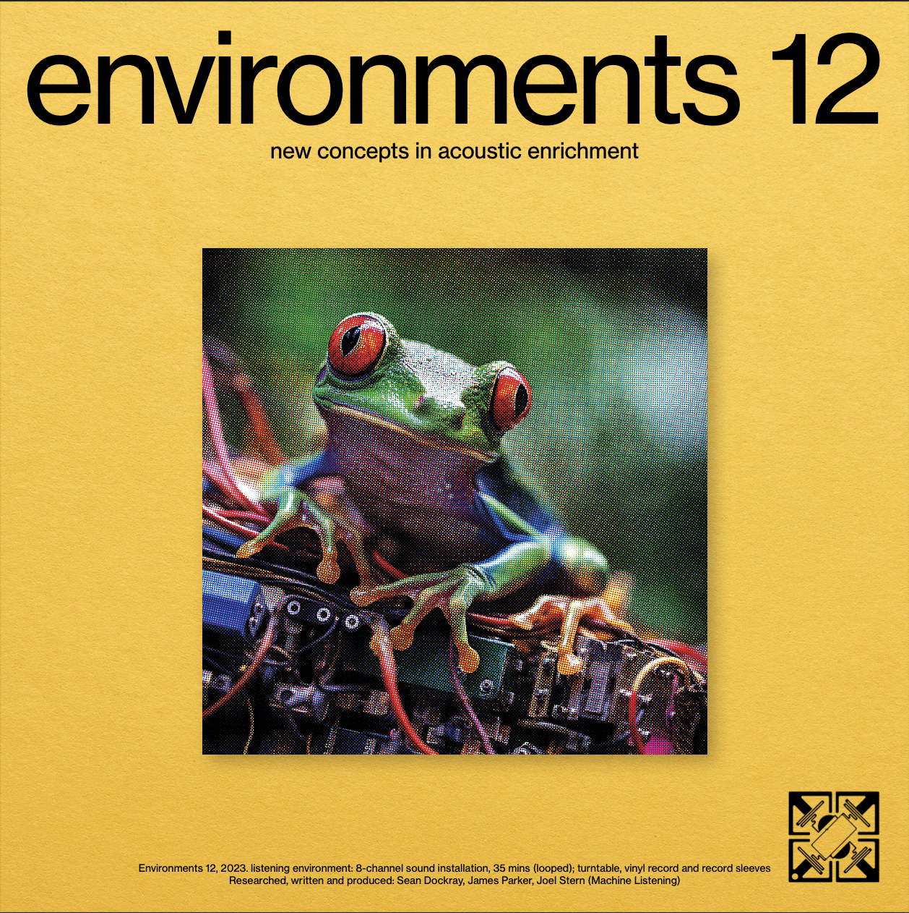
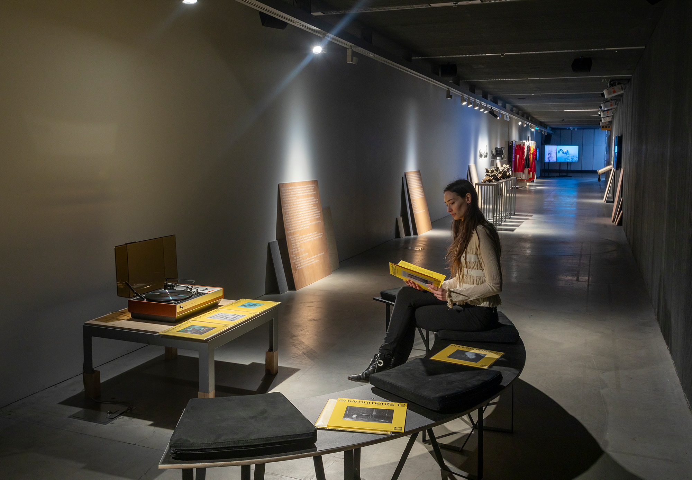

Date: 2023
Date 1: August 1, 2023

^ Machine Listening, *Environments 12*, 2023, cover art.

[Evironments 12 (2023).mp3](../_assets/works/environments-12/Evironments_12_(2023).mp3)

*Environments 12*, 2023
Listening environment: 8-channel sound installation, 35 minutes (looped); turntable, vinyl record and record sleeves.

Researched, written and produced: Sean Dockray, James Parker, Joel Stern.
Voices: David Chesworth, Jasper Dockray, Jenny Hickinbotham, Roslyn Orlando, Francis Plagne, Catherine Ryan, and their clones.
Design: Stuart Geddes.
Commissioned for: [WILD HOPE: Conversations for a Planetary Commons](https://designhub.rmit.edu.au/exhibitions-programs/wild-hope-conversations-for-a-planetary-commons/)**,** RMIT Design Hub.

‘*Is it difficult to reproduce the sounds of nature?*’ 

*Environments 12* is a new, speculative addition to the once-popular *Environments* series: a sequence of 11 [records](https://www.irvteibel.com/discography/environments/) released between 1969 and 1979 that anticipated a mass-market in mood-altering nature recordings. The work takes the form of a multi-channel audio installation, presenting a world in which the environment itself has been updated. In this world, the reproduction, synthesis and management of soundscapes has become ubiquitous and planetised. Loudspeakers and microphones are laced through the biosphere, all in the name of a cybernetic ecology. 

Unfolding across a series of historical, contemporary, and speculative scenes, the work is narrated by an ensemble of vocal performers and their generative voice clones. Together, this more-than-human chorus tells and retells stories of ‘psychologically ultimate seashores’, reef lullabies, natural symphonies designed for zoo enclosures, and large language models for whales and crows. A collection of songs and fables recovered from the ruins of a future history.

Link to [sleeve art and liner notes.](https://drive.google.com/open?id=15EeFrevHXgXXDahAturye4SN98oA7HAs&usp=drive_fs) 

_Environments_2012_2023._Wild_Hope_Exhibition_RMIT_Design_Hub._2023._Photo_by_Tobias_Titz_2.jpg)

^ Wild Hope Exhibition, RMIT Design Hub. 2023. Photo by Tobias Titz

^ Wild Hope Exhibition, RMIT Design Hub. 2023. Photo by Tobias Titz

**_Environments 12_, 2025, Stereo LP, 35 mins. Future Resistenza.**

[https://futuraresistenza.bandcamp.com/album/environments-12-new-concepts-in-acoustic-enrichment](https://futuraresistenza.bandcamp.com/album/environments-12-new-concepts-in-acoustic-enrichment)

Machine Listening's *Environments 12* was released by Belgium's 'Futura Resistenza' label in June 2025.

In sum, Environments 12 is deeply perplexing, beautifully garish, and an unbridled pleasure for all its grotesqueries. Rarely do records strike so deft a balance between high-conceptualism and irreverent absurdity, much less while maintaining a distinct emotional core. It is a mind-inverting libretto for the anthropocene: a post-historical field recording; aggressively brash and thoughtfully devious, one for the curling of your inner ear.

**Presentations:**

- *Wild Hope: Conversations for Planetary Commons*, RMIT Design Hub, 14 August - 29 September 2023.
- *Environments 12* LP launch, [Earthly Futures Studio, Montreuil, Paris](https://events.humanitix.com/host/earthly-futures-studio), 18 June 2025.
- *Environments 12* LP launch, [After 8 Books](https://after8books.com/events/), Paris, 17 June 2025.
- *Environments 12* LP launch, [Q-O2, Brussels](https://www.q-o2.be/en/event/machine-listening-environments-12-lp-launch-futura-resistenza/), presented by Futura Resistenza, 16 June 2025.
- *Environments 12* LP launch, [Ephemera Festival at Museum of Modern Art](https://ephemerafestival.com/),  Warsaw, 14 June 2025.
- *Environments 12* LP launch, [Deep Assignments at Apiary Studios](https://deepassignmentsldn.substack.com/p/deep-assignments-01), London, 2 June 2025.
- *Mono55,* [Room 40 at Institute of Modern Art (IMA), Brisbane](https://www.ima.org.au/ima-events/mono-55/), 13 November 2025.
    
    
    **Reviews:**
    
    - [Wild Hope](https://artandaustralia.com/58_2/review-wild-hope.html), Audrey Pfister, Art + Australia, 11 October 2023.
    - [Environments 12: new concepts in acoustic enrichment](https://acloserlisten.com/2025/06/24/machine-listening-environments-12-new-concepts-in-acoustic-enrichment/), Richard Allen, A Closer Listen, 24 June 2025.
    - [The Best Field Recordings on Bandcamp, June 2025](https://daily.bandcamp.com/best-field-recordings/the-best-field-recordings-on-bandcamp-june-2025?utm_source=notification), Matthew Blackwell, Bandcamp, 2 July 2025.
    - [Martin Beck’s ‘Environments’ Art Summons New Age Sights and Sounds](https://www.artnews.com/art-news/artists/martin-beck-environments-art-1234749668/#:~:text=volume%20imagined%20by-,Machine%20Listening,-%2C%20an%20artist%2Dresearch), Andy Battaglia, Artnews, 21 August 2025
    
    **Interviews:**
    

[https://open.substack.com/pub/deepassignmentsldn/p/deep-assignments-01-the-planetisation?r=8p7o&utm_campaign=post&utm_medium=web&showWelcomeOnShare=false](https://open.substack.com/pub/deepassignmentsldn/p/deep-assignments-01-the-planetisation?r=8p7o&utm_campaign=post&utm_medium=web&showWelcomeOnShare=false)

[Irv Teibel’s Environments, AI Audio, and the Future of Listening w/ Machine Listening](https://www.mackhagood.com/podcast/irv-teibels-environments-ai-audio-and-the-future-of-listening-w-machine-listening/)

[https://youtu.be/ShB9Blu9ObU?si=PGiZEPo5JKBY9uSv](https://youtu.be/ShB9Blu9ObU?si=PGiZEPo5JKBY9uSv)