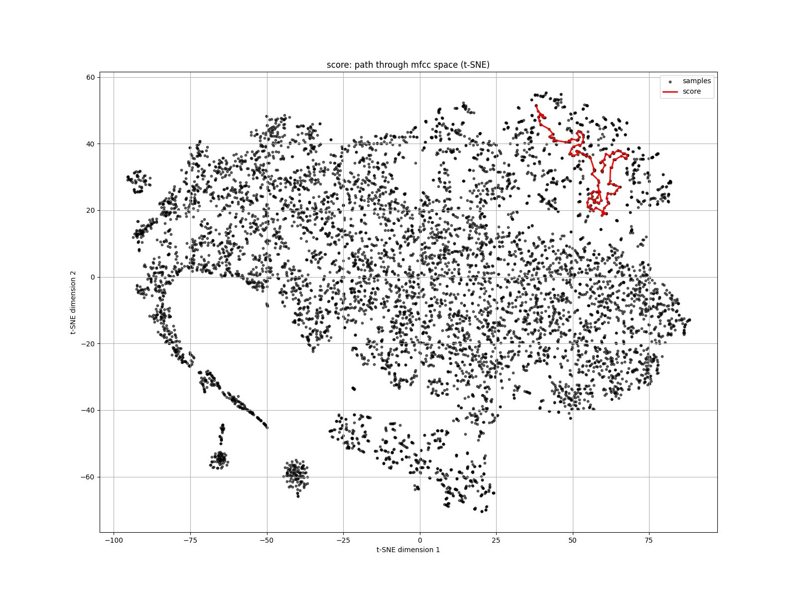
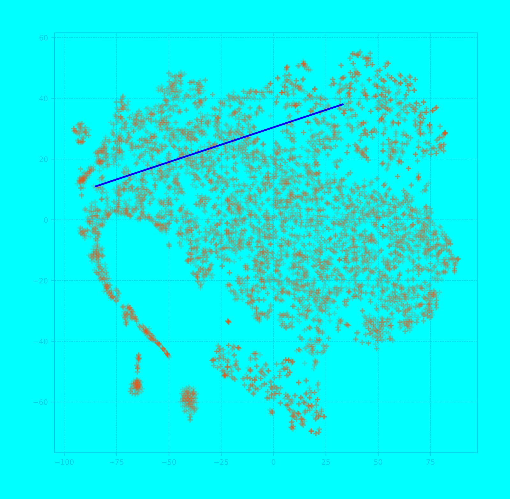
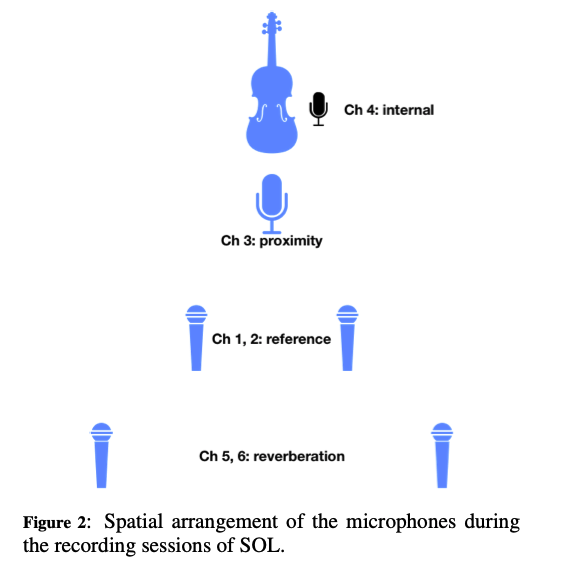
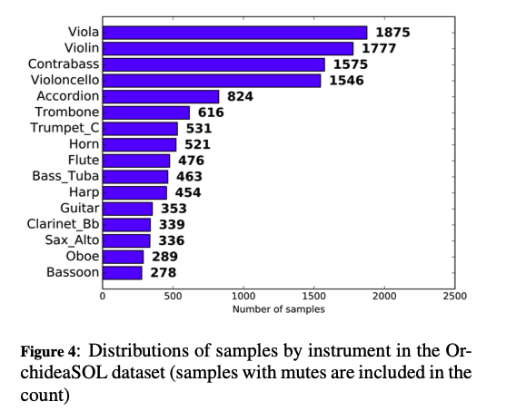
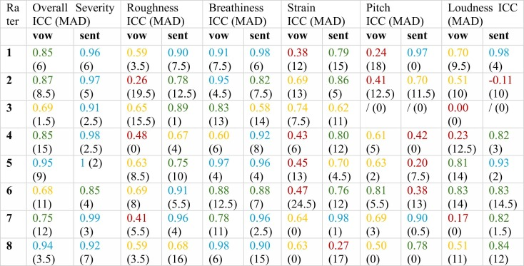
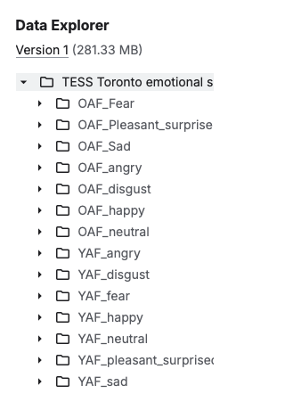
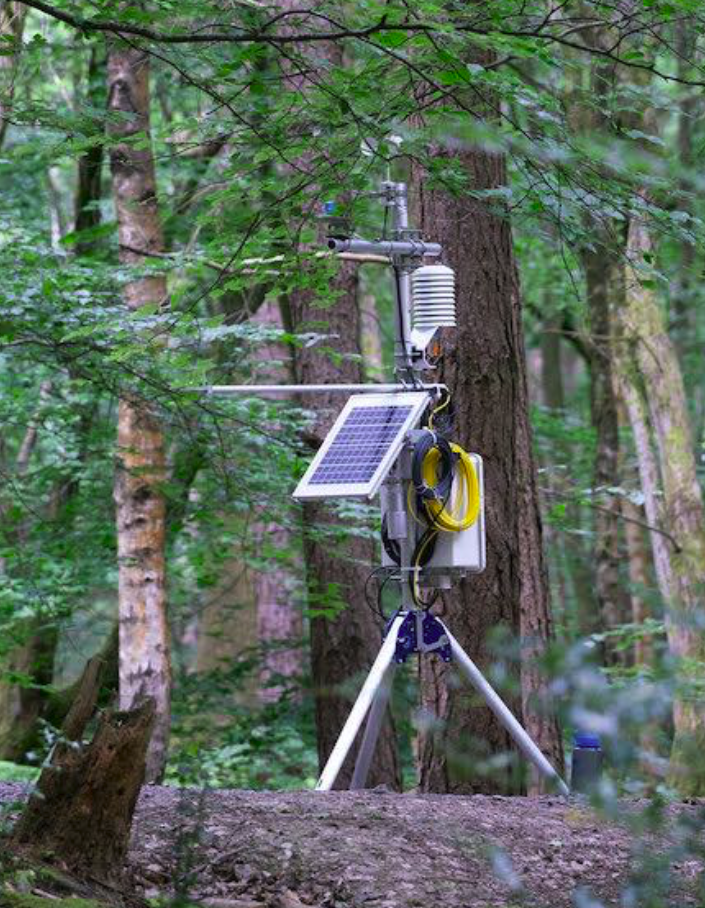

Date: 2025

***Here is a Dataset***, 2025

Radio artwork, stereo, made using audio datasets, custom-built software, Buchla synthesiser, 35 min.

Researched, composed and produced: Machine Listening (Sean Dockray, James Parker, Joel Stern).

Mastered: Joe Talia.

Commissioned: Cashmere Radio/Deutschlandfunk Kultur, 2025.

[Hörstück mit KI-Trainingsdaten - Here is a dataset](https://www.hoerspielundfeature.de/here-is-a-data-set-klangkunst-ki-trainingsdaten-100.html)

How does a sad voice sound? How is a dataset of sad voices different to a song, or a field recording, or a poem? This piece, which is derived from five different audio datasets all intended to be used in training AI systems, asks: are datasets worth listening to? What are the poetics of our performances for machines? And what can we learn about these machines by listening?

It is a widespread myth that data is mined. Just like you mine gold, coal, oil or diamonds. In this way of thinking, data is another natural resource of our world. But this is not correct: because data is not simply mined somewhere. It’s created. For example, when actresses are asked to read strange texts to train AI to classify emotions. Or when scientists record themselves performing office sounds, in order to train sound event detection systems. Such datasets aren’t meant for human ears. This piece insists they are worth listening to anyway.

Compositionally, some of the material in *Here is a Dataset* has been arranged ‘by ear’: for its aesthetic qualities, or to point to and draw out some poetic or affective feature that interested us and seemed to escape the logic of mechanisation.

Other passages have been assembled with **Konvolute**, a custom-built instrument for navigating datasets according to more machinic parameters. MFCCs, or [Mel Frequency Cepstral Coefficients](https://www.google.com/search?client=safari&sca_esv=02c515a629757f60&rls=en&sxsrf=AE3TifOwnaTWLsM5tZb-gKiGsYZuu6czGA%3A1757293749572&q=Mel+Frequency+Cepstral+Coefficients&sa=X&ved=2ahUKEwj5j9at_cePAxWGWHADHQToLY0QxccNegQIJRAB&mstk=AUtExfDNPUlrSWhZOjJ7KyW3lqYaBsFPRZt9nhN6yo9FY24Ddx3y6xg1yZjp1i-XCGqPOAMJZl6RkW8KE7Hvft2i91CSS-h7crhTqcU-w0WoGR1FC25fXzM6tPBj9XQWSkyhZabIzETaxpFIhIFhNWNJxKMuXnK_s1ZFoCFW7u7WKKeI3L5ad9VRwL5wIjfHjo9olE4vyU_3ZuQVckrKHagEbAAZhJOPaPsPMbaiae-0hgAiYsANQMCIGK4lNayKPgj25zbJxqk6lyljL-uqcgAhVut1&csui=3), for instance, are widely used in speech recognition and music information retrieval. Konvolute maps higher-dimensional MFCC space into 2D projections, plotting courses through them, letting us hear computers trying to listen like humans.

**Source Datasets:**

Most of the sounds are sampled directly from these five datasets:

1. [**Sensing the Forest**](https://sensingtheforest.github.io/): solar-powered recordings of a forest in Surrey.
2. [**Perceptual Voice Qualities Database**](https://voicefoundation.org/perceptual-voice-qualities-database/): vowel sounds and diagnostic sentences for voice disorder research.
3. [**OrchideaSOL**](https://forum.ircam.fr/projects/detail/orchideasol/): single musical notes for computer-assisted orchestration (IRCAM, Paris).
4. [**DCASE Synthetic Audio Dataset**](https://dcase.community/challenge2016/task-sound-event-detection-in-synthetic-audio): synthetic office sounds, for sound event detection system training.
5. [**Toronto Emotional Speech Set**](https://utoronto.scholaris.ca/collections/036db644-9790-4ed0-90cc-be1dfb8a4b66): emotional speech recordings (anger, fear, happiness, sadness, etc.) for emotion classification.

In addition, cloned voices (often derived from the training data) perform normally inaudible parts of datasets: spreadsheets, feature measurements, Python preprocessing code.

All of this is paired with a [Buchla synthesiser](https://buchla.com/music-easel/), set to respond dynamically to the voltages of other audio material.

^ MFCC dataset map, produced in Konvolute.

**Notes on Datasets:**

A dataset is never just a collection of files. It is:

- primary data (recordings, measurements)
- metadata describing how/when it was gathered
- the code that processes it
- the papers that cite it
- the spreadsheets that organise it
- the communities who interpret and repurpose it

Working with datasets is a kind of archaeology; slicing through layers of context, methodology, and interpretation. Like *musique concrète* and sampling practices, our work fragments, recombines, and recontextualises, but here the source is not mass media or commercial culture, but the scientific/technological research archive.

*Here is a Dataset* moves between systematic and intuitive, machinic and affective. Sometimes datasets are presented in sequence, sometimes layered to produce strange collisions, sometimes traversed as if by a machine-imitating-a-human listener.

**Audio Files:**

*Here is a Dataset* is available in two versions. Both are multilingual, but one includes narrated moments in English, the other in German.

[Here is a Dataset (Website in German)](https://www.hoerspielundfeature.de/here-is-a-data-set-klangkunst-ki-trainingsdaten-100.html)

[Here is a Dataset (broadcast master -23 LUFS) - German](https://drive.google.com/open?id=1TuIELmfrgUdmafPJY1KRSojHVy7Xn2H_&usp=drive_fs)

[Here is a Dataset (streaming master) - English and German](https://drive.google.com/open?id=1w9BuYnxc4WUR2A3xm7vR2oc-xb6i8IcN&usp=drive_fs)

**Presentations:**

- Cashmere Radio/Deutschlandfunk Kultur 2025