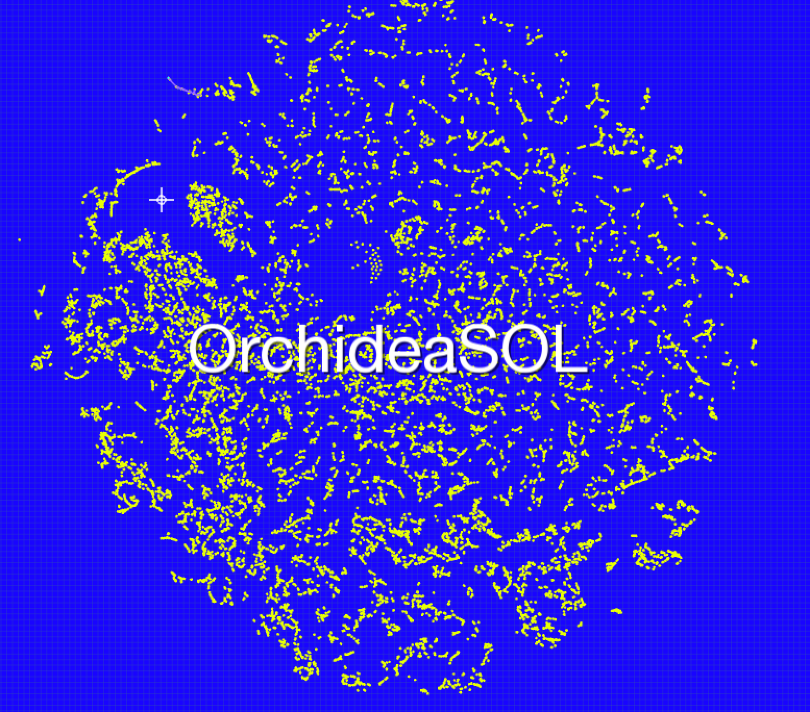
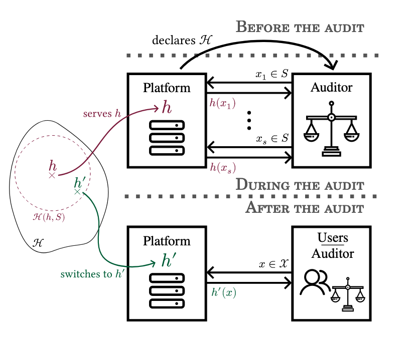
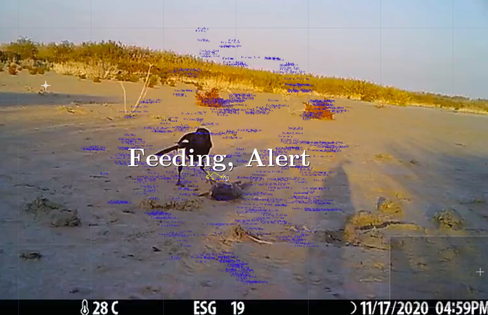

Date: 2025

# Readme.txt

## How to play a dataset

In this session, we will attempt to play some datasets together using Konvolute, a software instrument we’ve built. You can use this instrument in a few different ways.

- to play datasets back like a record or a movie.
- to search or investigate them like a detective.
- but also to manipulate, compose, and perform them live like a piano, sampler, or analogue synthesiser.

## Who are we?

[**Machine Listening**](https://machinelistening.exposed/) is a platform for collaborative research and artistic experimentation, founded in 2020 by Sean Dockray, James Parker, and Joel Stern. We work across [writing](https://machinelistening.exposed/site-map/texts), [installation](https://machinelistening.exposed/site-map/works), [performance](https://machinelistening.exposed/performances/performances), [software](https://machinelistening.exposed/site-map/software/software), [curation](https://machinelistening.exposed/curation), [pedagogy](https://machinelistening.exposed/curriculum), and [radio](https://machinelistening.exposed/site-map/works/here-is-a-dataset). A lot of this work has involved thinking with and about datasets, including various experiments in [dataset critique](https://knowingmachines.org/reading-list). Most recently:

[55 Falls / Ambient Assisted Living (2025)](https://machinelistening.exposed/site-map/works/55-falls-ambient-assisted-living)

[#C (2025)](https://machinelistening.exposed/site-map/works/c)

[Here is a dataset (2025)](https://machinelistening.exposed/site-map/works/here-is-a-dataset)

## What is a dataset?

A dataset is never just a collection of files. It is:

- primary data (labels, recordings, measurements)
- metadata describing how/when it was gathered
- the code that processes it
- the papers that cite it
- the spreadsheets that organise it
- the communities who interpret and repurpose it.

## What is a dataset audit?

Every dataset undergoes some kind of auditing process. Sometimes this is more technically oriented (’cleaning’, ‘augmented’), sometimes more political (’debiasing’, ‘bias mitigation’). But most of it is done in-house, by the computer scientists and engineers involved in producing the dataset, and with little regulatory oversight or public scrutiny. As a result, dataset audits tend to be self-serving, as the high-profile firings of various whistleblowers and internal critics attest (eg Timnit Gebru).

Computer scientists and engineers

[Dulhanty and Wong - 2019 - Auditing ImageNet Towards a Model-driven Framework for Annotating Demographic Attributes of Large-S.pdf](../_assets/works/how-to-play-a-dataset/Dulhanty_and_Wong_-_2019_-_Auditing_ImageNet_Towards_a_Model-driven_Framework_for_Annotating_Demographic_Attributes_of_Large-S.pdf)

[Huang et al. - 2023 - A Dataset Auditing Method for Collaboratively Trained Machine Learning Models.pdf](../_assets/works/how-to-play-a-dataset/Huang_et_al._-_2023_-_A_Dataset_Auditing_Method_for_Collaboratively_Trained_Machine_Learning_Models.pdf)

[Godinot et al. - 2024 - Under manipulations, are some AI models harder to .pdf](../_assets/works/how-to-play-a-dataset/Godinot_et_al._-_2024_-_Under_manipulations_are_some_AI_models_harder_to_.pdf)

[Gerchick et al. - 2025 - Auditing the Audits Lessons for Algorithmic Accountability from Local Law 144's Bias Audits.pdf](../_assets/works/how-to-play-a-dataset/Gerchick_et_al._-_2025_-_Auditing_the_Audits_Lessons_for_Algorithmic_Accountability_from_Local_Law_144s_Bias_Audits.pdf)

[Lafargue et al. - 2025 - Fairness is in the details  Face Dataset Auditing.pdf](../_assets/works/how-to-play-a-dataset/Lafargue_et_al._-_2025_-_Fairness_is_in_the_details__Face_Dataset_Auditing.pdf)

[Shao et al. - 2025 - DATABench Evaluating Dataset Auditing in Deep Learning from an Adversarial Perspective.pdf](../_assets/works/how-to-play-a-dataset/Shao_et_al._-_2025_-_DATABench_Evaluating_Dataset_Auditing_in_Deep_Learning_from_an_Adversarial_Perspective.pdf)

Regulators

[Andres - Auditing the quality of datasets used in algorithmic decision-making systems.pdf](../_assets/works/how-to-play-a-dataset/Andres_-_Auditing_the_quality_of_datasets_used_in_algorithmic_decision-making_systems.pdf)

[European Parliament. Directorate General for Parliamentary Research Services. - 2022 - Auditing the quality of datasets used in algorithmic decision-making systems..pdf](../_assets/works/how-to-play-a-dataset/European_Parliament._Directorate_General_for_Parliamentary_Research_Services._-_2022_-_Auditing_the_quality_of_datasets_used_in_algorithmic_decision-making_systems..pdf)

### What is dataset critique?

We are joining a tradition of artists and technology critics interested in diversifying and expanding on these techniques, and especially who gets to practice them, as a form of counter-auditing. We are interested in developing more critical and inclusive (para-institutional/academic?) forms of dataset auditing, but we do not presume to know in advance what they might be.

Artists and tech critics

- Kate Crawford and Trevor Paglen, [Excavating AI](https://excavating.ai)
- Adam Harvey, [Exposing AI](https://exposing.ai)
- Anna Ridler, [Myriad Tulips](https://artsandculture.google.com/story/anna-ridler-can-datasets-create-art-barbican-centre/_gXholnI1pkrLg?hl=en)
- Everest Pipkin, [Lacework](https://unthinking.photography/projects/lacework/index_2.html)
    
    [Beaton - 2016 - How to Respond to Data Science Early Data Criticism by Lionel Trilling.pdf](../_assets/works/how-to-play-a-dataset/Beaton_-_2016_-_How_to_Respond_to_Data_Science_Early_Data_Criticism_by_Lionel_Trilling.pdf)
    
    [Poirier - 2021 - Reading datasets Strategies for interpreting the politics of data signification.pdf](../_assets/works/how-to-play-a-dataset/Poirier_-_2021_-_Reading_datasets_Strategies_for_interpreting_the_politics_of_data_signification.pdf)
    
    [Raji et al. - 2020 - Saving Face Investigating the Ethical Concerns of Facial Recognition Auditing.pdf](../_assets/works/how-to-play-a-dataset/Raji_et_al._-_2020_-_Saving_Face_Investigating_the_Ethical_Concerns_of_Facial_Recognition_Auditing.pdf)
    
    [Costanza-Chock et al. - 2022 - Who Audits the Auditors Recommendations from a field scan of the algorithmic auditing ecosystem.pdf](../_assets/works/how-to-play-a-dataset/Costanza-Chock_et_al._-_2022_-_Who_Audits_the_Auditors_Recommendations_from_a_field_scan_of_the_algorithmic_auditing_ecosystem.pdf)
    

## What is konvolute?

Konvolute is custom software that maps and then makes datasets playable /navigable according to how they sound. The name is a reference to Walter Benjamin’s *Arcades Project*, his unfinished collection of notes, fragments and non-linear writings about the Paris arcades, where Benjamin uses the term ‘konvolute’ to refer to each unwiedly chapter or collection of materials. But we were also thinking of the convolution of convolutional neural nets, which suggests a way of processing materials that is more mathematical and systematic.

Download konvolute and read the user manual [here](https://app.notion.com/p/MANUAL-md-35321d7b0efc805b9217dbf4eb16dbc8?pvs=21)

## What are we going to do today?

### Playing a dataset

- download konvolute [here](https://app.notion.com/p/MANUAL-md-35321d7b0efc805b9217dbf4eb16dbc8?pvs=21)
- [download some prepared datasets here](https://drive.google.com/drive/u/0/folders/157ySWis4BFZ8n-AsSzloo3jQoRXQj5Ob)

### Collecting a dataset

- What datasets get collected? How? By who? Why? What gets left out?
- Mimi Onuoha, Library of missing datasets
- Jennifer Walshe, Ireland: a Dataset
- What belongs in a New Plymouth dataset?

### New Plymouth: a dataset

- collect our own dataset together
- play it

### Plenary

[https://textb.org/m/konvolute/](https://textb.org/m/konvolute/)