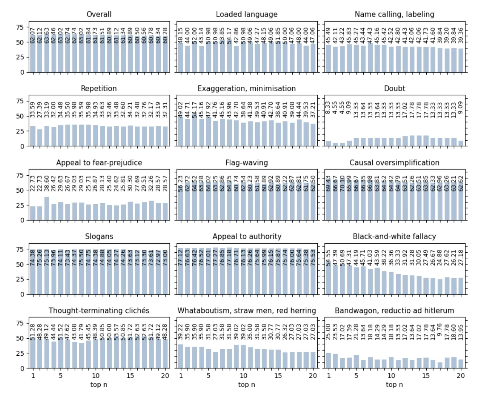
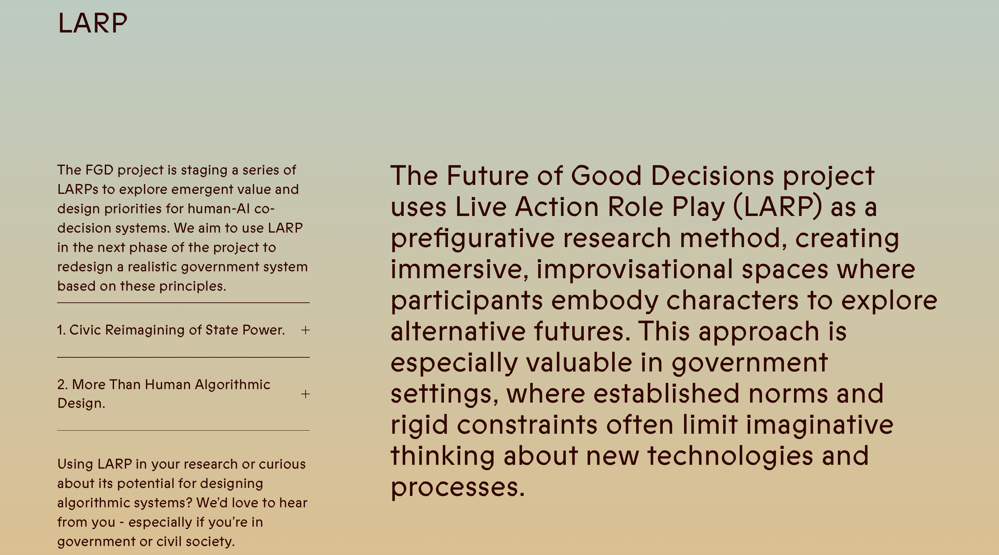
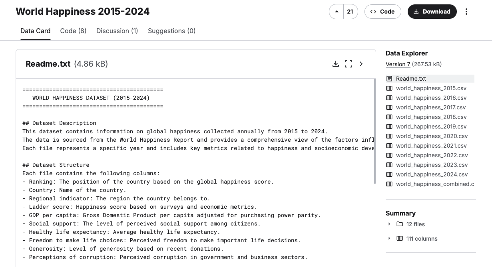
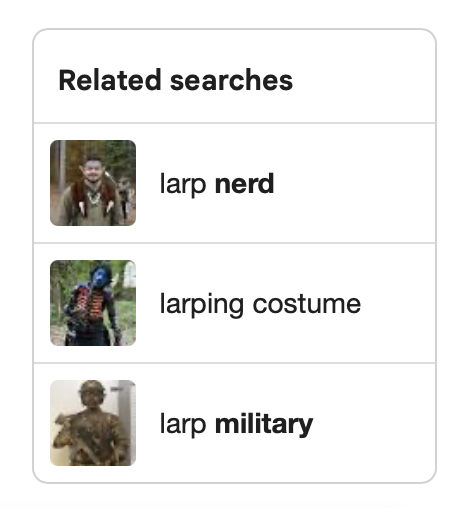
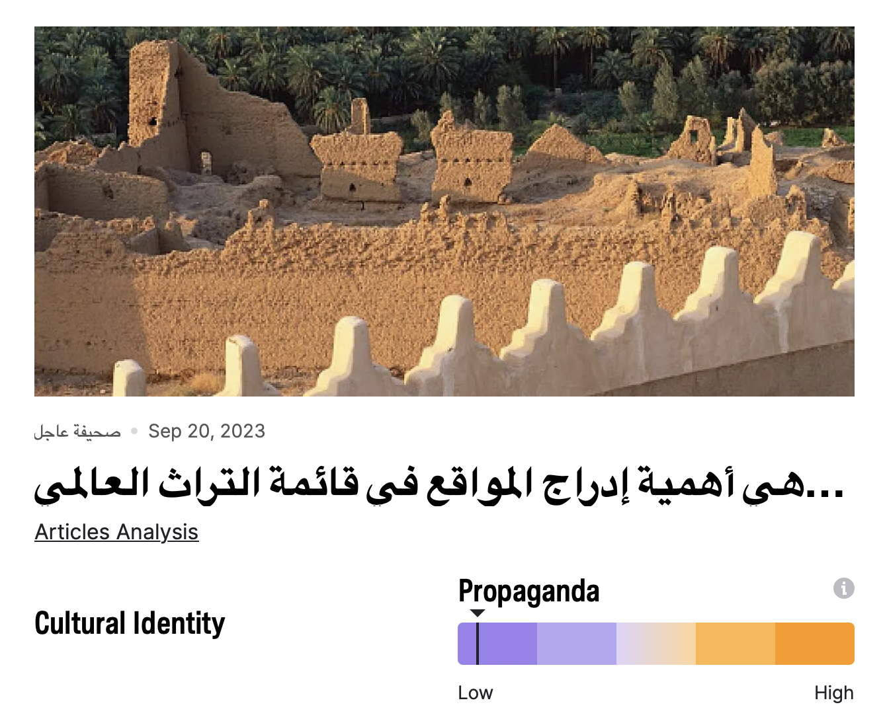
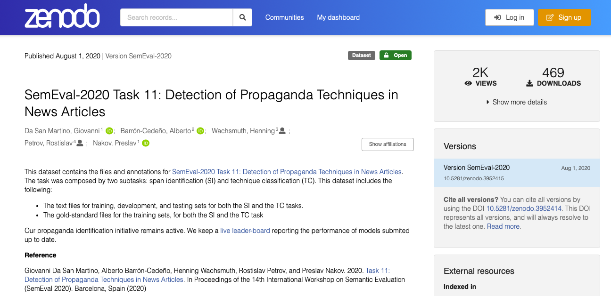
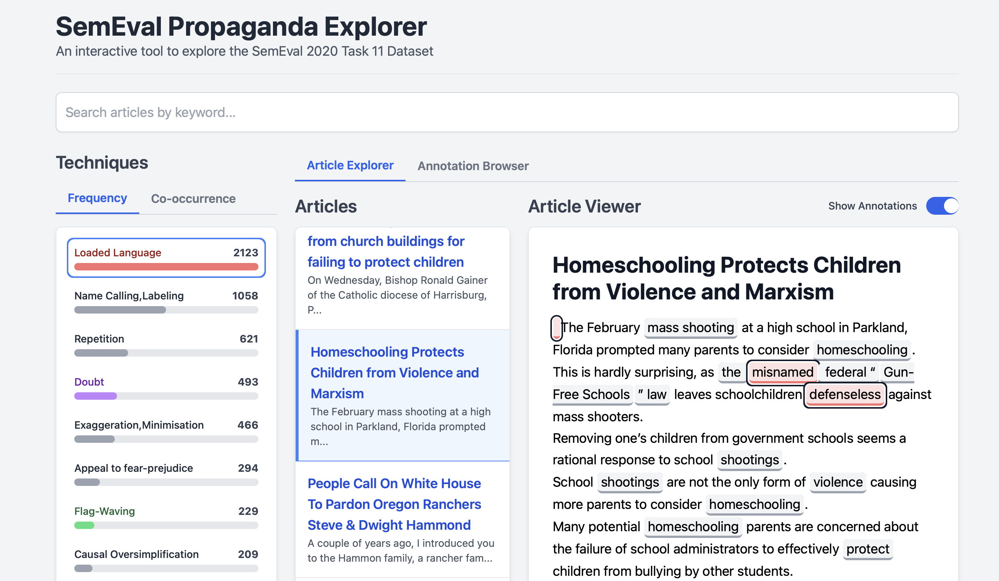

Date: 2025

# Readme.txt

## How to read a dataset (notes towards a Live Action Role Play)

In this session, we will attempt to read a dataset together. The dataset in question - the PTC-SemEval20 corpus - is one of many compiled for the purposes of automatic propaganda detection. It comprises hundreds of news articles, all annotated against fourteen alleged propaganda techniques. 

- How should we read a text like this?
- What can we learn about computer science or big tech by spending time with a dataset in this way?
- How might our collective reading practice differ from the forms of highly motivated dataset auditing currently practiced by industry?
- In what institution or para-institution does such a reading practice belong?

The session is part of our preparation for a [Live Action Role Play](https://www.gooddecisions.uk/about/#larp) we are hoping to run in late 2026 / early 2027, in which a group of us will design and then conduct a simulated dataset audit together. So the question of reading is also a question of role and positionality. 

- Who reads datasets anyway?
- Who else needs to?

## Who are we?

[**Machine Listening**](https://machinelistening.exposed/) is a platform for collaborative research and artistic experimentation, founded in 2020 by Sean Dockray, James Parker, and Joel Stern. We work across [writing](https://machinelistening.exposed/site-map/texts), [installation](https://machinelistening.exposed/site-map/works), [performance](https://machinelistening.exposed/performances/performances), [software](https://machinelistening.exposed/site-map/software/software), [curation](https://machinelistening.exposed/curation), [pedagogy](https://machinelistening.exposed/curriculum), and [radio](https://machinelistening.exposed/site-map/works/here-is-a-dataset). A lot of this work has involved thinking with and about datasets, including various experiments in [dataset critique](https://knowingmachines.org/reading-list). Most recently:

[55 Falls / Ambient Assisted Living (2025)](https://machinelistening.exposed/site-map/works/55-falls-ambient-assisted-living)

[#C (2025)](https://machinelistening.exposed/site-map/works/c)

[Here is a dataset (2025)](https://machinelistening.exposed/site-map/works/here-is-a-dataset)

For this project, we are teaming up with [Connal Parsley](https://www.kent.ac.uk/kent-law-school/people/1334/parsley-connal), leader of the [Future of Good Decisions](https://www.gooddecisions.uk) project, to develop this critical practice via Live Action Role Play (LARP). Connal is a critical legal scholar working across legal and political theory and visual culture. He is developing LARP as a research method for discovering new approaches to decision-making involving algorithmic technologies. His current LARPs focus on shifting conceptions of responsibility in decision-making, participatory system design and evaluation, and the collective reinvention of value concepts.

## What is a dataset?

A dataset is never just a collection of files. It is:

- primary data (labels, recordings, measurements)
- metadata describing how/when it was gathered
- the code that processes it
- the papers that cite it
- the spreadsheets that organise it
- the communities who interpret and repurpose it.

## What is a dataset audit?

Every dataset undergoes some kind of auditing process. Sometimes this is more technically oriented (’cleaning’, ‘augmented’), sometimes more political (’debiasing’, ‘bias mitigation’). But most of it is done in-house, by the computer scientists and engineers involved in producing the dataset, and with little regulatory oversight or public scrutiny. As a result, dataset audits tend to be self-serving, as the high-profile firings of various whistleblowers and internal critics attest (eg Timnit Gebru).

Computer scientists and engineers

[Dulhanty and Wong - 2019 - Auditing ImageNet Towards a Model-driven Framework for Annotating Demographic Attributes of Large-S.pdf](../_assets/works/how-to-read-a-dataset/Dulhanty_and_Wong_-_2019_-_Auditing_ImageNet_Towards_a_Model-driven_Framework_for_Annotating_Demographic_Attributes_of_Large-S.pdf)

[Huang et al. - 2023 - A Dataset Auditing Method for Collaboratively Trained Machine Learning Models.pdf](../_assets/works/how-to-read-a-dataset/Huang_et_al._-_2023_-_A_Dataset_Auditing_Method_for_Collaboratively_Trained_Machine_Learning_Models.pdf)

[Godinot et al. - 2024 - Under manipulations, are some AI models harder to .pdf](../_assets/works/how-to-read-a-dataset/Godinot_et_al._-_2024_-_Under_manipulations_are_some_AI_models_harder_to_.pdf)

[Gerchick et al. - 2025 - Auditing the Audits Lessons for Algorithmic Accountability from Local Law 144's Bias Audits.pdf](../_assets/works/how-to-read-a-dataset/Gerchick_et_al._-_2025_-_Auditing_the_Audits_Lessons_for_Algorithmic_Accountability_from_Local_Law_144s_Bias_Audits.pdf)

[Lafargue et al. - 2025 - Fairness is in the details  Face Dataset Auditing.pdf](../_assets/works/how-to-read-a-dataset/Lafargue_et_al._-_2025_-_Fairness_is_in_the_details__Face_Dataset_Auditing.pdf)

[Shao et al. - 2025 - DATABench Evaluating Dataset Auditing in Deep Learning from an Adversarial Perspective.pdf](../_assets/works/how-to-read-a-dataset/Shao_et_al._-_2025_-_DATABench_Evaluating_Dataset_Auditing_in_Deep_Learning_from_an_Adversarial_Perspective.pdf)

Regulators

[Andres - Auditing the quality of datasets used in algorithmic decision-making systems.pdf](../_assets/works/how-to-read-a-dataset/Andres_-_Auditing_the_quality_of_datasets_used_in_algorithmic_decision-making_systems.pdf)

[European Parliament. Directorate General for Parliamentary Research Services. - 2022 - Auditing the quality of datasets used in algorithmic decision-making systems..pdf](../_assets/works/how-to-read-a-dataset/European_Parliament._Directorate_General_for_Parliamentary_Research_Services._-_2022_-_Auditing_the_quality_of_datasets_used_in_algorithmic_decision-making_systems..pdf)

### What is dataset critique?

We are joining a tradition of artists and technology critics interested in diversifying and expanding on these techniques, and especially who gets to practice them, as a form of counter-auditing. We are interested in developing more critical and inclusive (para-institutional/academic?) forms of dataset auditing, but we do not presume to know in advance what they might be.

Artists and tech critics

- Kate Crawford and Trevor Paglen, [Excavating AI](https://excavating.ai)
- Adam Harvey, [Exposing AI](https://exposing.ai)
- Anna Ridler, [Myriad Tulips](https://artsandculture.google.com/story/anna-ridler-can-datasets-create-art-barbican-centre/_gXholnI1pkrLg?hl=en)
- Everest Pipkin, [Lacework](https://unthinking.photography/projects/lacework/index_2.html)
    
    [Beaton - 2016 - How to Respond to Data Science Early Data Criticism by Lionel Trilling.pdf](../_assets/works/how-to-read-a-dataset/Beaton_-_2016_-_How_to_Respond_to_Data_Science_Early_Data_Criticism_by_Lionel_Trilling.pdf)
    
    [Poirier - 2021 - Reading datasets Strategies for interpreting the politics of data signification.pdf](../_assets/works/how-to-read-a-dataset/Poirier_-_2021_-_Reading_datasets_Strategies_for_interpreting_the_politics_of_data_signification.pdf)
    
    [Raji et al. - 2020 - Saving Face Investigating the Ethical Concerns of Facial Recognition Auditing.pdf](../_assets/works/how-to-read-a-dataset/Raji_et_al._-_2020_-_Saving_Face_Investigating_the_Ethical_Concerns_of_Facial_Recognition_Auditing.pdf)
    
    [Costanza-Chock et al. - 2022 - Who Audits the Auditors Recommendations from a field scan of the algorithmic auditing ecosystem.pdf](../_assets/works/how-to-read-a-dataset/Costanza-Chock_et_al._-_2022_-_Who_Audits_the_Auditors_Recommendations_from_a_field_scan_of_the_algorithmic_auditing_ecosystem.pdf)
    

## What is LARP?

When you think of LARP, historical re-enactments might spring to mind. But in a way, LARP is the opposite. 

- It takes place in a fictional constructed setting where people interact freely in character.
- There are no lines to recite, no script, no ‘original’ to reproduce (or subvert).
- But there might be generative game conditions, limitations, and objectives for the players to navigate.

LARP is becoming more widely used in academic research, especially as a method to explore social and political dimensions of new technologies – existing or latent. It can be particularly useful in highly constrained contexts, where there is little space to examine alternative futures.
Our turn to LARP for dataset critique is based on allowing people who don’t have specialist knowledge to learn about machine learning systems in a practical way, and enabling them to bring their situated concerns, knowledge and points of view to bear. At its best, it might allow us to collectively reimagine the process and what kinds of perspectives it includes.

## Why propaganda detection?

We don’t need to explain the technopolitical context to you. The (dis)information society. Culture wars. Polarisation. Social media. Trump. Authoritarianism. Gaza.

‘Propaganda detection’ is one response by data scientists to a version of this political problem. We think it’s interesting that they chose to call it that, even though - as you’ll see - it’s clearly bound up with [other similar practices](https://web.archive.org/web/20201124135632/https://propaganda.qcri.org/index.html) that go by [other names](https://adata.pro/media-intelligence/social-listening/). Fake news. Sentiment analysis. Bias detection. Fact checking. And of course their account of propaganda is maybe... odd or unfamiliar. 

To be clear: automated ‘propaganda detection’ in this form is already a thing. [Tanbih](https://tanbih.qcri.org), for instance, is a collaboration between the Qatar Computing Research Institute (HBKU), Qatar University, MIT, Northwestern, Sofia University, and two data analytics companies which aims to ‘make explicit media stance, bias, and propaganda, thus limiting the effect of fake news.’ 

## Why the PTC-SemEval20 corpus?

We chose this particular propaganda dataset because it’s small, text based, and (therefore) easily accessible to a group like this. These factors also mean it was relatively easy to build a tool to access and analyse it.

Although we don’t necessarily think it’s the best propaganda dataset, or that propaganda datasets are the best datasets to audit, the PTC-SemEval20 corpus is also a ‘classic’ dataset in lots of ways. It was part of a competition held in 2020 in which 250 teams from universities and industry competed to build the best models. 

This is absolutely classic. It’s how data scientists define problems and build infrastructure together.

[[proceedings-of-semeval-2020-task-11-1|Proceedings of SemEval 2020 Task 11 (1)]]

## What are we going to do today?

We’re not here to tell you how to critique a dataset. We’re here to find out. We want to create a space for people to think for themselves about how to do it. So we’ve devised three ways of approaching the dataset, which we’d like to have to go at together with the following questions in mind.

1. What **tools** do you need in order to read this dataset? 
2. What do you need to **know** in order to read this dataset? 
3. **Who** needs to be involved in reading this dataset?
4. **Why** read this dataset?

For each approach, please enter your thoughts/answers/comments [in this chart](https://other.metadada.xyz/propaganda/v1/questions.html). We will use them to help us design our LARP.

### **Approach 1**

1. Download [the dataset](https://zenodo.org/records/3952415) (1.1MB) and skim read the accompanying paper by Martino et al.

[Martino et al. - 2020 - SemEval-2020 Task 11 Detection of Propaganda Techniques in News Articles.pdf](../_assets/works/how-to-read-a-dataset/Martino_et_al._-_2020_-_SemEval-2020_Task_11_Detection_of_Propaganda_Techniques_in_News_Articles.pdf)

1. Closely read parts 1 and 2 in small groups. 
2. You may also like to look at the introductions to some of these papers for comparison:

[[proceedings-of-semeval-2020-task-11|Proceedings of SemEval 2020 Task 11]]

### **Approach 2**

1. Use [this interface](https://other.metadada.xyz/propaganda/v1/) to explore the dataset. ([mobile version here](https://other.metadada.xyz/propaganda/v1/index-mobile.html))
2. Select an article and use the toggle to clear the annotations and then try to annotate it yourself.
3. You could also try asking eg ChatGPT or Claude to do it instead. Or try applying the same techniques to a text outside the dataset. 
4. Use the toggle to compare with the annotations in the dataset.

Here are some example articles without annotations in case you prefer a different interface.

[[example-articles-2|Example articles (2)]]

### **Approach 3**

Thinking forward to our future LARP or a ‘real life’ dataset audit:

- What kinds of people would you want in the room?
- What 10 characters would you include in a scenario for a dataset LARP?
- What kinds of outcomes would you like to imagine resulting from a dataset audit? How might these outcomes be related to the kinds of people in the room?

### Plenary

Collectively review the responses to the 4 questions in [the spreadsheet](https://other.metadada.xyz/propaganda/v1/questions.html).