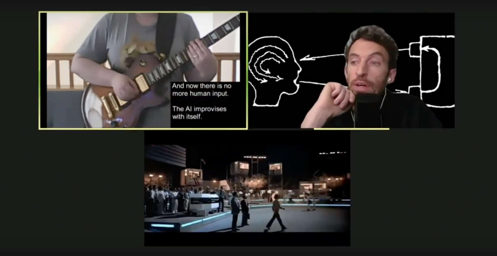
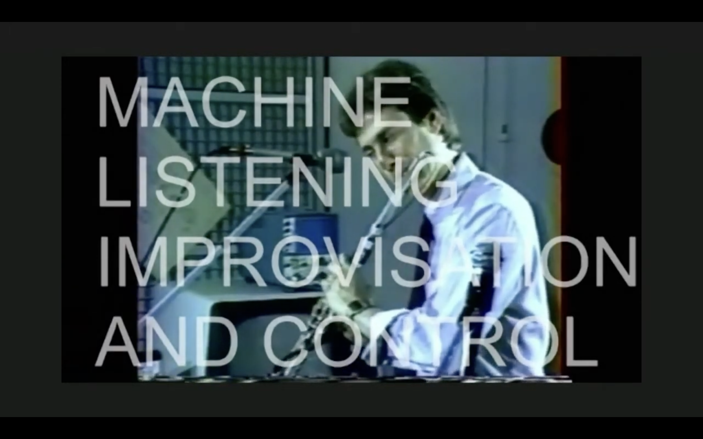

Date: 2021

Machine Listening, *Improvisation and Control*, 2021, Zoom essays, audio-video, 30 mins. (video still)

*Improvisation and Control*, 2021
Zoom essays, audio-video, 30 mins 

Researched, written, produced and performed: Machine Listening (Sean Dockray, James Parker, Joel Stern)
Narration: James Parker.

Presented by [NTU Centre for Contemporary Art Singapore](http://ntu.ccasingapore.org/), Unsound and Liquid Architecture as part of the festival program [Free Jazz III](http://ntu.ccasingapore.org/exhibition/free-jazz-iii-sound-walks/#:~:text=Singapore%20Art%20Museum.-,Partner%20programmes%3A,-Machine%20Listening%2C%20a) 

When the pandemic forced Machine Listening online, like everyone else, we quickly gravitated to Zoom as a means to connect, work, and perform together. The first three curated Machine Listening programs at Unsound 2020 were all held on Zoom and broadcast on YouTube and elsewhere. We thought of them a bit like pirate radio: a temporary station, with hosts, conversations, sounds and experiments. 

When we were invited by NTU Centre for Contemporary Art Singapore to develop another online program in 2021, we wanted to try something a bit different. For [[ep-4-improvisation-and-control|Improvisation and Control]], the radio format was interspersed with three audiovisual essays: 

[Interactive (music) systems](https://youtu.be/EZvK8atIlnA?t=61) 
[Rainbow Family](https://youtu.be/EZvK8atIlnA?t=3232)
[DARPA improv](https://youtu.be/EZvK8atIlnA?t=6197) 

These works play with the essay format and with the expectations and limitations of Zoom as both a medium and a readymade. 

Machine Listening, *Improvisation and Control*, 2021, Zoom essays, audio-video, 30 mins. (video stills)

**Presentations:**

- [*Free Jazz](https://preview.liquidarchitecture.org.au/events/machine-listening-improvisation-and-control),* NTU CCA Singapore, 2021, online

**Reviews:**

- [The Wire](https://liquidarchitecture.org.au/content/0-events/0-machine-listening-improvisation-and-control/202105-the-wire-machine-listening.pdf), 2021, Bruce Russell