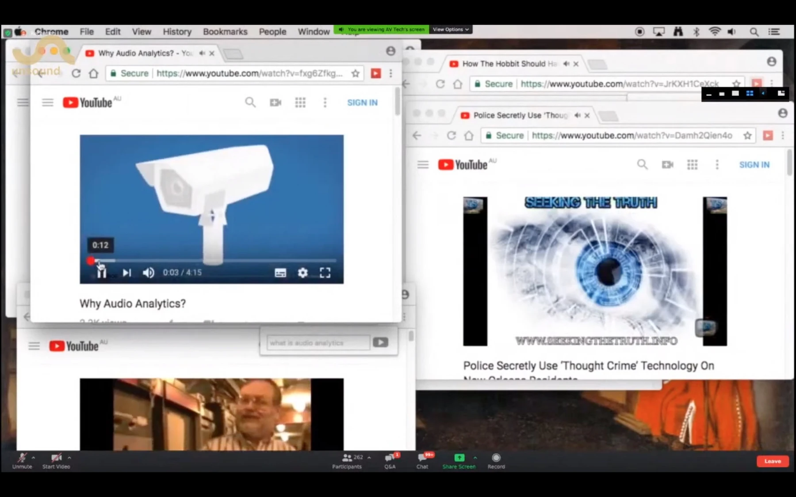

Date: 2018

Sean Dockray, *Learning From YouTube,* 2018, Machine Listening, a curriculum, Session 1, (Against) The World of Coming Listening Machines 2020 (video still).

*Learning from Youtube*, 2018
single-channel screen-capture video essay, 11 min 32 sec

Researched, written, and produced by: Sean Dockray.

A single-channel video essay originally commissioned for the Eavesdropping exhibition at the Ian Potter Museum of Art in 2018. The video self-reflexively tells the story of how YouTube videos have been taken up as training data by Google's Sound Understanding team in their production of Audio Set. By being uploaded and presented on YouTube, the artwork is composted into the same machine learning feedback loop it explores.

[Learning From Youtube Essay](https://assets.super.so/2aac1af0-b07e-417e-ac7d-b2634f6b9ab5/files/9dc9c555-63a4-49a7-9b9d-7bae4b641768/Dockray_Sean_2018_Learning_from_YouTube.pdf) 

[Sean Dockray 'Learning from YouTube' (2018), presented at [Against] The Coming World of Listening Machines, 2 October 2020.](https://youtu.be/iUbglqQLdrI?si=KIEGbwL9UQTvQv9K&t=2902)

Sean Dockray 'Learning from YouTube' (2018), presented at [Against] The Coming World of Listening Machines, 2 October 2020.

**Presentations:**

- Machine Listening, a curriculum, Session 1, (Against) The World of Coming Listening Machines, 2020, online.

**Review and papers:**

- [*Eavesdropping: A reader,](https://www.researchcatalogue.net/view/558982/1115318)* 2018, Journal of Sonic Studies, Tyler Shoemaker