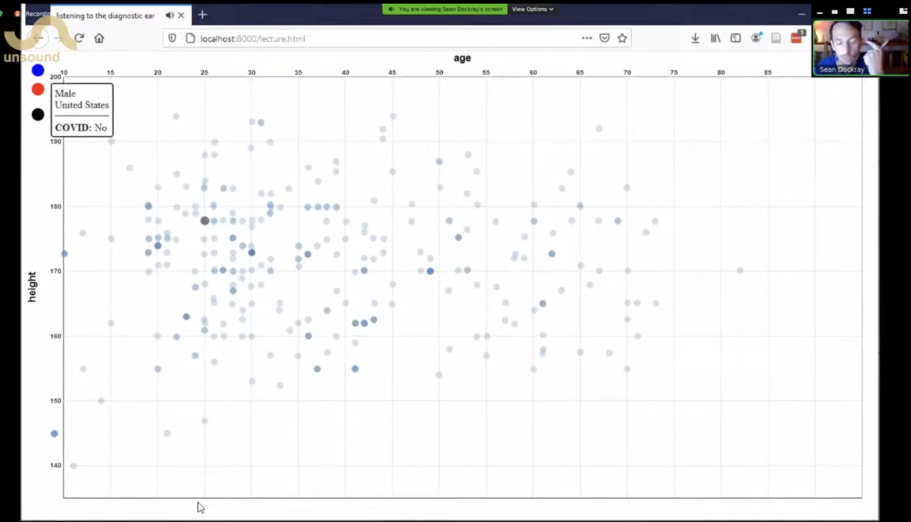

Date: 2020

^ Sean Dockray, *Listening to the Diagnostic Ear*, 2020, audio-video essay, presented as part of Machine Listening Ep 3: Listening With The Pandemic, Liquid Architecture and Unsound, (video still).

*Listening to the Diagnostic Ear,* 2020

audio-video essay, website, machine learning dataset.

Researched, written and produced: Sean Dockray

Software design: Sean Dockray

Commissioned: Ian Potter Museum of Art for the [MACHINE Interdisciplinary Forum,](https://art-museum.unimelb.edu.au/resources/special-project/sean-dockrays-listening-to-the-diagnostic-ear/) 2020

The Ian Potter Museum of Art commissioned Sean Dockray to develop an online artwork for the MACHINE Interdisciplinary Forum.

The commissioned work, [*Listening to the Diagnostic Ear](http://e-rat.org/listening-to-the-diagnostic-ear/),* engages with some questions – what can a cough tell us? What can a cough tell about us? More than a few medical/entrepreneurial projects, which are collecting and analysing coughs in order to diagnose COVID-19, have appeared over the past few months. These projects appeared suddenly, all at once, like symptoms of an underlying condition. When a project such as this is finally realised as an AI Doctor, it will confront us as a diagnostic ear, listening to the noises we make to recognise what can’t be heard, what we don’t even know about ourselves. In [*Listening to the Diagnostic Ear*](http://e-rat.org/listening-to-the-diagnostic-ear/), we listen back, by listening to one dataset of coughs that the machine is learning from. What is this ear learning from these coughs? What can a cough tell us?

[Sean Dockray, *Listening to the Diagnostic Ear*, 2020, audio-video essay, presented as part of Machine Listening Ep 3: Listening With The Pandemic, Liquid Architecture and Unsound.](https://youtu.be/7mcBE-qTcVI?si=5LkPDlNM8GtUa8Cu&t=1356)

^ Sean Dockray, *Listening to the Diagnostic Ear*, 2020, audio-video essay, presented as part of Machine Listening Ep 3: Listening With The Pandemic, Liquid Architecture and Unsound.

**Presentations:**

- Ian Potter Museum of Art for the [MACHINE Interdisciplinary Forum,](https://science.unimelb.edu.au/mcds/newsandevents/mcdsnews-events-news/machine-interdisciplinary-forum-ian-potter-museum-of-art) 2020
- Unsound Festival Machine Listening Ep3: Listening With the Pandemic, 2020