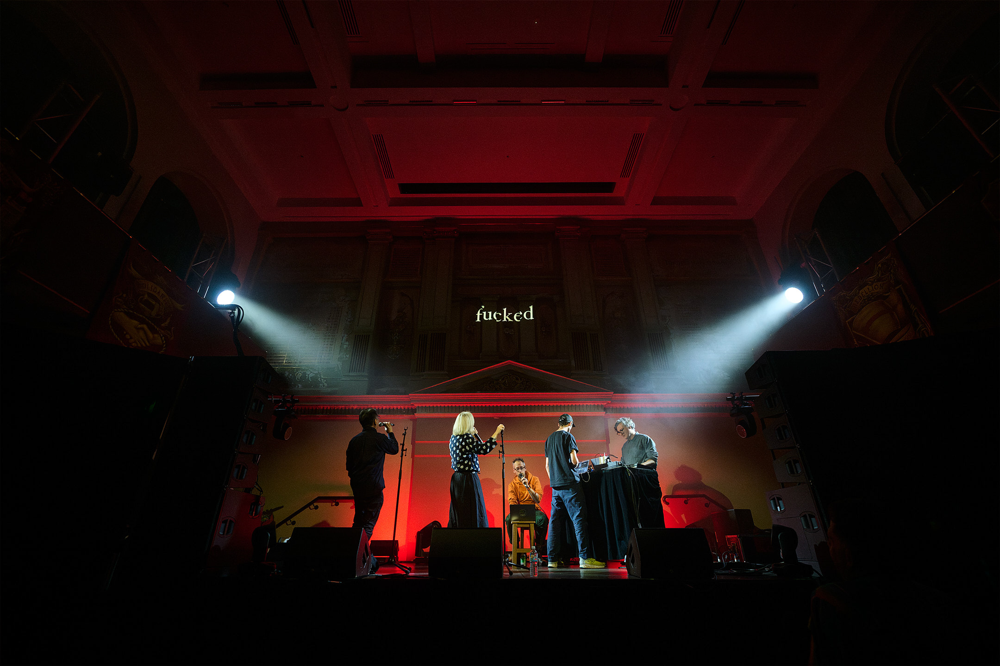

Date: 2024

^ Machine Listening, *Machine Listening Songbook (5-x) ft.* Jennifer Walshe and Tomomi Adachi*,* 2024, performance at SOFT CENTRE SUPERMODEL, Victorian Trades Hall. 31 August 2025. **Photo by Will Hamilton-Coates[.](https://www.instagram.com/will.hamiltoncoates/)

*Machine Listening Songbook: Songs About Fucking Suno,* 2024
Audio, audio-video, essay and live performance.

Researched, written and produced: Sean Dockray, James Parker, and Joel Stern.
Voices: cloned using ElevenLabs.
Instrument design: Sean Dockray.

Live performers: Jennifer Walshe and Tomomi Adachi.
Videos: Emile Zile.

The songbook is a media technology. Like all songbooks, this one is open-ended. It will keep growing. The first four entries were produced during our [residency](https://www.unsound.pl/en/dada/machine-listening-residency) at Unsound 2023, in response to the festival’s theme: [[machine-listening-songbook-dada-data|Dada/Data]].

The latest iteration, Songs About Fucking Suno, was originally commissioned by [SOFT CENTRE](https://www.softcentre.com.au) for performance in a library, and eventually realised at the Victorian Trades Hall with improvised vocals from the incredible [Jennifer Walshe](http://milker.org) and [Tomomi Adachi](https://www.adachitomomi.com) on 29 August 2025.

The studio version of *Songs About Fucking Suno* is now available on [bandcamp](https://machinelistening.bandcamp.com/album/songs-about-fucking-suno) and hosted on the usual streamers, like a virus. 

[https://bandcamp.com/EmbeddedPlayer/album=4167667279/size=small/bgcol=ffffff/linkcol=0687f5/transparent=true/](https://bandcamp.com/EmbeddedPlayer/album=4167667279/size=small/bgcol=ffffff/linkcol=0687f5/transparent=true/)

[https://soundcloud.com/machine-listening/sets/songs-about-fucking-suno?si=9135fbd4a23f4b9f8b7cd1ea9986b81e&utm_source=clipboard&utm_medium=text&utm_campaign=social_sharing](https://soundcloud.com/machine-listening/sets/songs-about-fucking-suno?si=9135fbd4a23f4b9f8b7cd1ea9986b81e&utm_source=clipboard&utm_medium=text&utm_campaign=social_sharing)

[An essay accompanying the album was published in December 2024 by Unsound](https://unsoundfestival.substack.com/i/145535377/songs-about-fucking-suno). 

*‘2024 was the year automatic music generation broke. 

Artists have been working with music made by generative AI systems for years, of course, but none of it was particularly popular. This is because, until 2024, most music being made with generative AI was still all about the strange and highly specific shittiness of generative AI as a medium.*

*2024 is the year automatic music generation broke because it was the year making this kind of unremarkable AI generated music became widely available to the public. Suno had launched right at the end of December 2023, and Udio followed just a few months later, both to considerable hype. According to one industry report from May 2024, ‘Udio’s users are now creating ten tracks a second on the platform.’ By July, Suno was claiming to have had 12 million discreet users. ‘Suno is building a future where anyone can make great music,’ the company said.’*

You could think of the album as digital liner notes in a post-liner notes age. Or maybe they’re just two perspectives on automatic music generation.

[https://youtu.be/Jfb6iISein8?si=AUsS7uNh9xUI8bXl](https://youtu.be/Jfb6iISein8?si=AUsS7uNh9xUI8bXl)

**Tracklist:**

1. **Giant Steps** - a chorus of voice clones attempts to replicate John Coltrane’s Giant Steps, a piece often presented as an apotheosis of human creativity and complexity. For this reason, it’s also sometimes used to demonstrate computer music techniques ('Wagner harmonises giant steps’)

2. **Sunogenesis** - Lyrics by Suno CEO Mikey Schulman

3. **No One Buys Books** - Lyrics based on this article about the state of the book publishing industry. Even celebrity books flop.

4. **Wilful Copyright Infringement** - A song about the scraping practices of generative AI. Lyrics by the Recording Industry Association of America. “Given that the foundation of [these businesses] has been to exploit copyrighted sound recordings without permission, [they have] been deliberately evasive about what exactly [they have] copied. This is unsurprising. After all, to answer that question honestly would be to admit willful copyright infringement on an almost unimaginable scale.”

5. **ASMR hitlist** - An ASMR CEO hitlist.

6. **I Think, If You Wrote A Book, You Fucked Up** - Lyrics by disgraced crypto CEO, Sam Bankman-Fried, in a particularly clear example of tech-CEO brain.

7. **Call numbers** - The library reference codes for books held in the State Library collection with ‘how to read’ in the title: as lyrics.

8. **Fair Use** - Lyrics taken fromthe lawsuit against Suno and Udio. Made in Suno.

9. **It’s Just Not For That** - Lyrics from a podcast interview with Suno CEO Mikey Shulman. Genre prompt: Medieval Bardcore.

10. **Audible Anagrams** - All possible anagrams of the word ‘audible’.

[https://youtu.be/iB3V6DOdZEQ?si=aOktnwd9V9CKf89P](https://youtu.be/iB3V6DOdZEQ?si=aOktnwd9V9CKf89P)

[https://youtu.be/hsk_oTC8ZHs?si=ihHLZj8t6Tt-gMiF](https://youtu.be/hsk_oTC8ZHs?si=ihHLZj8t6Tt-gMiF)

**Presentations:**

- [SOFT CENTRE](https://www.softcentre.com.au): SUPERMODEL presented as part of [Now or Never Festival](https://nowornever.melbourne.vic.gov.au), 31 August 2025, Victorian Trades Hall, Naarm/Melbourne.

[https://open.spotify.com/album/1dNQYlhepTe0rUowArhSsK?si=aflXFvU8SrG91kJqtSp4ag](https://open.spotify.com/album/1dNQYlhepTe0rUowArhSsK?si=aflXFvU8SrG91kJqtSp4ag)