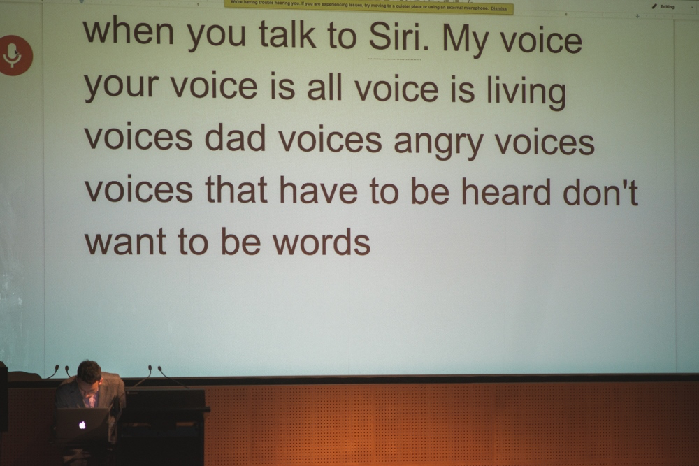

2026: September 24, 2015

[https://www.youtube.com/watch?v=NYzuxpuGk-Q](https://www.youtube.com/watch?v=NYzuxpuGk-Q)

Written and performed by Sean Dockray as part of [Capitalist Surrealism](https://liquidarchitecture.org.au/events/capitalist-surrealism), a performance program curated by Joel Stern for Liquid Architecture, and staged at the National Gallery of Victoria in September 20215.

This program of lecture-performances by sound artists is brought to you by the new cultural logic of capital — real, but honestly, also kind of surreal (algorhythmically-determined, creatively industrial, simulacra sold back to us as authentic alternatives).

The tenant farmers on digital lands of ever-increasing data-value, artists are creative entrepreneurs in creative industries which make up the creative economy. Practising art in the places where you can afford to live is the practice of participating in pricing yourself out of the market. 

Where once was the academy are now neurotic bureaucracies of questionable competence, except for when it comes to exploitation. And everywhere, it seems harder than ever to glimpse, let alone grasp, a world beyond work.Instead of being haunted by the spectres of our lost futures, let’s embrace the fantasies of productivism (just as scare quotes embrace “reality” when it goes before “TV”). 

Listening can enable us to sound unconscious capital. By engaging capitalist surrealism as an alternative present, are we naive, wishful, potentially collusive or hopefully imagining some kind of other horizon? 

Yes.