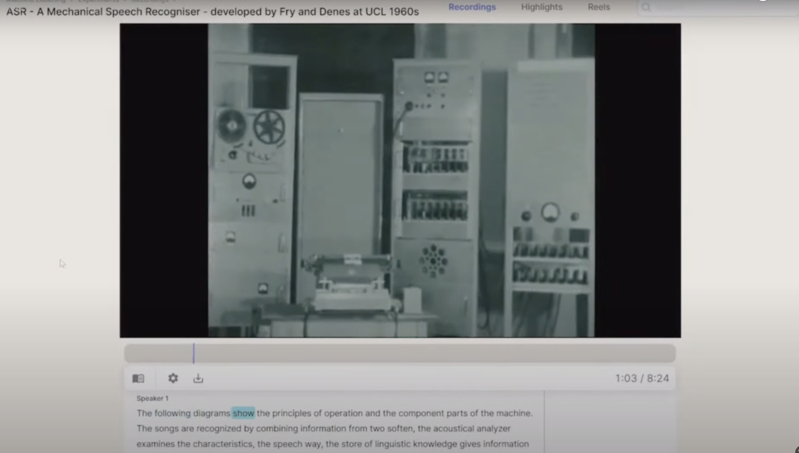
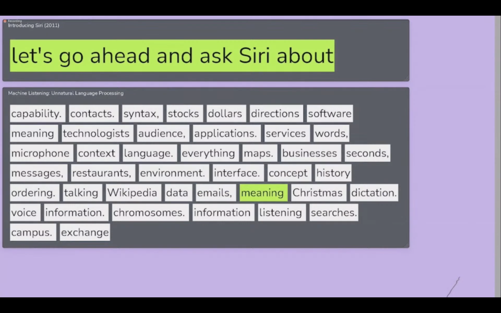
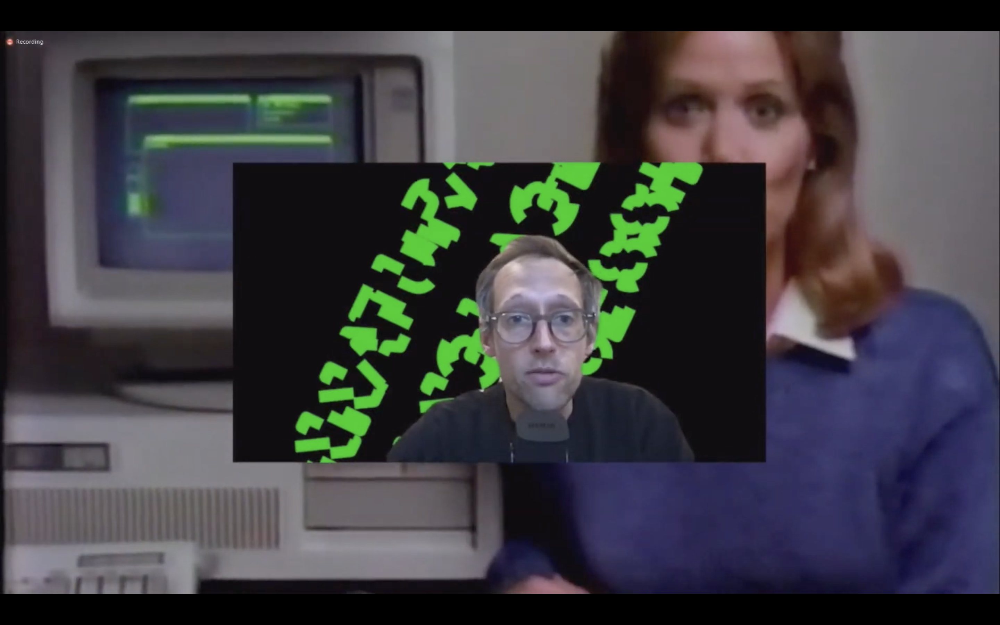

Date: 2021

^ Machine Listening, *Unnatural Language Processing*, 2021, Zoom essays, audio-video, 33 mins. (detail)

*Unnatural Language Processing*, 2021
Zoom essays, audio-video, 33 mins 

**Researched, written, produced and performed: Machine Listening (Sean Dockray, James Parker, Joel Stern)
Narration: James Parker

^ Machine Listening, *Unnatural Language Processing*, 2021, Zoom essays, audio-video, 33 mins. (video stills)

Machine Listening returned to Unsound in 2021, with a fifth live session. *Unnatural Language Processing* explores the history, politics and artistic potential of automatic speech recognition.

Along with talks, conversations and newly commissioned audio experiments, the session launches an ‘instrument’, built in collaboration with [*Reduct*](https://web.archive.org/web/20220615155337/https://reduct.video/), for the filtering, processing and manipulation of speech and text, which the public were invited to play.

The following artists appeared at the live session: Alessandro Bosetti, Martina Raponi, Sue Tompkins, Roslyn Orlando, Justin Clemens, and Mehak Sawney; plus contributions by Robert Ochshorn, Jennifer Walshe, Tomomi Adachi, Johannes Kreidler, Michael McClelland and more.

The *Unnatural Language Processing* audio-visual essay kicked off the program of the same name, surveying the world of machine listening, automatic speech recognition, language processing.

[Machine Listening, *Unnatural Language Processing*, 2021, Zoom essays, audio-video, 33 mins. [First 33 mins of this video]](https://www.youtube.com/watch?v=QL4--f3gRC4&t=2s)

^ Machine Listening, *Unnatural Language Processing*, 2021, Zoom essays, audio-video, 33 mins. [First 33 mins of this video]

**Presentations:**

- [Unsound Festival](https://www.unsound.pl/en/archive/en/dp-authentic/news/its-the-fifth-and-final-day-of-unsound-2021-whats-on-in-krakow-whats-online.html), 2021, online