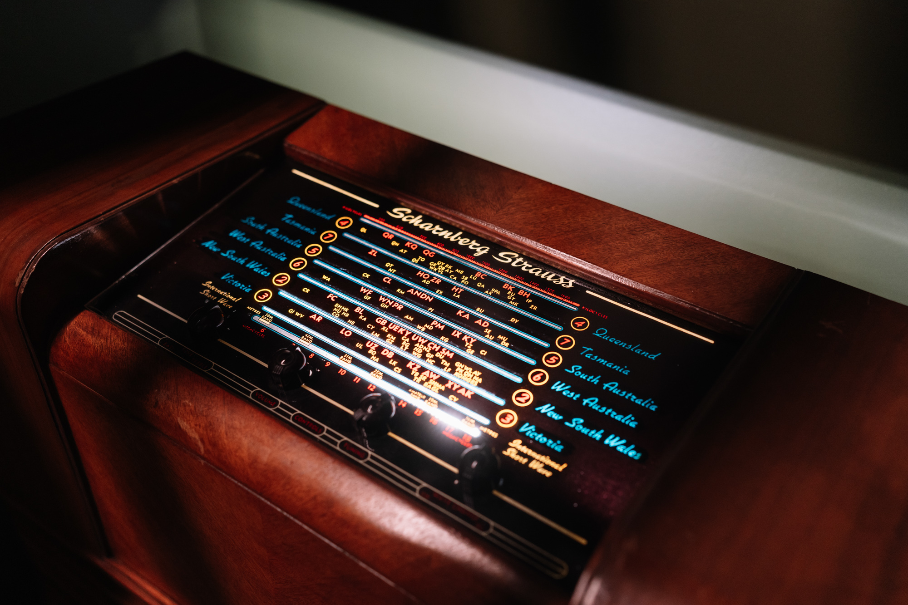
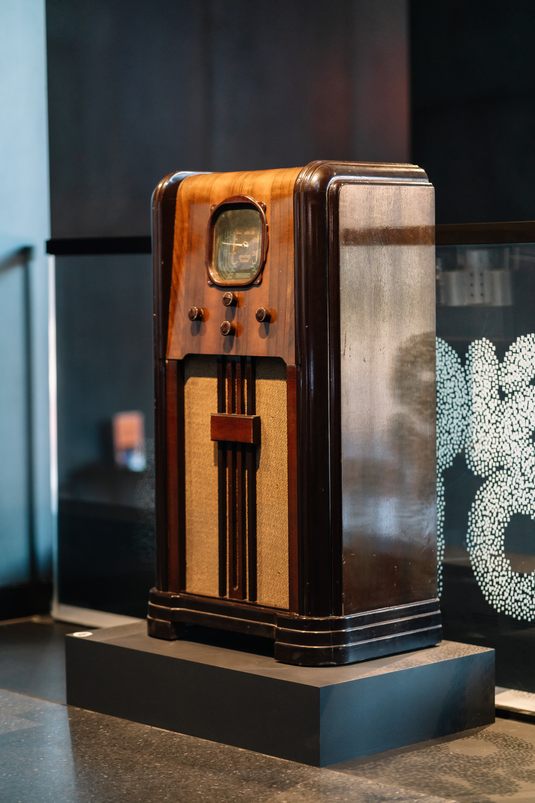
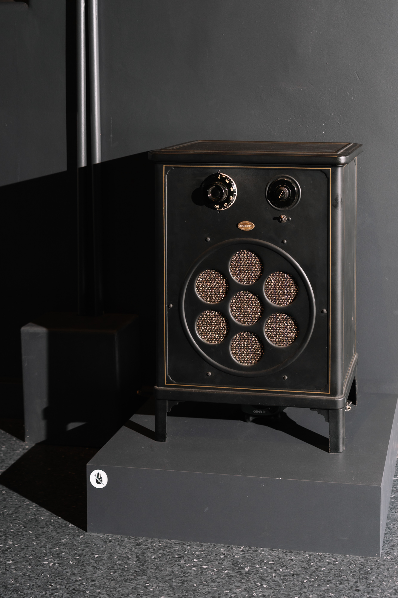
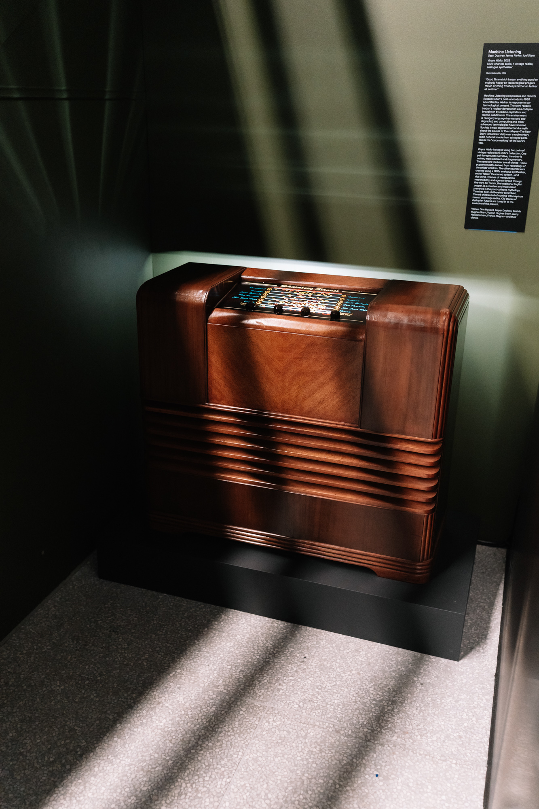

Date: 2025

Machine Listening, *Voyce Walkr,* 2025, Multi-channel audio, 4 vintage radios, analogue synthesiser. Photo by Phoebe Powell, 2025.

*Voyce Walkr*, 2025

Multi-channel audio, 4 vintage radios, analogue synthesiser.

Researched, written and produced: Machine Listening (Sean Dockray, James Parker and Joel Stern).

Voices: Orin Howard, Jasper Dockray, Beatrix Hughes Stern, Vyvyan Hughes Stern, Jenny Hickinbotham, Francis Plagne – and their clones.

Commissioned: National Communication Museum (NCM) for the exhibition 'Signal to Noise' curated by Eryk Salvaggio, Joel Stern, and Emily Siddons. 

[https://soundcloud.com/ncm_melbourne/4-voice-walkin-4?utm_source=clipboard&utm_campaign=wtshare&utm_medium=widget&utm_content=https%253A%252F%252Fsoundcloud.com%252Fncm_melbourne%252F4-voice-walkin-4](https://soundcloud.com/ncm_melbourne/4-voice-walkin-4?utm_source=clipboard&utm_campaign=wtshare&utm_medium=widget&utm_content=https%253A%252F%252Fsoundcloud.com%252Fncm_melbourne%252F4-voice-walkin-4)

[https://soundcloud.com/ncm_melbourne/2-the-user-story-2](https://soundcloud.com/ncm_melbourne/2-the-user-story-2)

*Voyce* *Walkr* by Machine Listening is a reimagining of Russel Hoban’s post-apocalyptic 1980 novel *Riddley Walker*, updated, reworked, and distilled in response to our technological present, and then staged at the NCM as an installation for four vintage radios.

This multi-channel audio work uses AI cloned speech and analogue synthesiser to create a kind of voice puppetry. It considers themes of manipulation, responsibility and agency, and a scrambling of time.

The work recasts Hoban’s nuclear devastation as a collapse brought on by carbon capitalism and techno-solutionism. The environment is ravaged, language has warped and degraded, and computing and other advanced technologies have vanished. Society is now organised around a myth about the causes of the collapse – The User Story – broadcast daily over a rudimentary radio network made from salvaged parts. This is the ‘voyce walking’ of the work’s title.

The piece is meant to evoke radio’s various golden age(s) at the same time as the story imagines radio as a crude post-apocalyptic medium, far in the future. Time has been deliberately scrambled. Cloned children tell of coming ‘infomayshun barms’ on vintage radios. Old stories of dystopian futures tuned in to the anxieties of the present.

Machine Listening, *Voyce Walkr,* 2025, Multi-channel audio, 4 vintage radios, analogue synthesiser. Photo by Phoebe Powell, 2025.

Machine Listening, *Voyce Walkr,* 2025, Multi-channel audio, 4 vintage radios, analogue synthesiser. Photo by Phoebe Powell, 2025.

Read the *Voyce Walkr* essay in full and listen to excerpts [here](https://ncm.org.au/exhibitions/signal-to-noise/content-map#machine-listening). Read the *Voyce Walkr* script [here](https://ncm.org.au/exhibitions/signal-to-noise/content-map#voyce-walkr-script). 

**Presentations:**

- [*Signal to Noise,* 12 April - 14 September 2025, National Communication Museum (NCM), Melbourne](https://ncm.org.au/exhibitions/signal-to-noise).
- [*Silicon Forest: Understories of Trees and Data,* 18 April - 21 June, PRAx Oregon, US.](https://www.e-flux.com/announcements/664336/futurefarmerssilicon-forest/)

**Reviews:**

- [[voyce-walkr|Exhibition review: Signal to Noise, National Communication Museum, Celina Lei, ArtsHub, 2025]].