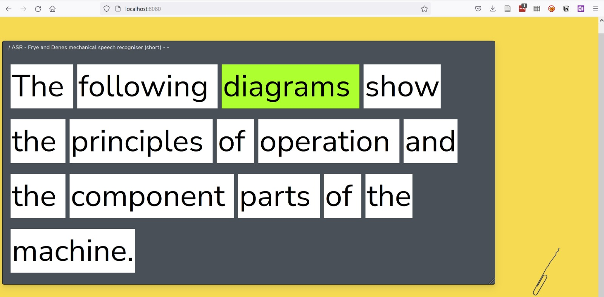
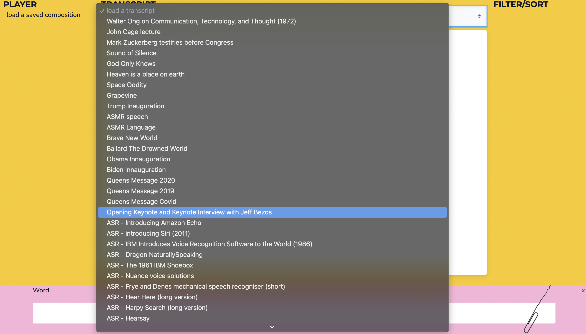

Date: 2021 - ongoing

^ Machine Listening, *Word Processor*, 2021-ongoing, software instrument, (detail).

*Word Processor*, 2021-ongoing

Software instrument.

Programming and Build: Sean Dockray, with Reduct
Concept and Development: Machine Listening (Sean Dockray, James Parker, Joel Stern)

> instrument (n.), from the Latin *instruere:* to “arrange, prepare, set in order; inform, teach”
> 

The [Word Processor](https://instrument.machinelistening.exposed/) is an ‘instrument / compositional / processing tool’ that appropriates methods from speech-to-text and Automatic Speech Recognition as parameters for text and audio composition and experimentation. It was originally built for [[ep-5-unnatural-language-processing|Unnatural Language Processing]], an online performance program at Unsound Festival 2021, in collaboration with [Reduct](https://reduct.video/), as a tool for artists to work, think, and compose with and against ASR. The public version of the Word Processor (which works best with Firefox) is preloaded with a range of audio-texts, largely drawn from technologists and corporations talking about ASR. If you would like to add your own, email us. 

A short film introducing the Word Processor along with some of the history and politics of speech recognition is available [[ep-5-unnatural-language-processing|here]]. This is also where you’ll find early experiments with the instrument by a range of artists and researchers. 

An unlisted playlist of Word Processor experiments [lives here](https://www.youtube.com/playlist?list=PL_WhOEp3AgTX0Wpn1oCUg2hbWSQQWH2Ku)

Thao Phan’s performance lecture [[listening-to-misrecognition|Listening for Misrecognition]], which extensively deploys the Word Processor is available [[listening-to-misrecognition|here]]

In 2023, we have begun to develop the next iteration of Word Processor (WP2) for live and offline performance. We plan to share this too. For now, WP2 will be launched live at Unsound 2023 in Krakow.

^ Machine Listening, *Word Processor*, 2021-ongoing, software instrument, (detail).